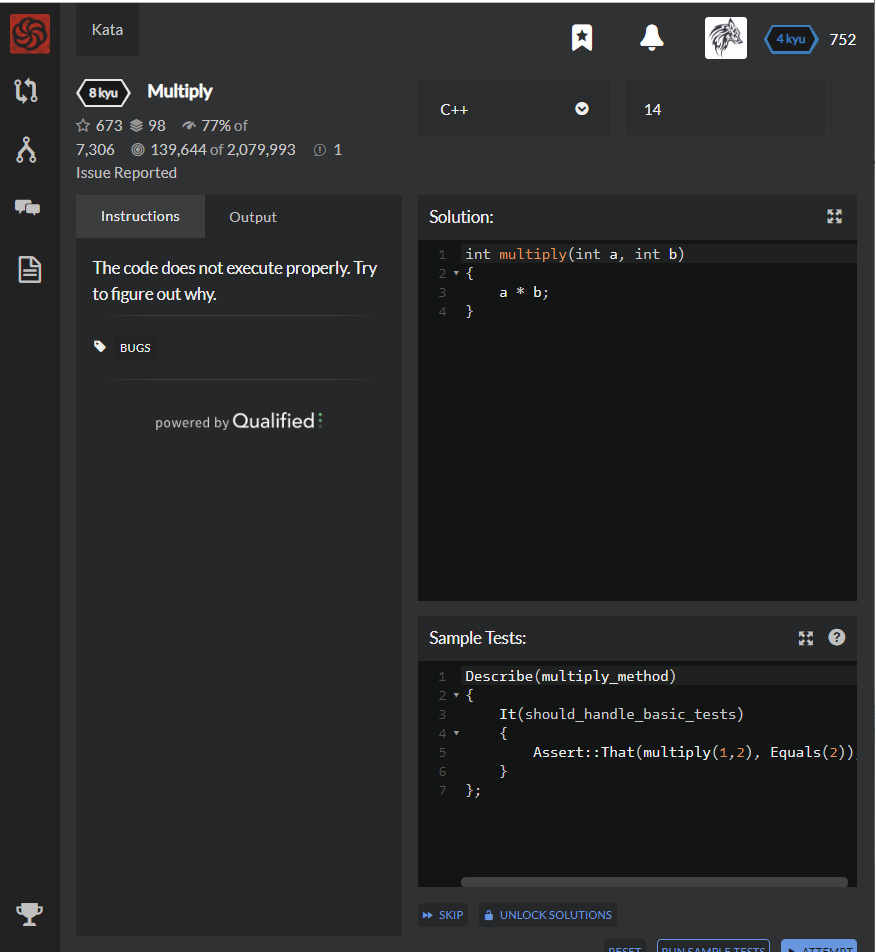

# [[8 Kyu] Multiply](https://www.codewars.com/kata/50654ddff44f800200000004/train/cpp)




## Instructions

The code does not execute properly. Try to figure out why.


## Sample Test

```c++
Describe(multiply_method)
{
    It(should_handle_basic_tests)
    {
        Assert::That(multiply(1,2), Equals(2));
    }
};
```


## My solution

```c++
int multiply(int a, int b)
{
    return a * b;
}
```


## Test Results

Test Passed

Test Passed

Test Passed

You have passed all of the tests! :)

---------

Time: 2084ms Passed: 1 Failed: 0


## Best Solution

```python
same
```


## The things I got

