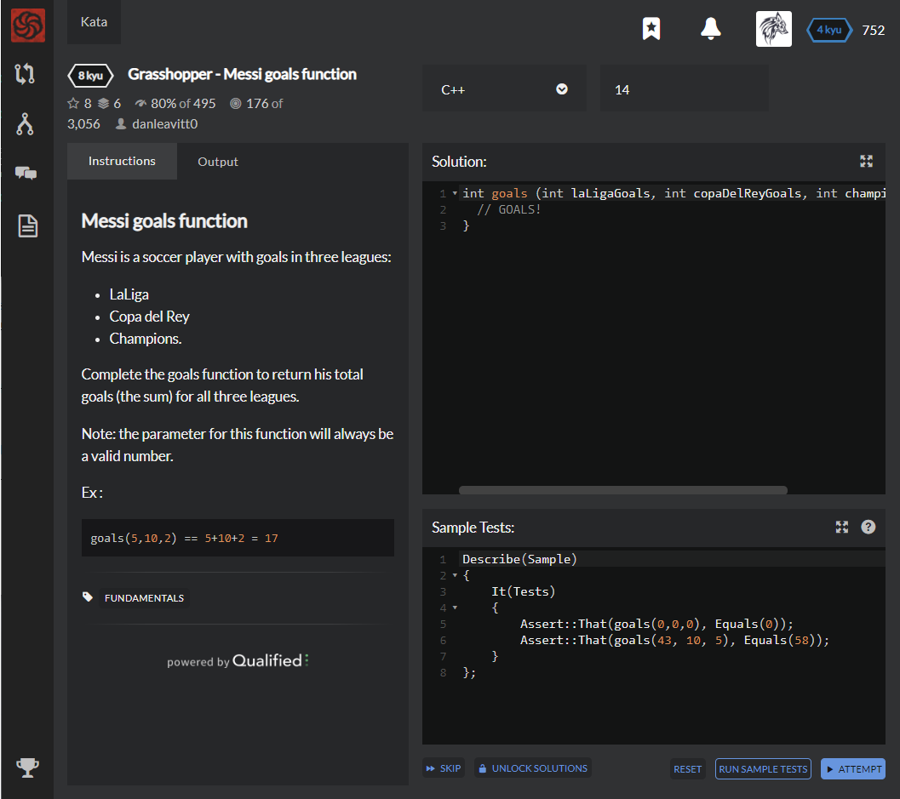

# [[8 Kyu] Grasshopper - Messi goals function](https://www.codewars.com/kata/55f73be6e12baaa5900000d4/train/cpp)




## Instructions

### Messi goals function

Messi is a soccer player with goals in three leagues:

- LaLiga
- Copa del Rey
- Champions.

Complete the goals function to return his total goals (the sum) for all three leagues.

Note: the parameter for this function will always be a valid number.

Ex :

```ruby
goals(5,10,2) == 5+10+2 = 17
```


## Sample Test

```python
Describe(Sample)
{
    It(Tests)
    {
        Assert::That(goals(0,0,0), Equals(0));
        Assert::That(goals(43, 10, 5), Equals(58));
    }
};
```


## My solution

```python
int goals (int laLigaGoals, int copaDelReyGoals, int championsLeagueGoals) {
  return laLigaGoals+copaDelReyGoals+championsLeagueGoals;
}
```


## Test Results

Test Passed

Test Passed

Test Passed

You have passed all of the tests! :)

---------

Time: 2172ms Passed: 3 Failed: 0


## Best Solution

```python
same
```


## The things I got

