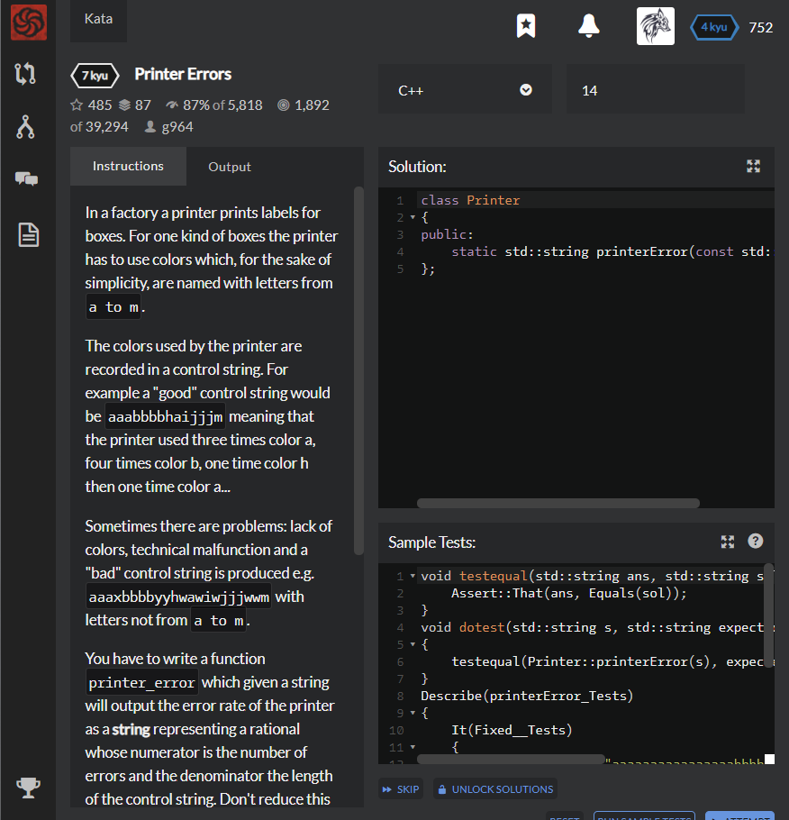

# [[7 Kyu] Printer Errors](https://www.codewars.com/kata/56541980fa08ab47a0000040/train/cpp)




## Instructions

In a factory a printer prints labels for boxes. For one kind of boxes the printer has to use colors which, for the sake of simplicity, are named with letters from `a to m`.

The colors used by the printer are recorded in a control string. For example a "good" control string would be `aaabbbbhaijjjm` meaning that the printer used three times color a, four times color b, one time color h then one time color a...

Sometimes there are problems: lack of colors, technical malfunction and a "bad" control string is produced e.g. `aaaxbbbbyyhwawiwjjjwwm` with letters not from `a to m`.

You have to write a function `printer_error` which given a string will output the error rate of the printer as a **string** representing a rational whose numerator is the number of errors and the denominator the length of the control string. Don't reduce this fraction to a simpler expression.

The string has a length greater or equal to one and contains only letters from `a`to `z`.

### Example

```c++
s="aaabbbbhaijjjm"
error_printer(s) => "0/14"

s="aaaxbbbbyyhwawiwjjjwwm"
error_printer(s) => "8/22"
```


## Sample Test

```python
void testequal(std::string ans, std::string sol) {
    Assert::That(ans, Equals(sol));
}
void dotest(std::string s, std::string expected)
{
    testequal(Printer::printerError(s), expected);
}
Describe(printerError_Tests)
{
    It(Fixed__Tests)
    {
        std::string s = "aaaaaaaaaaaaaaaabbbbbbbbbbbbbbbbbbmmmmmmmmmmmmmmmmmmmxyz";
        dotest(s, "3/56");
        s = "kkkwwwaaaaaaaaaaaaaabbbbbbbbbbbbbbbbbbmmmmmmmmmmmmmmmmmmmxyz";
        dotest(s, "6/60");
        s = "kkkwwwaaaaaaaaaaaaaabbbbbbbbbbbbbbbbbbmmmmmmmmmmmmmmmmmmmxyzuuuuu";
        dotest(s, "11/65");
    }
};

```


## My solution

```cpp
#include <iostream>    //cout를 사용하게 해준다.
using namespace std;

class Printer
{
public:
    static std::string printerError(const std::string &s){
      int count=0;
      for(int i=0;i<s.length();i++)
      {
        if (int(s.at(i)) > int('m'))
        {
          count++;
        }
      }
      
      return to_string(count) + "/" + to_string(s.length());
}
```


## Test Results

Test Passed

Test Passed

Test Passed

You have passed all of the tests! :)

---------

Time: 2677ms Passed: 2 Failed: 0


## Best Solution

```c++
class Printer
{
  public:
    static std::string printerError(std::string const & s)
    {
      auto const denum = s.length();
      auto const numer = std::count_if(
          s.cbegin(), s.cend(),
          [](char c) { return c > 'm'; });
      
      return std::to_string(numer) + "/" + std::to_string(denum);
    }
};
```


## The things I got

