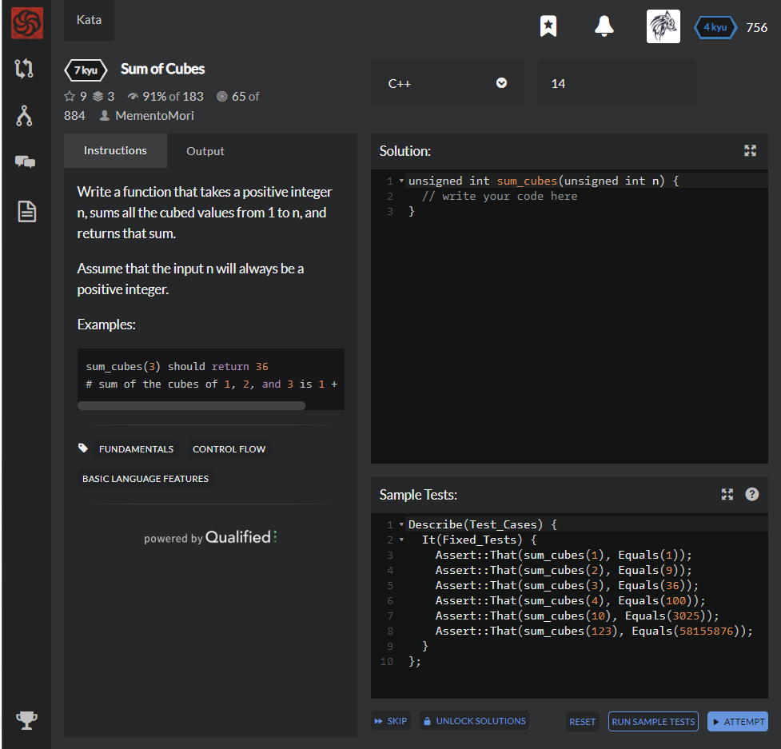

# [[7 Kyu] Sum of Cubes](https://www.codewars.com/kata/59a8570b570190d313000037/train/cpp)




## Instructions

Write a function that takes a positive integer n, sums all the cubed values from 1 to n, and returns that sum.

Assume that the input n will always be a positive integer.

### Examples

```cpp
sum_cubes(3) should return 36 
# sum of the cubes of 1, 2, and 3 is 1 + 8 + 27
```


## Sample Test

```c++
Describe(Test_Cases) {
  It(Fixed_Tests) {
    Assert::That(sum_cubes(1), Equals(1));
    Assert::That(sum_cubes(2), Equals(9));
    Assert::That(sum_cubes(3), Equals(36));
    Assert::That(sum_cubes(4), Equals(100));
    Assert::That(sum_cubes(10), Equals(3025));
    Assert::That(sum_cubes(123), Equals(58155876));
  }
};
```


## My solution

```python
unsigned int sum_cubes(unsigned int n) {
  int sum=0;
  for(int i=1; i<=n; i++){
    sum += i*i*i;
  }
  return sum;
}
```


## Test Results

Test Passed

Test Passed

Test Passed

You have passed all of the tests! :)

---------

Time: 2014ms Passed: 2 Failed: 0


## Best Solution

```python
unsigned int sum_cubes(unsigned int n)
{
    return (n = n * (n + 1) >> 1) * n;
}
```


## The things I got

