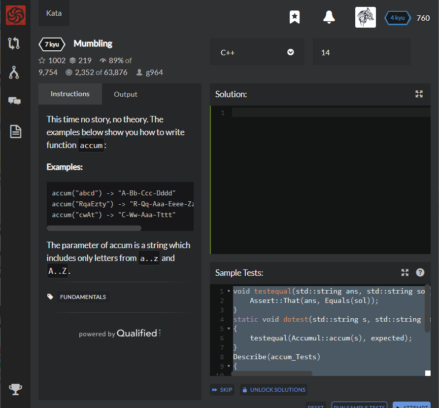

# [[7 Kyu] Mumbling](https://www.codewars.com/kata/5667e8f4e3f572a8f2000039/train/cpp)




## Instructions

This time no story, no theory. The examples below show you how to write function `accum`:

### Examples

```cpp
accum("abcd") -> "A-Bb-Ccc-Dddd"
accum("RqaEzty") -> "R-Qq-Aaa-Eeee-Zzzzz-Tttttt-Yyyyyyy"
accum("cwAt") -> "C-Ww-Aaa-Tttt"
```

The parameter of accum is a string which includes only letters from `a..z` and `A..Z`.


## Sample Test

```cpp
void testequal(std::string ans, std::string sol) {
    Assert::That(ans, Equals(sol));
}
static void dotest(std::string s, std::string expected)
{
    testequal(Accumul::accum(s), expected);
}
Describe(accum_Tests)
{
    It(Fixed_Tests)
    {
        dotest("ZpglnRxqenU", "Z-Pp-Ggg-Llll-Nnnnn-Rrrrrr-Xxxxxxx-Qqqqqqqq-Eeeeeeeee-Nnnnnnnnnn-Uuuuuuuuuuu");
        dotest("NyffsGeyylB", "N-Yy-Fff-Ffff-Sssss-Gggggg-Eeeeeee-Yyyyyyyy-Yyyyyyyyy-Llllllllll-Bbbbbbbbbbb");
    }
};

```


## My solution

```python
class Accumul
{
public:
    static std::string accum(const std::string &s)
    {
      std::string result = "";
      for(int i=0;i<s.length();i++)
      {
        result += toupper(s.at(i));
        for(int j=0;j<i;j++)
        {
          result += tolower(s.at(i));
        }
        if(i<s.length()-1) result += "-";
      }
      return result;
    }
};
```


## Test Results

Test Passed

Test Passed

Test Passed

You have passed all of the tests! :)

---------

Time: 1962ms Passed: 2 Failed: 0


## Best Solution

```c++
using namespace std;

class Accumul
{
public:
    static std::string accum(const std::string &s) {
      stringstream result;
      for (int i = 0; i < s.length(); i++) 
        result << "-" << string(1, toupper(s[i])) << string(i, tolower(s[i])); 
      return result.str().substr(1);
    }
};
```


## The things I got

