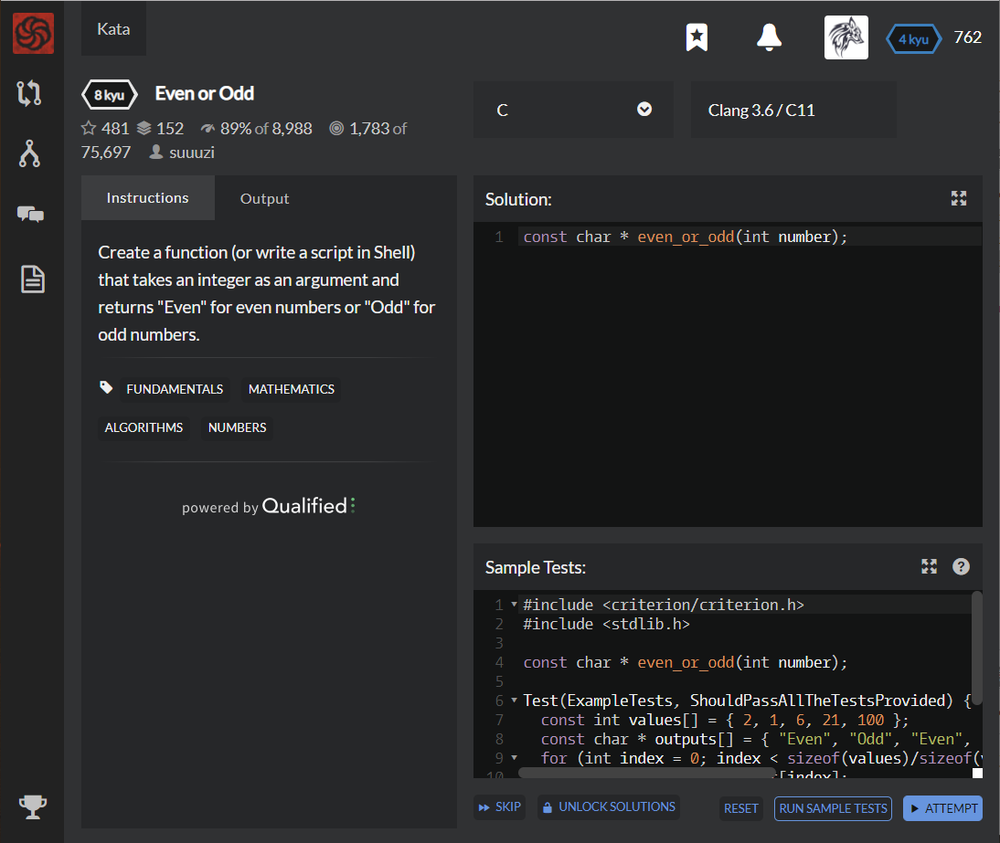

# [[8 Kyu] Even or Odd](https://www.codewars.com/kata/53da3dbb4a5168369a0000fe/train/c)




## Instructions

Create a function (or write a script in Shell) that takes an integer as an argument and returns "Even" for even numbers or "Odd" for odd numbers.


## Sample Test

```c
#include <criterion/criterion.h>
#include <stdlib.h>

const char * even_or_odd(int number);

Test(ExampleTests, ShouldPassAllTheTestsProvided) {
  const int values[] = { 2, 1, 6, 21, 100 };
  const char * outputs[] = { "Even", "Odd", "Even", "Odd", "Even" };
  for (int index = 0; index < sizeof(values)/sizeof(values[0]); ++index) {
    char * expected = outputs[index];
    char * received = even_or_odd(values[index]);
    cr_assert_str_eq(expected, received, "Expected: %s Received: %s", expected, received);
  }
}
```


## My solution

```c
char * even_or_odd(int number){
  char *s1 = "Even";
  char *s2 = "Odd";
  char *result;
  
  if(number%2 == 0) result = s1;
  else result = s2;
  
  return result;
}
```


## Test Results

Test Passed

Test Passed

Test Passed

You have passed all of the tests! :)

---------

Time: 899ms Passed: 77 Failed: 0


## Best Solution

```c
const char * even_or_odd(int n)
{
  return (n & 1)?("Odd"):("Even");
}
```

```c
const char * even_or_odd(int n) {
  if (n % 2 == 0) return "Even";
  else return "Odd";
}
```


## The things I got

**& Bit operator** : *and* operation.

**| Bit operator** : *or* operation

**^ Bit operator** : *nor* operation

```c
#include <stdio.h>

int main()
{
    unsigned char num1 = 1; // 0000 0001
    unsigned char num2 = 3; // 0000 0011
    
    printf("%d\n", num1 & num2); // 0000 0001 : and 연산 : 1
    printf("%d\n", num1 | num2); // 0000 0011 : or 연산 : 3
    printf("%d\n", num1 ^ num2); // 0000 0010 : xor 연산 : 2
    
  	return 0;
}
```

| 연산자 | 비트1 | 비트2 | 결과 |
| ------ | ----- | ----- | ---- |
| &      | 0     | 0     | 0    |
|        | 0     | 1     | 0    |
|        | 1     | 0     | 0    |
|        | 1     | 0     | 1    |
| \|     | 0     | 0     | 0    |
|        | 0     | 1     | 1    |
|        | 1     | 0     | 1    |
|        | 1     | 1     | 1    |
| ^      | 0     | 0     | 0    |
|        | 0     | 1     | 1    |
|        | 1     | 0     | 1    |
|        | 1     | 1     | 0    |