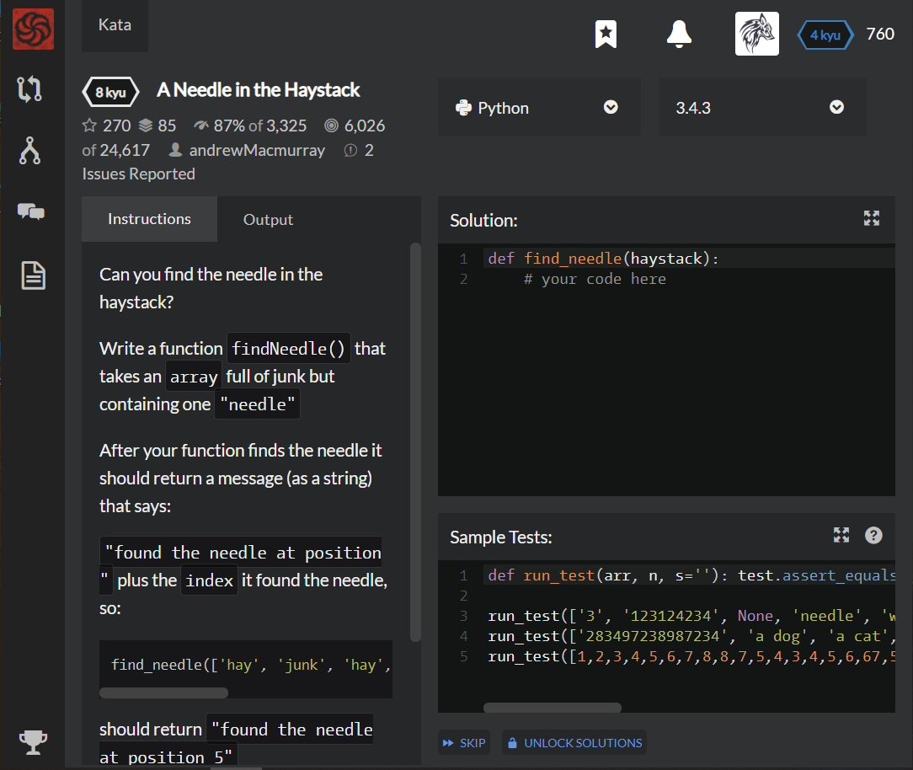

# [[8 Kyu] A Needle in the Haystack](https://www.codewars.com/kata/56676e8fabd2d1ff3000000c/train/python)




## Instructions

Can you find the needle in the haystack?

Write a function `findNeedle()` that takes an `array` full of junk but containing one `"needle"`

After your function finds the needle it should return a message (as a string) that says:

`"found the needle at position "` plus the `index` it found the needle, so:

```c
find_needle(['hay', 'junk', 'hay', 'hay', 'moreJunk', 'needle', 'randomJunk'])
```

should return `"found the needle at position 5"`


## Sample Test

```c
def run_test(arr, n, s=''): test.assert_equals(find_needle(arr), 'found the needle at position %d' % n, s)

run_test(['3', '123124234', None, 'needle', 'world', 'hay', 2, '3', True, False], 3)
run_test(['283497238987234', 'a dog', 'a cat', 'some random junk', 'a piece of hay', 'needle', 'something somebody lost a while ago'], 5)
run_test([1,2,3,4,5,6,7,8,8,7,5,4,3,4,5,6,67,5,5,3,3,4,2,34,234,23,4,234,324,324,'needle',1,2,3,4,5,5,6,5,4,32,3,45,54], 30)
```


## My solution

```c
fail
```


## Test Results

Test Passed

Test Passed

Test Passed

You have passed all of the tests! :)

---------

Time: 


## Best Solution

```python
#include <stdio.h>

char *find_needle(const char **haystack, size_t count)
{
  for(int i=0; i<count;++i)
  {
    if(!strcmp(haystack[i], "needle")) // strcmp will return 0 if true, so we need '!' to it to work
    {
      char* buff;
      asprintf(&buff, "found the needle at position %d", i);
      return buff;
    }
  }
}
```


## The things I got

**strcmp(string1, string2)** : compare between two string from **<string.h>**

```c
#include <stdio.h>
#include <string.h>    // strcmp 함수가 선언된 헤더 파일

int main()
{
    char s1[10] = "Hello";
    char *s2 = "Hello";

    int ret = strcmp(s1, s2);    // 두 문자열이 같은지 문자열 비교

    printf("%d\n", ret);         // 0: 두 문자열이 같으면 0

    return 0;
}
```

* return 1 if *string1* is **bigger** than *string2*, 

* return 0 if **same**, and

* return -1 if *string1* is **smaller** than *string2* in ASCII code.


**sprintf()** : similar with prinft(), but it saves buffer of input *string*

**snprintf()** : sprintf() + buf_size

**asprintf()** : allocate buffer size such as snprintf() but this is for Linux

```c
int sprintf  (char *buffer, const char *format, ...)
int snprintf (char *buffer, int buf_size, const char *format, ...)
```

```c
#include <stdio.h>
int main() {
  int i;
  char str[100];

  scanf("%d", &i);
  sprintf(str, "%d", i);

  printf("str : %s \n", str);

  return 0;
}
```

will return string "str : 12345"