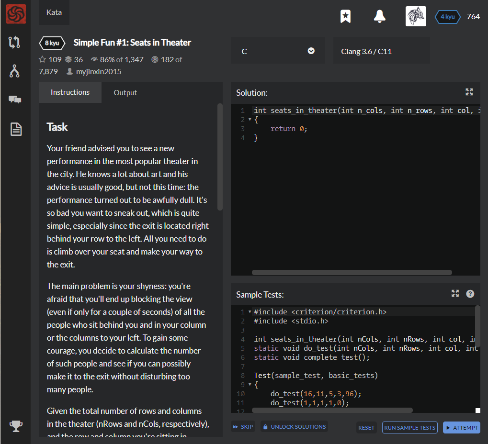

# [[8 Kyu] Simple Fun #1: Seats in Theater](https://www.codewars.com/kata/588417e576933b0ec9000045/train/c)




## Instructions

### Task

Your friend advised you to see a new performance in the most popular theater in the city. He knows a lot about art and his advice is usually good, but not this time: the performance turned out to be awfully dull. It's so bad you want to sneak out, which is quite simple, especially since the exit is located right behind your row to the left. All you need to do is climb over your seat and make your way to the exit.

The main problem is your shyness: you're afraid that you'll end up blocking the view (even if only for a couple of seconds) of all the people who sit behind you and in your column or the columns to your left. To gain some courage, you decide to calculate the number of such people and see if you can possibly make it to the exit without disturbing too many people.

Given the total number of rows and columns in the theater (nRows and nCols, respectively), and the row and column you're sitting in, return the number of people who sit strictly behind you and in your column or to the left, assuming all seats are occupied.

### Example

For nCols = 16, nRows = 11, col = 5 and row = 3, the output should be

```c
seats_in_theater(nCols, nRows, col, row) == 96
```

Here is what the theater looks like:


## Sample Test

```python
#include <criterion/criterion.h>
#include <stdio.h>

int seats_in_theater(int nCols, int nRows, int col, int row);
static void do_test(int nCols, int nRows, int col, int row, int expected);
static void complete_test();

Test(sample_test, basic_tests)
{
    do_test(16,11,5,3,96);
    do_test(1,1,1,1,0);
    do_test(13,6,8,3,18);
    do_test(60,100,60,1,99);
    do_test(1000,1000,1000,1000,0);
    complete_test();
}
static void do_test(int nCols, int nRows, int col, int row, int expected)
{
    int actual = seats_in_theater(nCols, nRows, col, row);
    if ( actual != expected )
        cr_assert(false, "Expected %d\nReceived %d\n", expected, actual);
}
static void complete_test()
{
    fflush(stdout);
    cr_assert(true);
}
```


## My solution

```python
int seats_in_theater(int n_cols, int n_rows, int col, int row)
{
    return (n_cols-col+1)*(n_rows-row);
}
```


## Test Results

Test Passed

Test Passed

Test Passed

You have passed all of the tests! :)

---------

Time: 835ms Passed: 2 Failed: 0


## Best Solution

```python
same
```


## The things I got

