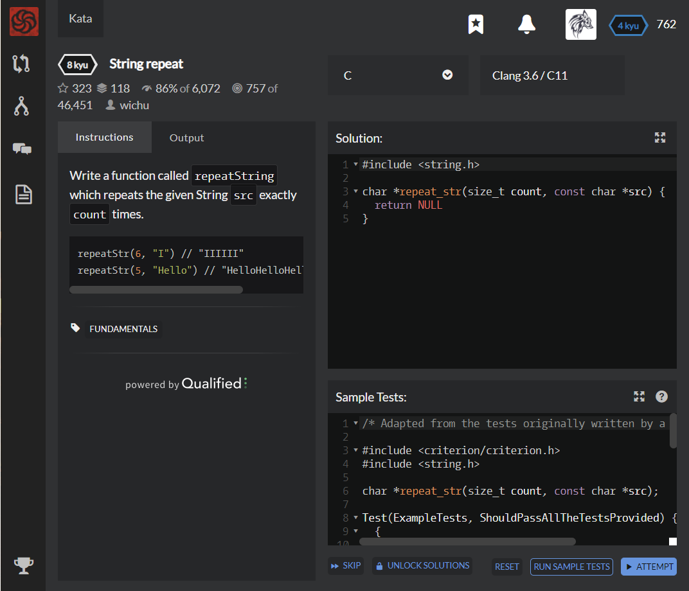

# [[8 Kyu] String repeat](https://www.codewars.com/kata/57a0e5c372292dd76d000d7e/train/c)




## Instructions

Write a function called `repeatString` which repeats the given String `src` exactly `count` times.

```c
repeatStr(6, "I") // "IIIIII"
repeatStr(5, "Hello") // "HelloHelloHelloHelloHello"
```


## Sample Test

```python
/* Adapted from the tests originally written by a code warrior wichu */

#include <criterion/criterion.h>
#include <string.h>

char *repeat_str(size_t count, const char *src);

Test(ExampleTests, ShouldPassAllTheTestsProvided) {
  {
    size_t count = 4;
    const char *str = "a";
    char *result = repeat_str(count, str);
    cr_assert(strcmp(result, "aaaa") == 0);
    free(result);
  }
  
  {
    size_t count = 3;
    const char *str = "hello ";
    char *result = repeat_str(count, str);
    cr_assert(strcmp(result, "hello hello hello ") == 0);
    free(result);
  }
  
  {
    size_t count = 2;
    const char *str = "abc";
    char *result = repeat_str(count, str);
    cr_assert(strcmp(result, "abcabc") == 0);
    free(result);
  }
}
```


## My solution

```python
#define _CRT_SECURE_NO_WARNINGS
#include <stdio.h>
#include <string.h>
#include <stdlib.h>    // malloc, free 함수가 선언된 헤더 파일

char *repeat_str(size_t count, const char *src) {
  char *s2 = malloc(sizeof(char) * 10000); 
  strcpy(s2,"");
  for(int i=0; i<count; i++){
    strcat(s2,src);
  }
  return s2;
}
```


## Test Results

Test Passed

Test Passed

Test Passed

You have passed all of the tests! :)

---------

Time: 859ms Passed: 67 Failed: 0


## Best Solution

```python
char *repeat_str(size_t count, const char *src) {
  int length = strlen(src);
  char* dest = malloc(count * length * sizeof(char));
  for (int i = 0; i < count; i++) {
    strcpy(dest + i * length, src);
  }
  return dest;
}
```


## The things I got

### Concatenate String

**Basic form : char *strcat ( char *_Destination, char *const_Source );**  

return **Pointer** of final return.  

#### Array concatenate

```c
#define _CRT_SECURE_NO_WARNINGS    // strcat 보안 경고로 인한 컴파일 에러 방지
#include <stdio.h>
#include <string.h>    // strcat 함수가 선언된 헤더 파일

int main()
{
    char s1[10] = "world";
    char s2[20] = "Hello"; // s2 뒤에 붙일 것이므로 배열 크기를 크게 만듦

    strcat(s2, s1);        // s2 뒤에 s1를 붙임

    printf("%s\n", s2);    // Helloworld

    return 0;
}

// 실행결과 : Helloworld
```


#### Pointer Concatenate  

*not like this*  

```c
#define _CRT_SECURE_NO_WARNINGS    // strcat 보안 경고로 인한 컴파일 에러 방지
#include <stdio.h>
#include <string.h>    // strcat 함수가 선언된 헤더 파일

int main()
{
    char *s1 = "world";    // 문자열 포인터
    char *s2 = "Hello";    // 문자열 포인터

    strcat(s2, s1);    // 실행 에러

    printf("%s\n", s1);

    return 0;
}
// 에러메시지 : 0xC0000005: 0x013A585D 위치를 기록하는 동안 액세스 위반이 발생했습니다.
```


*like this*  

```c
#define _CRT_SECURE_NO_WARNINGS    // strcpy 보안 경고로 인한 컴파일 에러 방지
#include <stdio.h>
#include <string.h>    // strcat 함수가 선언된 헤더 파일
#include <stdlib.h>    // malloc, free 함수가 선언된 헤더 파일

int main()
{
    char *s1 = "world";                      // 문자열 포인터
    char *s2 = malloc(sizeof(char) * 20);    // char 20개 크기만큼 동적 메모리 할당

    strcpy(s2, "Hello");   // s2에 Hello 문자열 복사

    strcat(s2, s1);       // s2 뒤에 s1을 붙임

    printf("%s\n", s2);   // Helloworld

    free(s2);    // 동적 메모리 해제

    return 0;
}
// 실행결과 : Helloworld
```


