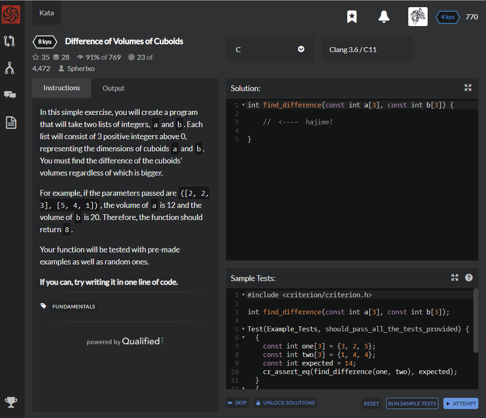

# [[8 Kyu] Difference of Volumes of Cuboids](https://www.codewars.com/kata/58cb43f4256836ed95000f97/train/c)




## Instructions

In this simple exercise, you will create a program that will take two lists of integers, `a` and `b`. Each list will consist of 3 positive integers above 0, representing the dimensions of cuboids `a` and `b`. You must find the difference of the cuboids' volumes regardless of which is bigger.

For example, if the parameters passed are `([2, 2, 3], [5, 4, 1])`, the volume of `a` is 12 and the volume of `b` is 20. Therefore, the function should return `8`.

Your function will be tested with pre-made examples as well as random ones.

**If you can, try writing it in one line of code.**


## Sample Test

```c
#include <criterion/criterion.h>

int find_difference(const int a[3], const int b[3]);

Test(Example_Tests, should_pass_all_the_tests_provided) {
  {
    const int one[3] = {3, 2, 5};
    const int two[3] = {1, 4, 4};
    const int expected = 14;
    cr_assert_eq(find_difference(one, two), expected);
  }
  {
    const int one[3] = {9, 7, 2};
    const int two[3] = {5, 2, 2};
    const int expected = 106;
    cr_assert_eq(find_difference(one, two), expected);
  }
}
```


## My solution

```c
#include <math.h>

int find_difference(const int a[3], const int b[3]) {
  int result_a = 1;
  int result_b = 1;
  for(int i=0;i<3;i++){
    result_a *= a[i];
    result_b *= b[i];
  }
  
  return abs(result_a-result_b);
}
```


## Test Results

Test Passed

Test Passed

Test Passed

You have passed all of the tests! :)

---------

Time: 863ms Passed: 105 Failed: 0


## Best Solution

```c
#include <stdlib.h>

int find_difference(const int a[3], const int b[3]) {
    return abs(a[0] * a[1] * a[2] - b[0] * b[1] * b[2]);
}
```


## The things I got

