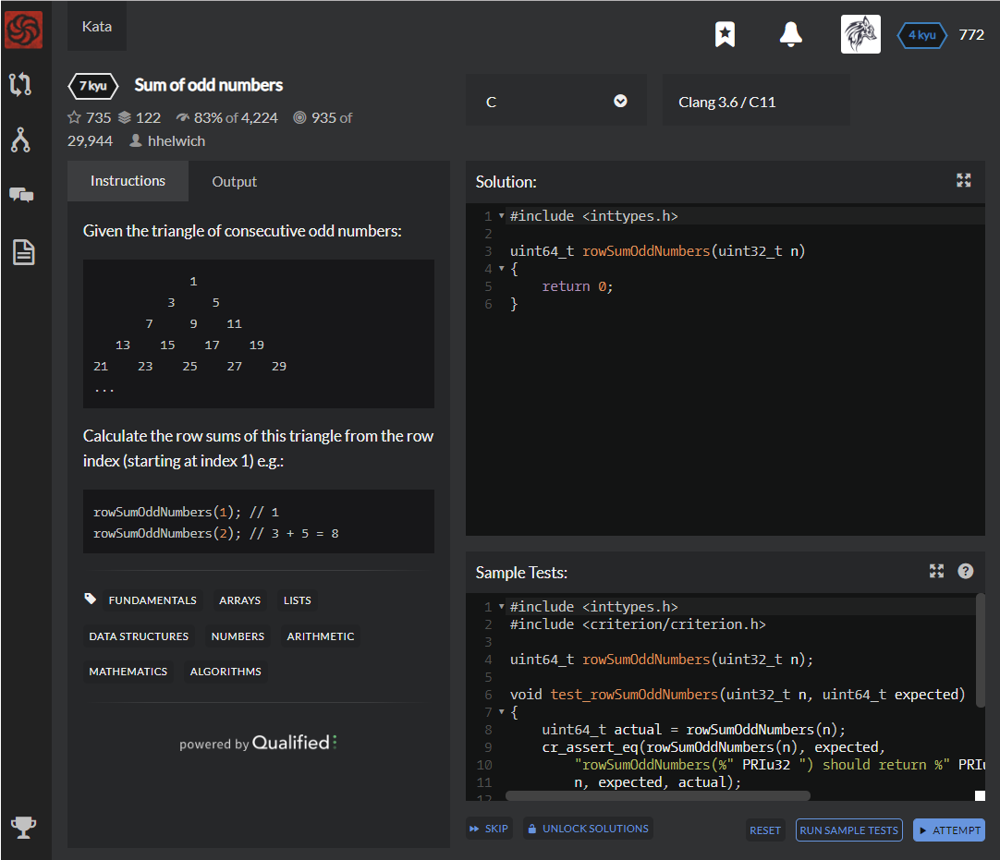

# [[7 Kyu] Sum of odd numbers](https://www.codewars.com/kata/55fd2d567d94ac3bc9000064/train/c)




## Instructions

Given the triangle of consecutive odd numbers:

```c
             1
          3     5
       7     9    11
   13    15    17    19
21    23    25    27    29
...
```

Calculate the row sums of this triangle from the row index (starting at index 1) e.g.:

```c
rowSumOddNumbers(1); // 1
rowSumOddNumbers(2); // 3 + 5 = 8
```


## Sample Test

```c
#include <inttypes.h>
#include <criterion/criterion.h>

uint64_t rowSumOddNumbers(uint32_t n);

void test_rowSumOddNumbers(uint32_t n, uint64_t expected)
{
    uint64_t actual = rowSumOddNumbers(n);
    cr_assert_eq(rowSumOddNumbers(n), expected,
        "rowSumOddNumbers(%" PRIu32 ") should return %" PRIu64 ", actual: %" PRIu64 "\n",
        n, expected, actual);
}

Test(rowSumOddNumbers, should_pass_some_example_tests)
{
    test_rowSumOddNumbers(1, 1);
    test_rowSumOddNumbers(2, 8);
    test_rowSumOddNumbers(42, 74088);
}
```


## My solution

```c
#include <inttypes.h>

uint64_t rowSumOddNumbers(uint32_t n)
{ 
    long long a = n;
    return a*a*a;
}
```


## Test Results

Test Passed

Test Passed

Test Passed

You have passed all of the tests! :)

---------

Time: 928ms Passed: 109 Failed: 0


## Best Solution

```c
#include <inttypes.h>

uint64_t rowSumOddNumbers(uint32_t n)
{
    return (uint64_t) n * n * n;
}
```


## The things I got

at 64bit intel architecture

* **int** : 4 byte

* **long** : 4 byte

* **long long** : 8 byte


bigger than long long?

[큰 수 표현하기 - kamang]([https://kamang-it.tistory.com/entry/AlgorithmBig-Integer%ED%81%B0%EC%88%98-%ED%91%9C%ED%98%84%ED%95%98%EA%B8%B0](https://kamang-it.tistory.com/entry/AlgorithmBig-Integer큰수-표현하기))

