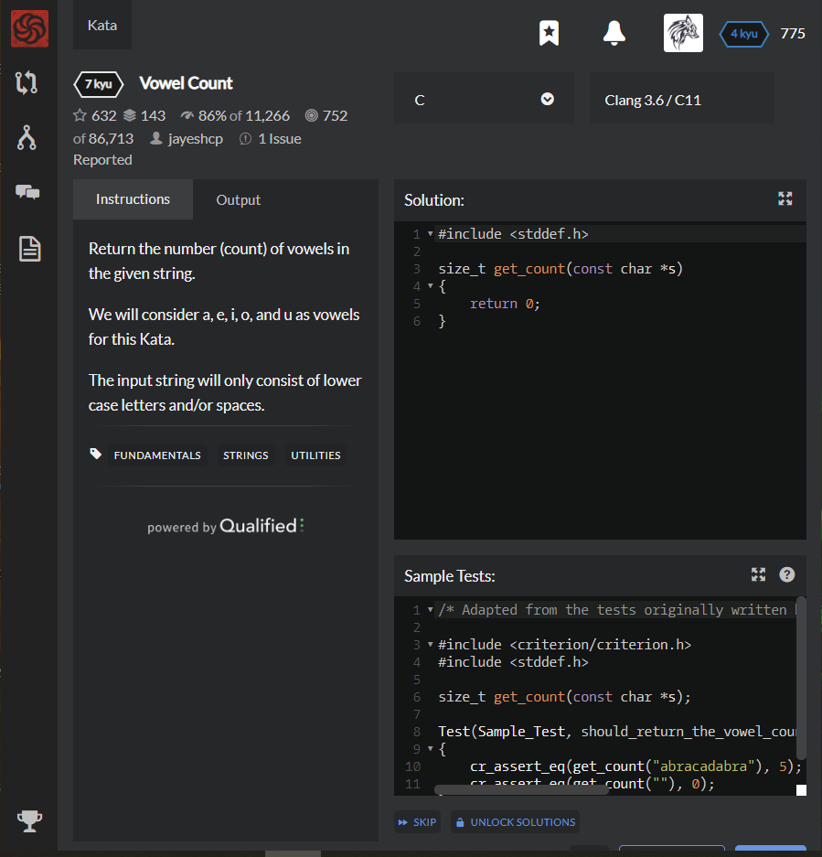

# [[7 Kyu] Vowel Count](https://www.codewars.com/kata/54ff3102c1bad923760001f3/train/c)




## Instructions

Return the number (count) of vowels in the given string.

We will consider a, e, i, o, and u as vowels for this Kata.

The input string will only consist of lower case letters and/or spaces.


## Sample Test

```c
/* Adapted from the tests originally written by a code warrior jayeshcp and lilsweetcaligua */

#include <criterion/criterion.h>
#include <stddef.h>

size_t get_count(const char *s);

Test(Sample_Test, should_return_the_vowel_count)
{
    cr_assert_eq(get_count("abracadabra"), 5);
    cr_assert_eq(get_count(""), 0);
}
```


## My solution

```c
#include <stddef.h>
#include <string.h>

size_t get_count(const char *s)
{
    int count = 0;
    for(int i=0;i<strlen(s);i++){
        if(s[i]=='a'||s[i]=='e'||s[i]=='i'||s[i]=='o'||s[i]=='u') count++;
    }
    return count;
}
```


## Test Results

Test Passed

Test Passed

Test Passed

You have passed all of the tests! :)

---------

Time: 838ms Passed: 98 Failed: 0


## Best Solution

```c
#include <stddef.h>

size_t get_count(const char *s)
{
    size_t cnt = 0ul;
    if (!s)
        return 0ul;
    while (*s)
        switch (*s++) {
        case 'a':
        case 'e':
        case 'i':
        case 'o':
        case 'u':
            ++cnt;
            break;
        }
    return cnt;
}
```


## The things I got

