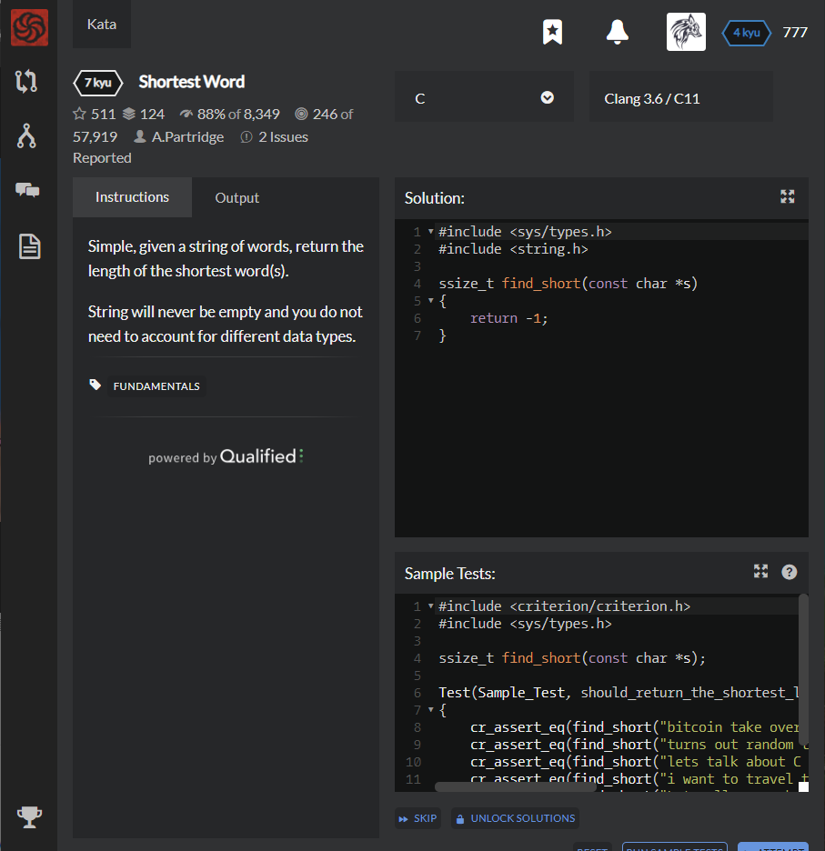

# [[7 Kyu] Shortest Word](https://www.codewars.com/kata/57cebe1dc6fdc20c57000ac9/train/c)




## Instructions

Simple, given a string of words, return the length of the shortest word(s).

String will never be empty and you do not need to account for different data types.


## Sample Test

```c
#include <criterion/criterion.h>
#include <sys/types.h>

ssize_t find_short(const char *s);

Test(Sample_Test, should_return_the_shortest_length)
{
    cr_assert_eq(find_short("bitcoin take over the world maybe who knows perhaps"), 3l);
    cr_assert_eq(find_short("turns out random test cases are easier than writing out basic ones"), 3l);
    cr_assert_eq(find_short("lets talk about C the best language"), 1l);
    cr_assert_eq(find_short("i want to travel the world writing code one day"), 1l);
    cr_assert_eq(find_short("Lets all go on holiday somewhere very cold"), 2l);
}
```


## My solution

```c
#include <sys/types.h>
#include <string.h>

ssize_t find_short(const char *s)
{
    ssize_t len = 500;
    ssize_t count = 0;
    for(int i=0;i<strlen(s)+1;i++){
      count++;
      if(s[i]==' '||i==strlen(s)){
        if(count<len) len = count;
        count = 0;
      } 
    }
    return len-1;
}
```


## Test Results

Test Passed

Test Passed

Test Passed

You have passed all of the tests! :)

---------

Time: 884ms Passed: 71 Failed: 0


## Best Solution

```python
#include <sys/types.h>
#include <string.h>

void check_if_less_found(int *s, int *c){
  if(*c < *s || *s == 0)
    *s = *c;
  *c = 0;
}

ssize_t find_short(const char *s){
  int curr = 0, shortest = 0;

  while(*s != '\0'){
    if(*s == ' ') check_if_less_found(&shortest, &curr);
    else curr++;
    s += sizeof(char);
  }
    
  check_if_less_found(&shortest, &curr);
  return shortest;
}
```


## The things I got

**For-ing String** : while (*s != '\0')