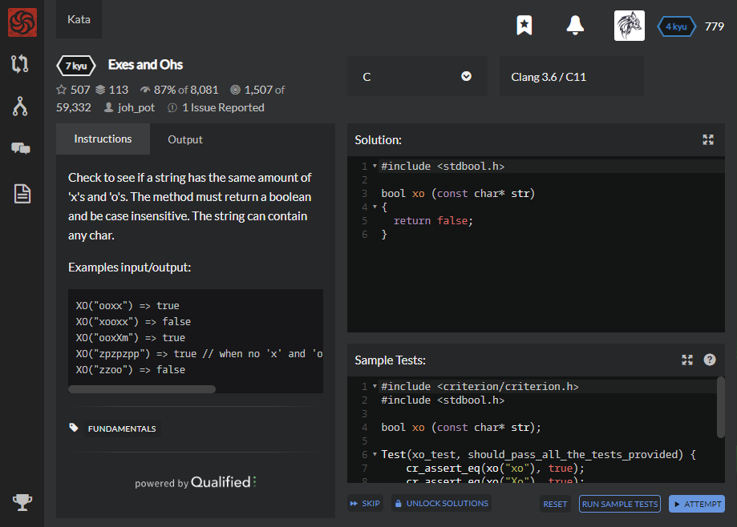

# [[7 Kyu] Exes and Ohs](https://www.codewars.com/kata/55908aad6620c066bc00002a/train/c)




## Instructions

Check to see if a string has the same amount of 'x's and 'o's. The method must return a boolean and be case insensitive. The string can contain any char.

Examples input/output:

```c
XO("ooxx") => true
XO("xooxx") => false
XO("ooxXm") => true
XO("zpzpzpp") => true // when no 'x' and 'o' is present should return true
XO("zzoo") => false
```


## Sample Test

```c
#include <criterion/criterion.h>
#include <stdbool.h>

bool xo (const char* str);

Test(xo_test, should_pass_all_the_tests_provided) {
    cr_assert_eq(xo("xo"), true);
    cr_assert_eq(xo("Xo"), true);
    cr_assert_eq(xo("xxOo"), true);
    cr_assert_eq(xo("xxxm"), false);
    cr_assert_eq(xo("Oo"), false);
    cr_assert_eq(xo("ooom"), false);
}
```


## My solution

```c
#include <stdbool.h>
#include <string.h>

bool xo (const char* str)
{
  int x_count = 0;
  int o_count = 0;
  
  for(int i=0;i<strlen(str);i++){
    if (str[i]=='o' || str[i]=='O') o_count++;
    else if (str[i] == 'x' || str[i]=='X') x_count++;
  }
  
  if (x_count==o_count) return true;
  else return false;
}
```


## Test Results

Test Passed

Test Passed

Test Passed

You have passed all of the tests! :)

---------

Time: 898ms Passed: 206 Failed: 0


## Best Solution

```c
#include <stdbool.h>

bool xo (const char* str)
{
  unsigned x = 0, o = 0;
  for (char *p = str; *p; p++) {
      if      (tolower(*p)=='x') x++;
      else if (tolower(*p)=='o') o++;
  }
  return x == o;
}
```


## The things I got

**For -ing string type** : for ( char *init = target ; *init ; init++ )

파이썬에서는 `for init in target` 이런느낌

