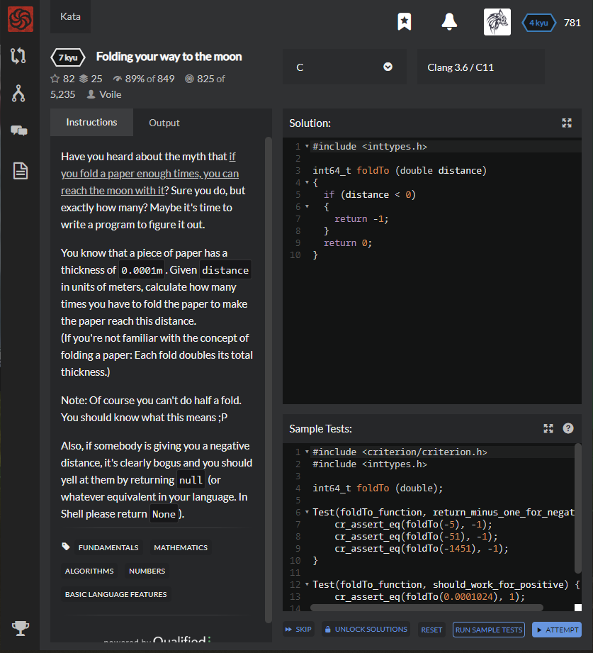

# [[7 Kyu] Folding your way to the moon](https://www.codewars.com/kata/58f0ba42e89aa6158400000e/train/c)




## Instructions

Have you heard about the myth that [if you fold a paper enough times, you can reach the moon with it](http://scienceblogs.com/startswithabang/2009/08/31/paper-folding-to-the-moon/)? Sure you do, but exactly how many? Maybe it's time to write a program to figure it out.

You know that a piece of paper has a thickness of `0.0001m`. Given `distance` in units of meters, calculate how many times you have to fold the paper to make the paper reach this distance.
(If you're not familiar with the concept of folding a paper: Each fold doubles its total thickness.)

Note: Of course you can't do half a fold. You should know what this means ;P

Also, if somebody is giving you a negative distance, it's clearly bogus and you should yell at them by returning `null` (or whatever equivalent in your language. In Shell please return `None`).


## Sample Test

```c
#include <criterion/criterion.h>
#include <inttypes.h>

int64_t foldTo (double);

Test(foldTo_function, return_minus_one_for_negative) {
    cr_assert_eq(foldTo(-5), -1);
    cr_assert_eq(foldTo(-51), -1);
    cr_assert_eq(foldTo(-1451), -1);
}

Test(foldTo_function, should_work_for_positive) {
    cr_assert_eq(foldTo(0.0001024), 1);
    cr_assert_eq(foldTo(0.0000965), 0);
}

```


## My solution

```c
#include <inttypes.h>
#include <math.h>

int64_t foldTo (double distance)
{
  if (distance < 0)
  {
    return -1;
  }
  
  else {
    if (distance < 0.0001) return 0;
    double twice = 0.0001;
    int64_t count = 0;
    while(distance>twice){
      twice *= 2;
      count++;
    }
    return count;
  }
}
```


## Test Results

Test Passed

Test Passed

Test Passed

You have passed all of the tests! :)

---------

Time: 884ms Passed: 434 Failed: 0


## Best Solution

```c
#include <inttypes.h>
#include <math.h>

int64_t foldTo (double distance)
{
  if (distance < 0) { return -1; }  
  if (distance < 0.0001) { return 0; } 
  
  return floor(log2(distance*20000));
  
}
```


## The things I got

