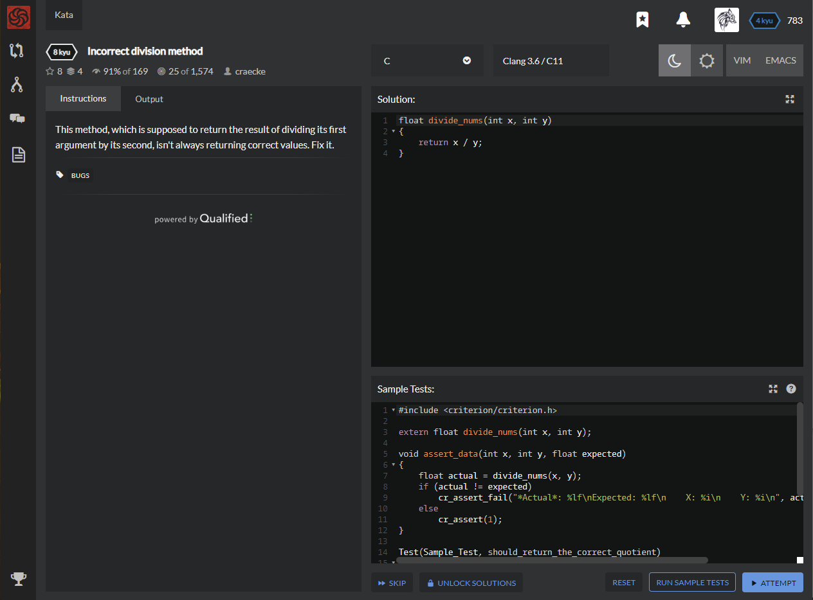

# [[8 Kyu] Incorrect division method](https://www.codewars.com/kata/54d1c59aba326343c80000e7/train/c)




## Instructions

This method, which is supposed to return the result of dividing its first argument by its second, isn't always returning correct values. Fix it.


## Sample Test

```c
#include <criterion/criterion.h>

extern float divide_nums(int x, int y);

void assert_data(int x, int y, float expected)
{
    float actual = divide_nums(x, y);
    if (actual != expected)
        cr_assert_fail("*Actual*: %lf\nExpected: %lf\n    X: %i\n    Y: %i\n", actual, expected, x, y);
    else
        cr_assert(1);
}

Test(Sample_Test, should_return_the_correct_quotient)
{
    assert_data(4, 2, 2.f);
    assert_data(10, 2, 5.f);
    assert_data(9, 4, 2.25f);
    assert_data(21, 5, 4.2f);
    assert_data(9, 3, 3.f);
    assert_data(1, 100, 0.01f);
    assert_data(0, 10, 0.f);
}
```


## My solution

```c
float divide_nums(int x, int y)
{
    return (x*0.1) / (y*0.1);
}
```


## Test Results

Test Passed

Test Passed

Test Passed

You have passed all of the tests! :)

---------

Time: 909ms Passed: 165 Failed: 0


## Best Solution

```python
float divide_nums(int x, int y)
{
    return (float)x / y;
}
```


## The things I got

To change value type : `(float) ~ ` or `(double) ~ ` 

