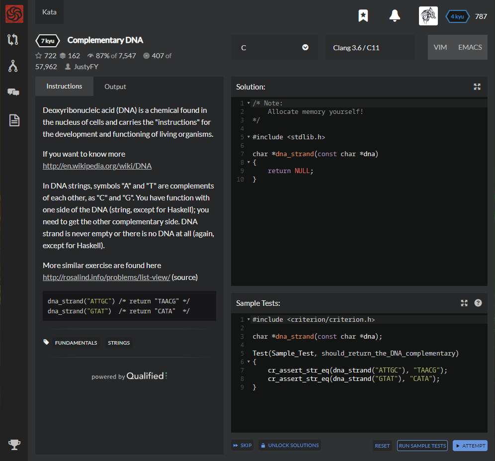

# [[7 Kyu] Complementary DNA](https://www.codewars.com/kata/554e4a2f232cdd87d9000038/train/c)




## Instructions

Deoxyribonucleic acid (DNA) is a chemical found in the nucleus of cells and carries the "instructions" for the development and functioning of living organisms.

If you want to know more http://en.wikipedia.org/wiki/DNA

In DNA strings, symbols "A" and "T" are complements of each other, as "C" and "G". You have function with one side of the DNA (string, except for Haskell); you need to get the other complementary side. DNA strand is never empty or there is no DNA at all (again, except for Haskell).

More similar exercise are found here http://rosalind.info/problems/list-view/ (source)

```c
dna_strand("ATTGC") /* return "TAACG" */
dna_strand("GTAT")  /* return "CATA"  */
```


## Sample Test

```c
#include <criterion/criterion.h>

char *dna_strand(const char *dna);

Test(Sample_Test, should_return_the_DNA_complementary)
{
    cr_assert_str_eq(dna_strand("ATTGC"), "TAACG");
    cr_assert_str_eq(dna_strand("GTAT"), "CATA");
}
```


## My solution

```c
-
```


## Test Results

Test Passed

Test Passed

Test Passed

You have passed all of the tests! :)

---------

Time: 


## Best Solution

```c
#include <string.h>

char *dna_strand(const char *dna)
{
    char *result = strdup(dna);
    for (char *cp = result; *cp; ++cp)
    {
        switch (*cp)
        {
        case 'A': *cp = 'T'; break;
        case 'C': *cp = 'G'; break;
        case 'G': *cp = 'C'; break;
        case 'T': *cp = 'A'; break;
        }
    }
    return result;
}
```


## The things I got

Use break when using switch - case statement

