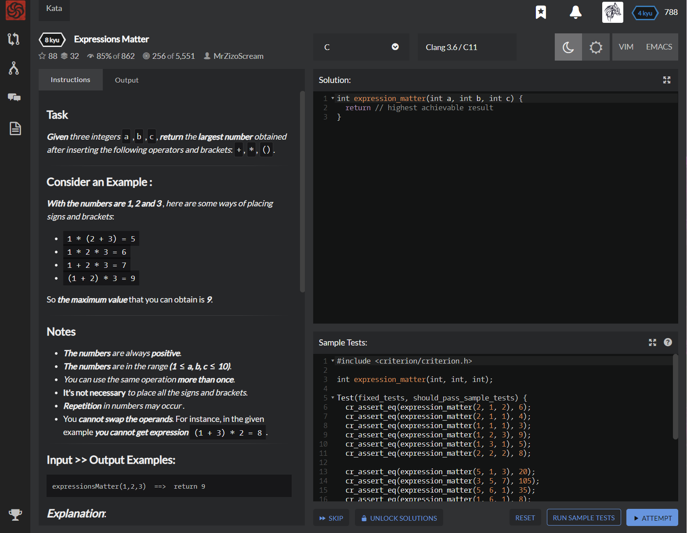

# [[8 Kyu] Expressions Matter](https://www.codewars.com/kata/5ae62fcf252e66d44d00008e/train/c)




## Instructions

### Task

**Given** *three integers* `a` ,`b` ,`c`, **return** *the **largest number** obtained after inserting the following operators and brackets*: `+`, `*`, `()`.

### Consider an Example

**With the numbers are 1, 2 and 3** , *here are some ways of placing signs and brackets*:

- `1 * (2 + 3) = 5`
- `1 * 2 * 3 = 6`
- `1 + 2 * 3 = 7`
- `(1 + 2) * 3 = 9`

So **the maximum value** that you can obtain is **9**.

### Notes

- **The numbers** *are always* **positive**.
- **The numbers** *are in the range* **(1  ≤  a, b, c  ≤  10)**.
- *You can use the same operation* **more than once**.
- **It's not necessary** *to place all the signs and brackets*.
- **Repetition** *in numbers may occur* .
- You **cannot swap the operands**. For instance, in the given example **you cannot get expression** `(1 + 3) * 2 = 8`.

### Input >> Output Examples

```c
expressionsMatter(1,2,3)  ==>  return 9
```

*After placing signs and brackets, the **Maximum value** obtained from the expression* `(1+2) * 3 = 9`.

```c
expressionsMatter(1,1,1)  ==>  return 3
```

*After placing signs, the **Maximum value** obtained from the expression is* `1 + 1 + 1 = 3`.

```c
expressionsMatter(9,1,1)  ==>  return 18
```

*After placing signs and brackets, the **Maximum value** obtained from the expression is* `9 * (1+1) = 18`.


## Sample Test

```c
#include <criterion/criterion.h>

int expression_matter(int, int, int);

Test(fixed_tests, should_pass_sample_tests) {
  cr_assert_eq(expression_matter(2, 1, 2), 6);
  cr_assert_eq(expression_matter(2, 1, 1), 4);
  cr_assert_eq(expression_matter(1, 1, 1), 3);
  cr_assert_eq(expression_matter(1, 2, 3), 9);
  cr_assert_eq(expression_matter(1, 3, 1), 5);
  cr_assert_eq(expression_matter(2, 2, 2), 8);
  
  cr_assert_eq(expression_matter(5, 1, 3), 20);
  cr_assert_eq(expression_matter(3, 5, 7), 105);
  cr_assert_eq(expression_matter(5, 6, 1), 35);
  cr_assert_eq(expression_matter(1, 6, 1), 8);
  cr_assert_eq(expression_matter(2, 6, 1), 14);
  cr_assert_eq(expression_matter(6, 7, 1), 48);
  
  cr_assert_eq(expression_matter(2, 10, 3), 60);
  cr_assert_eq(expression_matter(1, 8, 3), 27);
  cr_assert_eq(expression_matter(9, 7, 2), 126);
  cr_assert_eq(expression_matter(1, 1, 10), 20);
  cr_assert_eq(expression_matter(9, 1, 1), 18);
  cr_assert_eq(expression_matter(10, 5, 6), 300);
  cr_assert_eq(expression_matter(1, 10, 1), 12);
}
```


## My solution

```c
int expression_matter(int a, int b, int c) {
  
  int max = 0;
  
  int value1 = a + b + c;
  if (value1 > max) max = value1;
  int value2 = a + b * c;
  if (value2 > max) max = value2;
  int value3 = a * b * c;
  if (value3 > max) max = value3;
  int value4 = a * b + c;
  if (value4 > max) max = value4;
  int value5 = (a + b) * c;
  if (value5 > max) max = value5;
  int value7 = a * (b + c);
  if (value7 > max) max = value7;
  
  printf("%d",max);
  
  
  return max;
}
```


## Test Results

Test Passed

Test Passed

Test Passed

You have passed all of the tests! :)

---------

Time: 973ms Passed: 103 Failed: 0


## Best Solution

```c
int expression_matter (int a, int b, int c) {
  if (a==1) ++b;
  if (c==1) ++b;
  if (b==1) if (a<c) ++a; else ++c;
  return a*b*c;
}
```


## The things I got

