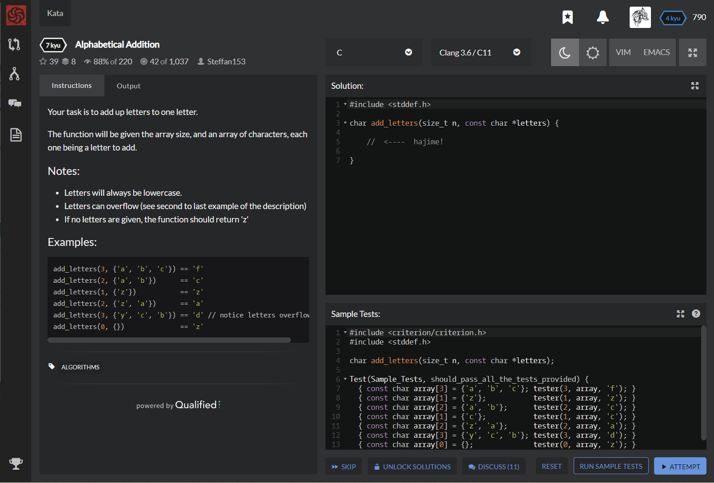

# [[7 Kyu] Alphabetical Addition](https://www.codewars.com/kata/5d50e3914861a500121e1958/train/c)




## Instructions

Your task is to add up letters to one letter.

The function will be given the array size, and an array of characters, each one being a letter to add.

### Notes

- Letters will always be lowercase.
- Letters can overflow (see second to last example of the description)
- If no letters are given, the function should return 'z'

### Examples

```c
add_letters(3, {'a', 'b', 'c'}) == 'f'
add_letters(2, {'a', 'b'})      == 'c'
add_letters(1, {'z'})           == 'z'
add_letters(2, {'z', 'a'})      == 'a'
add_letters(3, {'y', 'c', 'b'}) == 'd' // notice letters overflowing
add_letters(0, {})              == 'z'
```


## Sample Test

```c
#include <criterion/criterion.h>
#include <stddef.h>

char add_letters(size_t n, const char *letters);

Test(Sample_Tests, should_pass_all_the_tests_provided) {
  { const char array[3] = {'a', 'b', 'c'}; tester(3, array, 'f'); }
  { const char array[1] = {'z'};           tester(1, array, 'z'); }
  { const char array[2] = {'a', 'b'};      tester(2, array, 'c'); }
  { const char array[1] = {'c'};           tester(1, array, 'c'); }
  { const char array[2] = {'z', 'a'};      tester(2, array, 'a'); }
  { const char array[3] = {'y', 'c', 'b'}; tester(3, array, 'd'); }
  { const char array[0] = {};              tester(0, array, 'z'); }
}
```


## My solution

```c
#include <stddef.h>

char add_letters(size_t n, const char *letters) {
    if (n==0) return 'z';
    else {
        int len = 0;
        for(int i=0; i<n; i++){
          len += (int)letters[i]+1-97;
        }
        return (char)((len-1)%26+97);
    }
}
```


## Test Results

Test Passed

Test Passed

Test Passed

You have passed all of the tests! :)

---------

Time: 1029ms Passed: 107 Failed: 0


## Best Solution

```c
#include <stddef.h>

char add_letters(size_t n, const char *letters)
{
    int sum = 0;
    for(int i = 0; i < n; i++)
    {
        sum += letters[i] - '`';
        sum %= 26;
    }
    return sum ? sum + '`' : 'z';
}
```


## The things I got

