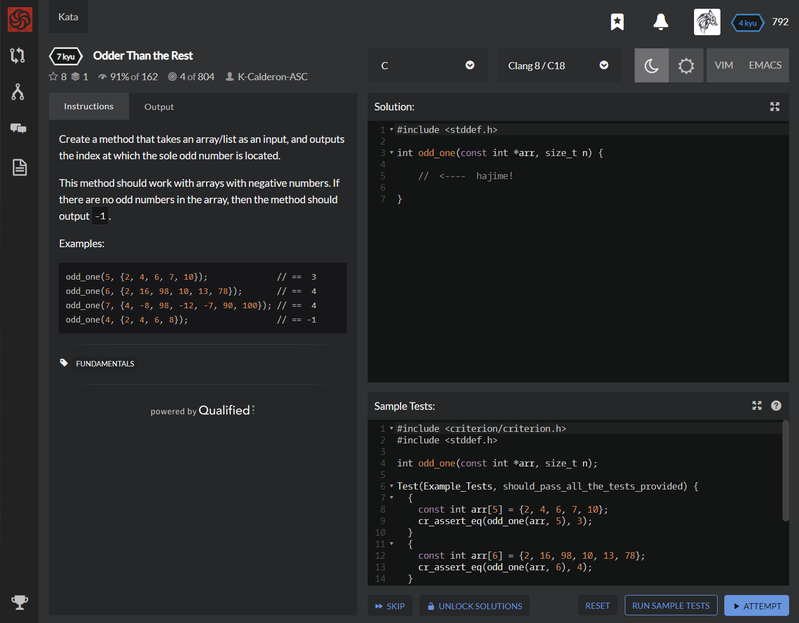

# [[7 Kyu] Odder Than the Rest](https://www.codewars.com/kata/5983cba828b2f1fd55000114/train/c)




## Instructions

Create a method that takes an array/list as an input, and outputs the index at which the sole odd number is located.

This method should work with arrays with negative numbers. If there are no odd numbers in the array, then the method should output `-1`.

### Examples

```c
odd_one(5, {2, 4, 6, 7, 10});              // ==  3
odd_one(6, {2, 16, 98, 10, 13, 78});       // ==  4
odd_one(7, {4, -8, 98, -12, -7, 90, 100}); // ==  4
odd_one(4, {2, 4, 6, 8});                  // == -1
```


## Sample Test

```c
#include <criterion/criterion.h>
#include <stddef.h>

int odd_one(const int *arr, size_t n);

Test(Example_Tests, should_pass_all_the_tests_provided) {
  {
    const int arr[5] = {2, 4, 6, 7, 10};
    cr_assert_eq(odd_one(arr, 5), 3);
  }
  {
    const int arr[6] = {2, 16, 98, 10, 13, 78};
    cr_assert_eq(odd_one(arr, 6), 4);
  }
  {
    const int arr[7] = {4, -8, 98, -12, -7, 90, 100};
    cr_assert_eq(odd_one(arr, 7), 4);
  }
  {
    const int arr[4] = {2, 4, 6, 8};
    cr_assert_eq(odd_one(arr, 4), -1);
  }
}
```


## My solution

```c
#include <stddef.h>

int odd_one(const int *arr, size_t n) {
    int index = -1;
    for (int i=0 ; i<n ; i++){
      if (arr[i]%2) index = i;
    }
    return index;
}
```


## Test Results

Test Passed

Test Passed

Test Passed

You have passed all of the tests! :)

---------

Time: 875ms Passed: 104 Failed: 0


## Best Solution

```c
#include <stddef.h>

char add_letters(size_t n, const char *letters)
{
    int sum = 0;
    for(int i = 0; i < n; i++)
    {
        sum += letters[i] - '`';
        sum %= 26;
    }
    return sum ? sum + '`' : 'z';
}
```


## The things I got

