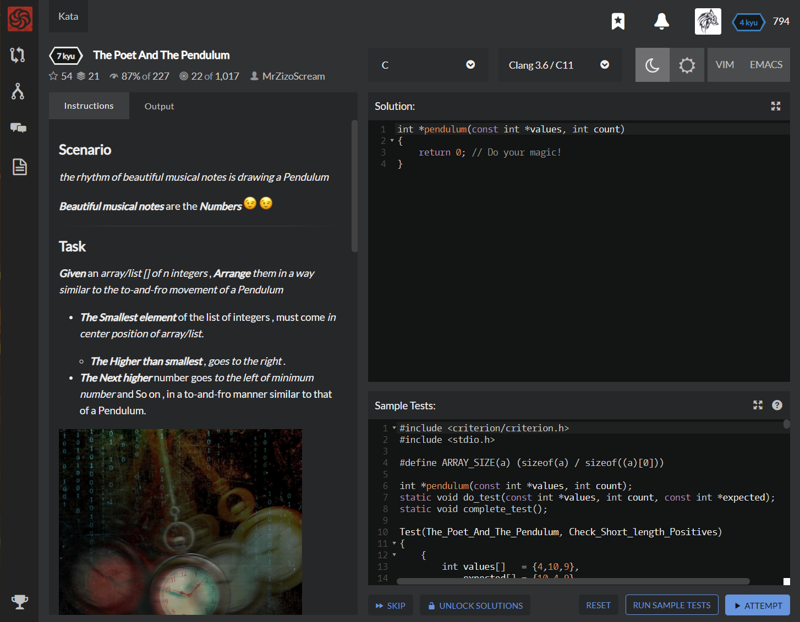

# [[7 Kyu] The Poet And The Pendulum](https://www.codewars.com/kata/5bd776533a7e2720c40000e5/train/c)




## Instructions

# Scenario

*the rhythm of beautiful musical notes is drawing a Pendulum*

**Beautiful musical notes** are the **Numbers**  

------

# Task

**Given** an *array/list [] of n integers* , **Arrange** *them in a way similar to the to-and-fro movement of a Pendulum*

- **The Smallest element** of the list of integers , must come *in center position of array/list*.
  - **The Higher than smallest** , *goes to the right* .
- **The Next higher** number goes *to the left of minimum number* and So on , in a to-and-fro manner similar to that of a Pendulum.


### Notes

- **Array/list** size is *at least **3*** .
- In **Even array size** , *The minimum element should be moved to (n-1)/2 index* (considering that indexes start from 0)
- **Repetition** of numbers in *the array/list could occur* , So **(duplications are included when Arranging)**.

### Input >> Output Examples

```cassandra
pendulum ([6, 6, 8 ,5 ,10]) ==> [10, 6, 5, 6, 8]
```

- **Since** , `5` is the **The Smallest element** of the list of integers , came *in The center position of array/list*

- **The Higher than smallest** is `6` *goes to the right* of `5` .

- **The Next higher** number goes *to the left of minimum number* and So on .

- Remeber , **Duplications are included when Arranging** , Don't Delete Them .

  

```c
pendulum ([-9, -2, -10, -6]) ==> [-6, -10, -9, -2]
```

- **Since** , `-10` is the **The Smallest element** of the list of integers , came *in The center position of array/list*

- **The Higher than smallest** is `-9` *goes to the right* of it .

- **The Next higher** number goes *to the left of* `-10` , and So on .

- Remeber , In **Even array size** , *The minimum element moved to (n-1)/2 index* (considering that indexes start from 0) .

  

```c
pendulum ([11, -16, -18, 13, -11, -12, 3, 18 ]) ==> [13, 3, -12, -18, -16, -11, 11, 18]
```

- **Since** , `-18` is the **The Smallest element** of the list of integers , came *in The center position of array/list*

- **The Higher than smallest** is `-16` *goes to the right* of it .

- **The Next higher** number goes *to the left of* `-18` , and So on .

- Remember , In **Even array size** , *The minimum element moved to (n-1)/2 index* (considering that indexes start from 0) .

  

## Sample Test

```c
#include <criterion/criterion.h>
#include <stdio.h>

#define ARRAY_SIZE(a) (sizeof(a) / sizeof((a)[0]))

int *pendulum(const int *values, int count);
static void do_test(const int *values, int count, const int *expected);
static void complete_test();

Test(The_Poet_And_The_Pendulum, Check_Short_length_Positives)
{
    {
        int values[]   = {4,10,9},
            expected[] = {10,4,9},
            count      = ARRAY_SIZE(values);
        do_test(values, count, expected);
    }
    {
        int values[]   = {8,7,10,3},
            expected[] = {8,3,7,10},
            count      = ARRAY_SIZE(values);
        do_test(values, count, expected);
    }
    {
        int values[]   = {6,6,8,5,10},
            expected[] = {10,6,5,6,8},
            count      = ARRAY_SIZE(values);
        do_test(values, count, expected);
    }
    {
        int values[]   = {9,4,6,4,10,5},
            expected[] = {9,5,4,4,6,10},
            count      = ARRAY_SIZE(values);
        do_test(values, count, expected);
    }
    {
        int values[]   = {4,6,8,7,5},
            expected[] = {8,6,4,5,7},
            count      = ARRAY_SIZE(values);
        do_test(values, count, expected);
    }
    {
        int values[]   = {10,5,6,10},
            expected[] = {10,5,6,10},
            count      = ARRAY_SIZE(values);
        do_test(values, count, expected);
    }
    {
        int values[]   = {11,12,12},
            expected[] = {12,11,12},
            count      = ARRAY_SIZE(values);
                do_test(values, count, expected);
    }
    complete_test();
}
Test(The_Poet_And_The_Pendulum, Check_Medium_length_Positives)
{
    {
        int values[]   = {27,27,19,21,22,28,24},
            expected[] = {28,27,22,19,21,24,27},
            count      = ARRAY_SIZE(values);
        do_test(values, count, expected);
    }
    {
        int values[]   = {20,19,25,16,19,30,18,24},
            expected[] = {25,20,19,16,18,19,24,30},
            count      = ARRAY_SIZE(values);
        do_test(values, count, expected);
    }
    {
        int values[]   = {22,26,21,27,24,21,15,26,25},
            expected[] = {27,26,24,21,15,21,22,25,26},
            count      = ARRAY_SIZE(values);
        do_test(values, count, expected);
    }
    {
        int values[]   = {19,30,16,19,28,26,28,17,21,17},
            expected[] = {28,26,19,17,16,17,19,21,28,30},
            count      = ARRAY_SIZE(values);
        do_test(values, count, expected);
    }
    {
        int values[]   = {27,28,26,28,24,22,18,16,15,24},
            expected[] = {28,26,24,18,15,16,22,24,27,28},
            count      = ARRAY_SIZE(values);
        do_test(values, count, expected);
    }
    {
        int values[]   = {17,26,15,26,26,20,16,18,15},
            expected[] = {26,26,18,16,15,15,17,20,26},
            count      = ARRAY_SIZE(values);
        do_test(values, count, expected);
    }
    {
        int values[]   = {22,21,19,27,18,15,24,24},
            expected[] = {24,22,19,15,18,21,24,27},
            count      = ARRAY_SIZE(values);
                do_test(values, count, expected);
    }
    complete_test();
}
Test(The_Poet_And_The_Pendulum, Check_lengthy_Positives)
{
    {
        int values[]   = {33,38,38,36,43,48,32,40,47,50,33},
            expected[] = {50,47,40,38,33,32,33,36,38,43,48},
            count      = ARRAY_SIZE(values);
        do_test(values, count, expected);
    }
    {
        int values[]   = {49,40,41,41,39,43,40,46,30,47,46,40},
            expected[] = {47,46,41,40,40,30,39,40,41,43,46,49},
            count      = ARRAY_SIZE(values);
        do_test(values, count, expected);
    }
    {
        int values[]   = {48,41,38,35,50,46,38,42,37,49,44,32,37},
            expected[] = {50,48,44,41,38,37,32,35,37,38,42,46,49},
            count      = ARRAY_SIZE(values);
        do_test(values, count, expected);
    }
    {
        int values[]   = {49,30,39,30,40,44,43,48,47,50,42,48,33},
            expected[] = {50,48,47,43,40,33,30,30,39,42,44,48,49},
            count      = ARRAY_SIZE(values);
        do_test(values, count, expected);
    }
    {
        int values[]   = {48,43,35,47,39,38,38,46,49,32,42},
            expected[] = {49,47,43,39,38,32,35,38,42,46,48},
            count      = ARRAY_SIZE(values);
                do_test(values, count, expected);
    }
    complete_test();
}
Test(The_Poet_And_The_Pendulum, Check_Short_length_Negatives)
{
    {
        int values[]   = {-9,-2,-10,-6},
            expected[] = {-6,-10,-9,-2},
            count      = ARRAY_SIZE(values);
        do_test(values, count, expected);
    }
    {
        int values[]   = {-3,-6,-7},
            expected[] = {-3,-7,-6},
            count      = ARRAY_SIZE(values);
        do_test(values, count, expected);
    }
    {
        int values[]   = {-7,-8,-2,-3,-4},
            expected[] = {-2,-4,-8,-7,-3},
            count      = ARRAY_SIZE(values);
        do_test(values, count, expected);
    }
    {
        int values[]   = {-8,-8,-9,-10,-10,-3},
            expected[] = {-8,-9,-10,-10,-8,-3},
            count      = ARRAY_SIZE(values);
        do_test(values, count, expected);
    }
    {
        int values[]   = {-7,-10,-1,-10,-8},
            expected[] = {-1,-8,-10,-10,-7},
            count      = ARRAY_SIZE(values);
        do_test(values, count, expected);
    }
    {
        int values[]   = {-6,-2,-5},
            expected[] = {-2,-6,-5},
            count      = ARRAY_SIZE(values);
                do_test(values, count, expected);
    }
    complete_test();
}
Test(The_Poet_And_The_Pendulum, Check_Medium_length_Negatives)
{
    {
        int values[]   = {-2,-11,-6,-11,-4,-3,-5},
            expected[] = {-2,-4,-6,-11,-11,-5,-3},
            count      = ARRAY_SIZE(values);
        do_test(values, count, expected);
    }
    {
        int values[]   = {-19,-9,-5,-6,-15,-16,-5,-12},
            expected[] = {-5,-9,-15,-19,-16,-12,-6,-5},
            count      = ARRAY_SIZE(values);
        do_test(values, count, expected);
    }
    {
        int values[]   = {-18,-2,-11,-10,-6,-7,-7,-12,-16},
            expected[] = {-2,-7,-10,-12,-18,-16,-11,-7,-6},
            count      = ARRAY_SIZE(values);
        do_test(values, count, expected);
    }
    {
        int values[]   = {-10,-10,-12,-13,-5,-10,-4,-17,-5,-12},
            expected[] = {-5,-10,-10,-12,-17,-13,-12,-10,-5,-4},
            count      = ARRAY_SIZE(values);
        do_test(values, count, expected);
    }
    complete_test();
}
Test(The_Poet_And_The_Pendulum, Check_lengthy_Negatives)
{
    {
        int values[]   = {-33,-21,-6,-29,-24,-5,-50,-42,-43,-17,-17},
            expected[] = {-5,-17,-21,-29,-42,-50,-43,-33,-24,-17,-6},
            count      = ARRAY_SIZE(values);
        do_test(values, count, expected);
    }
    {
        int values[]   = {-4,-50,-32,-23,-47,-44,-43,-24,-29,-44,-20,-35},
            expected[] = {-20,-24,-32,-43,-44,-50,-47,-44,-35,-29,-23,-4},
            count      = ARRAY_SIZE(values);
        do_test(values, count, expected);
    }
    {
        int values[]   = {-36,-38,-44,-47,-41,-27,-10,-30,-22,-11,-23,-50,-23},
            expected[] = {-10,-22,-23,-30,-38,-44,-50,-47,-41,-36,-27,-23,-11},
            count      = ARRAY_SIZE(values);
        do_test(values, count, expected);
    }
    complete_test();
}
Test(The_Poet_And_The_Pendulum, Check_Mixture_Of_Positives_And_Negatives)
{
    {
        int values[]   = {-15,8,11},
            expected[] = {11,-15,8},
            count      = ARRAY_SIZE(values);
        do_test(values, count, expected);
    }
    {
        int values[]   = {8,-1,-1,-10},
            expected[] = {-1,-10,-1,8},
            count      = ARRAY_SIZE(values);
        do_test(values, count, expected);
    }
    {
        int values[]   = {-8,15,8,-3,-11},
            expected[] = {15,-3,-11,-8,8},
            count      = ARRAY_SIZE(values);
        do_test(values, count, expected);
    }
    {
        int values[]   = {15,17,3,-20,-1,3},
            expected[] = {15,3,-20,-1,3,17},
            count      = ARRAY_SIZE(values);
        do_test(values, count, expected);
    }
    {
        int values[]   = {-8,-13,-19,-8,7,15,-10},
            expected[] = {15,-8,-10,-19,-13,-8,7},
            count      = ARRAY_SIZE(values);
        do_test(values, count, expected);
    }
    {
        int values[]   = {11,-16,-18,13,-11,-12,3,18},
            expected[] = {13,3,-12,-18,-16,-11,11,18},
            count      = ARRAY_SIZE(values);
        do_test(values, count, expected);
    }
    {
        int values[]   = {7,-5,-20,15,2,10,18,4,-10},
            expected[] = {18,10,4,-5,-20,-10,2,7,15},
            count      = ARRAY_SIZE(values);
        do_test(values, count, expected);
    }
    {
        int values[]   = {-6,1,2,12,19,12,19,-10,13,1},
            expected[] = {19,12,2,1,-10,-6,1,12,13,19},
            count      = ARRAY_SIZE(values);
        do_test(values, count, expected);
    }
    complete_test();
}
static char *array_to_string(const int *arr, int count)
{
    char *s = malloc((count * 13 + 3) * sizeof(char));
    int len = sprintf(s, "{");
    for (int i = 0; i < count; i++)
        len += sprintf(s+len, "%d, ", arr[i]);
    sprintf(s+len-1, "}");
    return s;
}
static void do_test(const int *values, int count, const int *expected)
{
    int *actual = pendulum(values, count);
    if ( !actual )
        cr_assert(false, "Received NULL ptr");
    char *expstr = array_to_string(expected, count),
         *actstr = array_to_string(actual, count);
    if ( strcmp(expstr, actstr) != 0 )
        cr_assert(false, "Expected %s\nReceived %s\n", expstr, actstr);
    free(expstr);
    free(actstr);
    free(actual);
}
static void complete_test()
{
    fflush(stdout);
    cr_assert(true);
}
```


## My solution

```c
#include <stddef.h>

int odd_one(const int *arr, size_t n) {
    int index = -1;
    for (int i=0 ; i<n ; i++){
      if (arr[i]%2) index = i;
    }
    return index;
}
```


## Test Results

Test Passed

Test Passed

Test Passed

You have passed all of the tests! :)

---------

Time: 875ms Passed: 104 Failed: 0


## Best Solution

```c
#include <stddef.h>

char add_letters(size_t n, const char *letters)
{
    int sum = 0;
    for(int i = 0; i < n; i++)
    {
        sum += letters[i] - '`';
        sum %= 26;
    }
    return sum ? sum + '`' : 'z';
}
```


## The things I got

