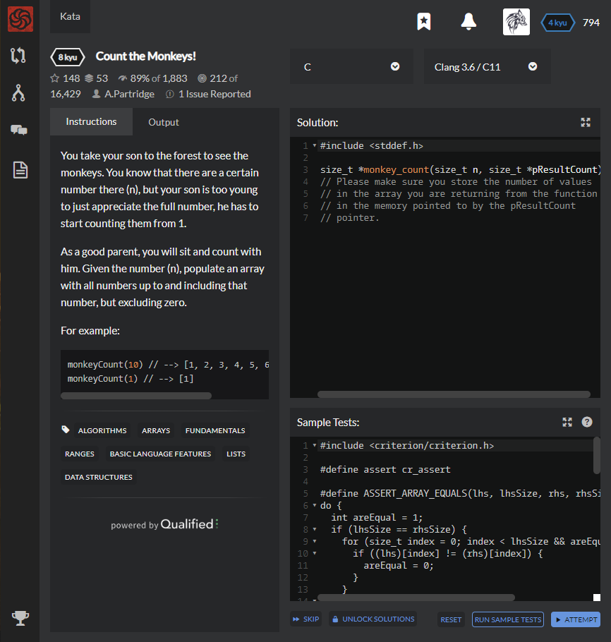

# [[8 Kyu] Count the Monkeys!](https://www.codewars.com/kata/56f69d9f9400f508fb000ba7/train/c)




## Instructions

You take your son to the forest to see the monkeys. You know that there are a certain number there (n), but your son is too young to just appreciate the full number, he has to start counting them from 1.

As a good parent, you will sit and count with him. Given the number (n), populate an array with all numbers up to and including that number, but excluding zero.

### For example

```c
monkeyCount(10) // --> [1, 2, 3, 4, 5, 6, 7, 8, 9, 10]
monkeyCount(1) // --> [1]
```


## Sample Test

```c
#include <criterion/criterion.h>

#define assert cr_assert

#define ASSERT_ARRAY_EQUALS(lhs, lhsSize, rhs, rhsSize)            \
do {                                                               \
  int areEqual = 1;                                                \
  if (lhsSize == rhsSize) {                                        \
    for (size_t index = 0; index < lhsSize && areEqual; ++index) { \
      if ((lhs)[index] != (rhs)[index]) {                          \
        areEqual = 0;                                              \
      }                                                            \
    }                                                              \
  } else {                                                         \
    areEqual = 0;                                                  \
  }                                                                \
  assert(areEqual);                                                \
} while (0)

size_t *monkey_count(size_t n, size_t *pResultCount);

Test(CoreTests, ShouldPassAllTheTestsProvided) {
  {
    const size_t n = 5;
    size_t count = 0;
    const size_t *received = monkey_count(n, &count);
    
    const size_t expected[] = { 1, 2, 3, 4, 5 };
    const size_t expectedCount = sizeof(expected)/sizeof(expected[0]);
    
    ASSERT_ARRAY_EQUALS(received, count, expected, expectedCount);
  }
  
  {
    const size_t n = 3;
    size_t count = 0;
    const size_t *received = monkey_count(n, &count);
    
    const size_t expected[] = { 1, 2, 3 };
    const size_t expectedCount = sizeof(expected)/sizeof(expected[0]);
    
    ASSERT_ARRAY_EQUALS(received, count, expected, expectedCount);
  }
  
  {
    const size_t n = 9;
    size_t count = 0;
    const size_t *received = monkey_count(n, &count);
    
    const size_t expected[] = { 1, 2, 3, 4, 5, 6, 7, 8, 9 };
    const size_t expectedCount = sizeof(expected)/sizeof(expected[0]);
    
    ASSERT_ARRAY_EQUALS(received, count, expected, expectedCount);
  }
}
```


## My solution

```python
x
```


## Test Results

Test Passed

Test Passed

Test Passed

You have passed all of the tests! :)

---------


## Best Solution

```c
#include <stddef.h>

size_t *monkey_count(size_t n, size_t *c) {
  size_t* ptr = malloc(n * sizeof(size_t));
  *c = n;
  for (int i = 0; i < n; i++) ptr[i] = i + 1;
  return ptr;
}
```


## The things I got

**malloc** : Dynamic Memory Allocate 입력받은 크기만큼 메모리공간을 할당해줌

free()로 동적할당 풀어줌

```c
// int k [n] 이렇게 하는게 아니라 malloc을 써서 해야되는구먼
#include <stdio.h>
#include <malloc.h>

int main()
{
    int *arr;
    int size;
    int i;
    
    printf("배열의 크기 입력: ");
    scanf("%d",&size);
    
    arr = (int *)malloc(sizeof(int)*size);
    // 입력받은 크기만큼 int 배열을 생성
    // 정확히는, 입력받은 크기(size)만큼 메모리공간을 할당
    // 배열을 사용하는것처럼 값을 입력하거나 값을 가져올 수 있음
    
    printf("값을 입력\n");
    
   for(i=0 ; i<size; i++)
   {
       printf("arr[%d]:",i);
       scanf("%d",&arr[i]);
   }
    
    printf("입력한 배열의 값 출력\n");
    for(i=0; i<size; i++)
    {
        printf("arr[%d]: %d\n",i,arr[i]);
    }
    
    return 0;
}
```

