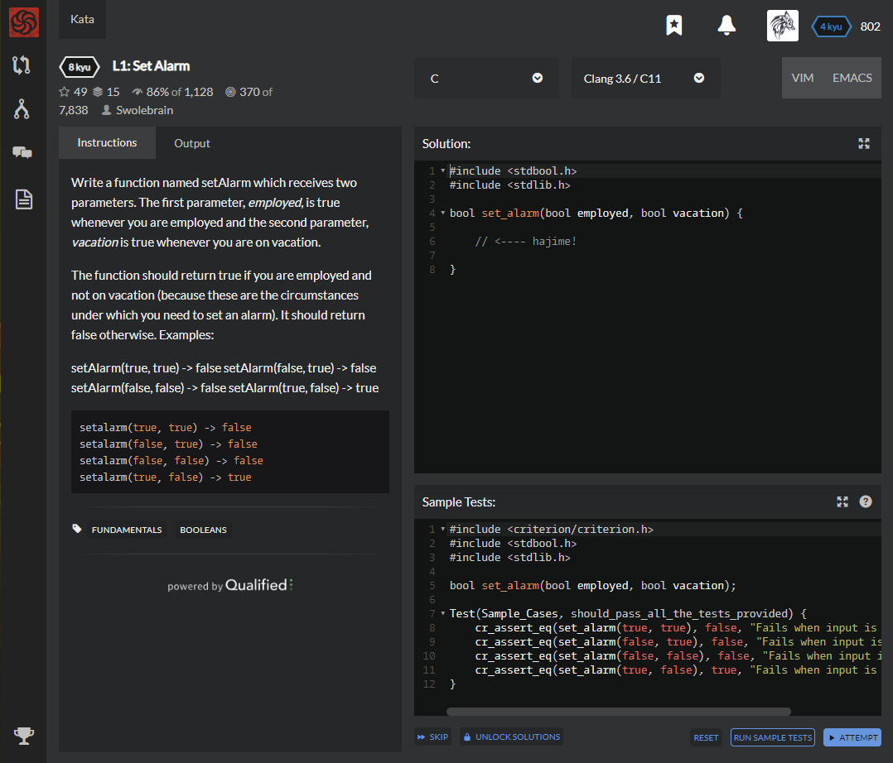

# [[8 Kyu] L1: Set Alarm](https://www.codewars.com/kata/568dcc3c7f12767a62000038/train/c)




## Instructions

Write a function named setAlarm which receives two parameters. The first parameter, *employed*, is true whenever you are employed and the second parameter, *vacation* is true whenever you are on vacation.

The function should return true if you are employed and not on vacation (because these are the circumstances under which you need to set an alarm). It should return false otherwise. Examples:

setAlarm(true, true) -> false setAlarm(false, true) -> false setAlarm(false, false) -> false setAlarm(true, false) -> true

```c
setalarm(true, true) -> false
setalarm(false, true) -> false
setalarm(false, false) -> false
setalarm(true, false) -> true
```


## Sample Test

```python
#include <criterion/criterion.h>
#include <stdbool.h>
#include <stdlib.h>

bool set_alarm(bool employed, bool vacation);

Test(Sample_Cases, should_pass_all_the_tests_provided) {
    cr_assert_eq(set_alarm(true, true), false, "Fails when input is true, true");
    cr_assert_eq(set_alarm(false, true), false, "Fails when input is false, true");
    cr_assert_eq(set_alarm(false, false), false, "Fails when input is false, false");
    cr_assert_eq(set_alarm(true, false), true, "Fails when input is true, false");
}
```


## My solution

```python
#include <stdbool.h>
#include <stdlib.h>

bool set_alarm(bool employed, bool vacation) {

    return (employed && !vacation) ? true : false;

}
```


## Test Results

Test Passed

Test Passed

Test Passed

You have passed all of the tests! :)

---------

Time: 


## Best Solution

```c
#include <stdbool.h>

bool set_alarm(bool employed, bool vacation) {
  return employed && !vacation;
}
```


## The things I got

