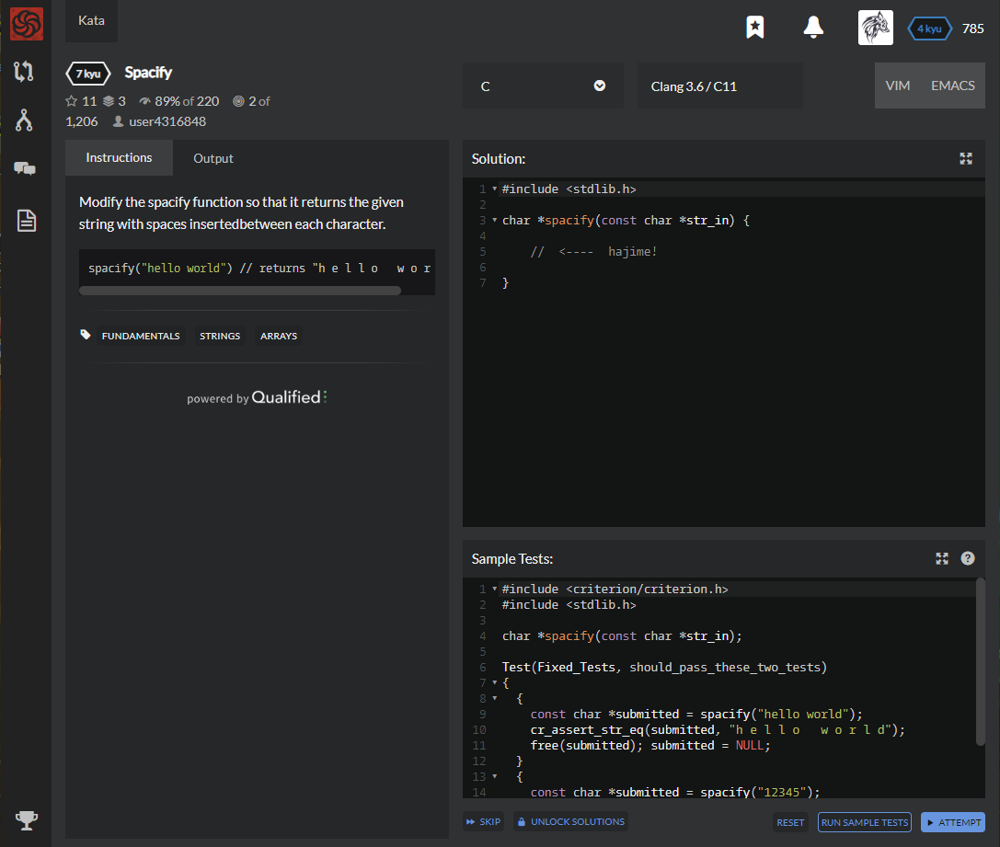

# [[7 Kyu] Spacify](https://www.codewars.com/kata/57f8ee485cae443c4d000127/train/c)




## Instructions

Modify the specify function so that it returns the given string with spaces inserted between each character.

```c
spacify("hello world") // returns "h e l l o   w o r l d"
```


## Sample Test

```c
#include <criterion/criterion.h>
#include <stdlib.h>

char *spacify(const char *str_in);

Test(Fixed_Tests, should_pass_these_two_tests)
{
  {
    const char *submitted = spacify("hello world");
    cr_assert_str_eq(submitted, "h e l l o   w o r l d");
    free(submitted); submitted = NULL;
  }
  {
    const char *submitted = spacify("12345");
    cr_assert_str_eq(submitted, "1 2 3 4 5");
    free(submitted); submitted = NULL;
  }
}
```


## My solution

```c
#include <stdio.h>
#include <stdlib.h>
#include <string.h>


char *spacify(const char *str_in) {
    char *result = (char*)malloc(2*sizeof(char)*strlen(str_in));
  

    for(int i=0 ; i<strlen(str_in); i++){
      result[2*i] = str_in[i];
      result[2*i+1] = ' ';
      if(i==strlen(str_in)-1) result[2*i+1] = '\0';
    }
    
    
    return result;
}
```


## Test Results

Test Passed

Test Passed

Test Passed

You have passed all of the tests! :)

---------

Time: 974ms Passed: 107 Failed: 0


## Best Solution

```c
#include <stdlib.h>

char *spacify(const char *str_in) {
  char *res = malloc(strlen(str_in) * 2);
  for (char *p = res; *str_in; *p++ = *str_in++, *p++ = *str_in ? 32 : 0);
  return res;
}
```


## The things I got

**for statement** : for looping

`for (초기화 식; 조건 식; 루프 식)`

* 초기화식 : 루프가 시작되기 전 한번만 실행되는 식
* 조건식 : 참이면 문장을 반복
* 루프식 : 문장을 반복할 때 마다 계산되는 식 (잘쓰면 안에 안써도 됨)
* (모든 식을 생략할 수 있음, 세미콜론은 그대로)

```c
#include <stdio.h>

int main(){
    int iMax, iCount;
    printf("반복 횟수 입력\n");
    
    for(scanf("%d", &iMax), iCount=0 ; iCount < iMax ; iCount++)
        printf("%d번째 반복입니다.\n", iCount);
    return 0;
}
```

`,(콤마)`연산자 : 반드시 왼쪽에서 오른쪽으로 연산함

```c
// 잘쓰면 이렇게도 응용할 수 있다
Temp1 = Var1, Var1 = Var2, Var2 = Temp;
// 그래도 ; 쓰는게 보기도 편함
Var2 ^= Var1 ; Var1 ^= Var2 ; Var2 ^= VAr1;
```


study with [C언어 흐름제어 - for문](https://araikuma.tistory.com/547), [C언어 동적할당]([https://effectivesquid.tistory.com/entry/C%EC%97%90%EC%84%9C%EC%9D%98-%EB%8F%99%EC%A0%81%ED%95%A0%EB%8B%B9%EA%B3%BC-%ED%95%B4%EC%A0%9Cnew-delete](https://effectivesquid.tistory.com/entry/C에서의-동적할당과-해제new-delete)) 