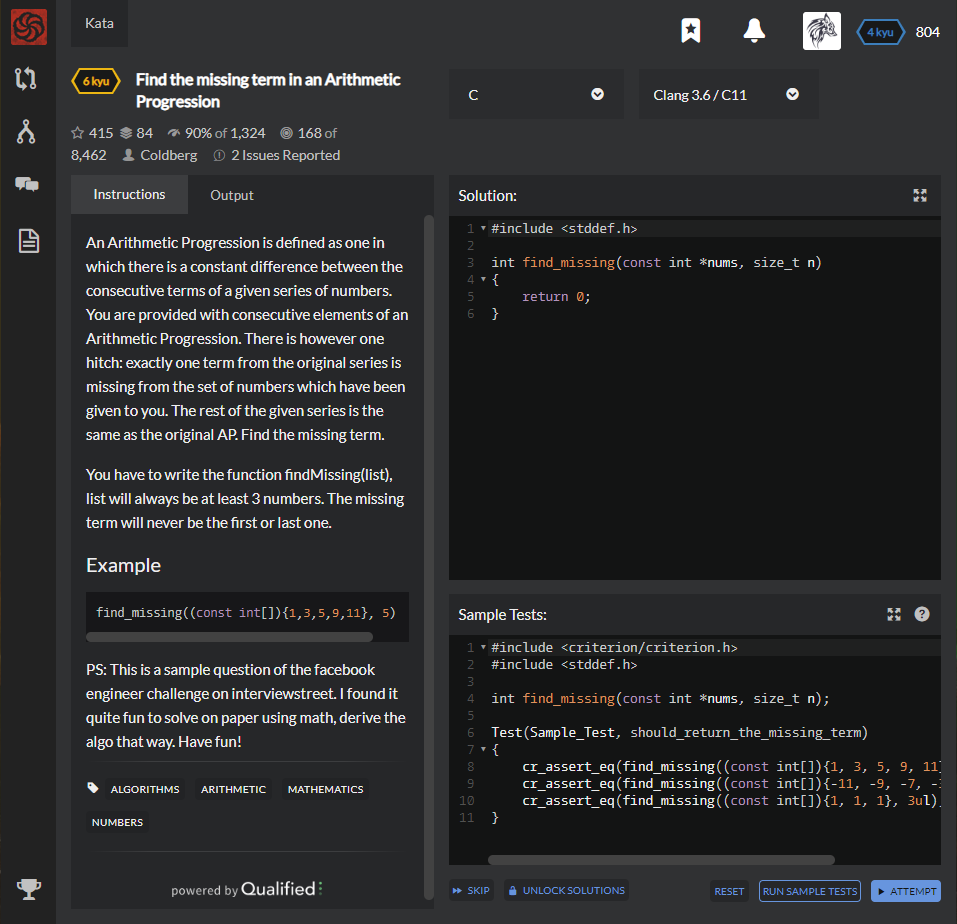

# [[6 Kyu] Find the missing term in an Arithmetic Progression](https://www.codewars.com/kata/find-the-missing-term-in-an-arithmetic-progression/train/c)




## Instructions

An Arithmetic Progression is defined as one in which there is a constant difference between the consecutive terms of a given series of numbers. You are provided with consecutive elements of an Arithmetic Progression. There is however one hitch: exactly one term from the original series is missing from the set of numbers which have been given to you. The rest of the given series is the same as the original AP. Find the missing term.

You have to write the function findMissing(list), list will always be at least 3 numbers. The missing term will never be the first or last one.

## Example

```c
find_missing((const int[]){1,3,5,9,11}, 5)  => 7
```

PS: This is a sample question of the facebook engineer challenge on interviewstreet. I found it quite fun to solve on paper using math, derive the algo that way. Have fun!


## Sample Test

```c
#include <criterion/criterion.h>
#include <stddef.h>

int find_missing(const int *nums, size_t n);

Test(Sample_Test, should_return_the_missing_term)
{
    cr_assert_eq(find_missing((const int[]){1, 3, 5, 9, 11}, 5ul), 7);
    cr_assert_eq(find_missing((const int[]){-11, -9, -7, -3, -1}, 5ul), -5);
    cr_assert_eq(find_missing((const int[]){1, 1, 1}, 3ul), 1);
}
```


## My solution

```c
#include <stddef.h>

int find_missing(const int *nums, size_t n)
{
    if(n==3){
      if(nums[0]<nums[2]) return (nums[1]-nums[0]+nums[1]);
      else return (nums[1]+nums[1]-nums[2]);
      }
    int one=0, another=0,count=0;

    for(int i=2,one = nums[1]-nums[0] ; i<n ; i++){
      if(one == nums[i]-nums[i-1]) count++;
      else another = (nums[i]-nums[i-1]);
      if(count && another) {printf("%d\n",i); return nums[i-1]+one;}
      if(!count && another && (another^(nums[i+1]-nums[i]))) return nums[0]+another;
      if(count==n) return nums[0];
    }
    
    return 0;
}
```


## Test Results

Test Passed

Test Passed

Test Passed

You have passed all of the tests! :)

---------

Time: 896ms Passed: 70 Failed: 0


## Best Solution

```c
#include <stddef.h>

int find_missing(const int *nums, size_t n)
{
    int sum = (n+1)*(nums[0]+nums[n-1]) / 2;
    for (int i = 0; i < n; ++i)
        sum -= nums[i];
        
    return sum;
}
```


## The things I got

