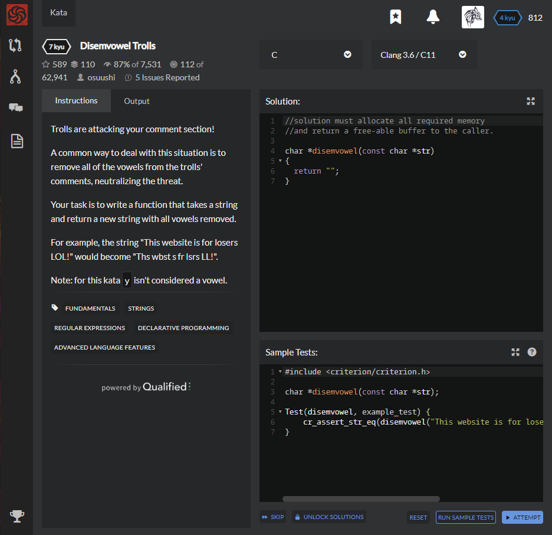

# [[7 Kyu] Disemvowel Trolls](https://www.codewars.com/kata/52fba66badcd10859f00097e/train/c)




## Instructions

Trolls are attacking your comment section!

A common way to deal with this situation is to remove all of the vowels from the trolls' comments, neutralizing the threat.

Your task is to write a function that takes a string and return a new string with all vowels removed.

For example, the string "This website is for losers LOL!" would become "Ths wbst s fr lsrs LL!".

Note: for this kata `y` isn't considered a vowel.


## Sample Test

```c
#include <criterion/criterion.h>

char *disemvowel(const char *str);

Test(disemvowel, example_test) {
    cr_assert_str_eq(disemvowel("This website is for losers LOL!"), "Ths wbst s fr lsrs LL!");
}
```


## My solution

```c
//solution must allocate all required memory
//and return a free-able buffer to the caller.

#include <stdlib.h>
#include <string.h>

char *disemvowel(const char *str)
{
  char *result = malloc(sizeof(char)*strlen(str)+1);
  size_t i=0;
  for(char *p = str; *p; p++){
    switch(towlower(*p)){
      case 'a' :
      case 'e' :
      case 'i' :
      case 'o' :
      case 'u' :
                  continue; break;
      default : *(result+i) = *p; i++; break;
    }
  }
  *(result+i) = '\0';
  return result;
}
```


## Test Results

Test Passed

Test Passed

Test Passed

You have passed all of the tests! :)

---------

Time: 928ms Passed: 104 Failed: 0


## Best Solution

```c
#include <stdbool.h>
#include <stdlib.h>
#include <string.h>

bool is_vowel(char c) {
  c |= 'A' ^ 'a';
  return c == 'a' || c == 'e' || c == 'i' || c == 'o' || c == 'u';
}

char *disemvowel(const char *str) {
  const size_t len = strlen(str);
  char *const res = malloc(len + 1);
  size_t i_dst = 0;
  for (size_t i_src = 0; i_src < len; i_src++)
    if (!is_vowel(str[i_src]))
      res[i_dst++] = str[i_src];
  res[i_dst] = '\0';
  return res;
}
```


## The things I got

동적할당때

* 크기를 줄이고싶다? -> 줄이고 싶은 index에 '/0'으로 초기화
* 크기를 키우고싶다? -> realloc(타겟, 새로운 배열 크기) 사용