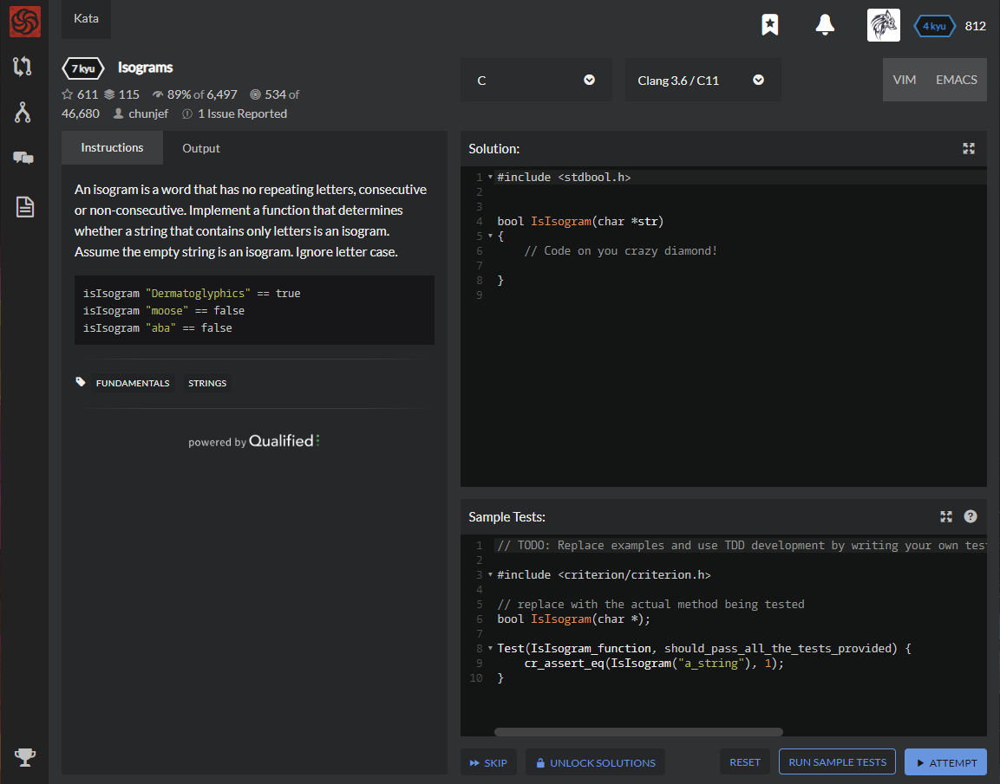

# [[7 Kyu] Isograms](https://www.codewars.com/kata/54ba84be607a92aa900000f1/train/c)




## Instructions

An isogram is a word that has no repeating letters, consecutive or non-consecutive. Implement a function that determines whether a string that contains only letters is an isogram. Assume the empty string is an isogram. Ignore letter case.

```c
isIsogram "Dermatoglyphics" == true
isIsogram "moose" == false
isIsogram "aba" == false
```


## Sample Test

```c
// TODO: Replace examples and use TDD development by writing your own tests. The code provided here is just a how-to example.

#include <criterion/criterion.h>

// replace with the actual method being tested
bool IsIsogram(char *);

Test(IsIsogram_function, should_pass_all_the_tests_provided) {
    cr_assert_eq(IsIsogram("a_string"), 1);
}
```


## My solution

```c
#include <stdbool.h>


bool IsIsogram(char *str) 
{
    int alpha [128];
    for(char*p = str;*p;p++){
      printf("%d\n",(int)(tolower(*p)));
      if(alpha[(int)(tolower(*p))]==-1) return 0;
      else alpha[(int)(tolower(*p))] = -1;
    }
     return 1;
}

```


## Test Results

Test Passed

Test Passed

Test Passed

You have passed all of the tests! :)

---------

Time: 924ms Passed: 8 Failed: 0


## Best Solution

```c
#include <stdbool.h>

bool IsIsogram(char *str) {
    char cache[26] = {0};
    for (int i = 0; str[i] != 0; ++i) {
      char c = tolower(str[i]) - 'a';
      if (cache[c]) return false;
      cache[c] = 1;
    }
    return str[0] == 0 || true;
}
```


## The things I got

