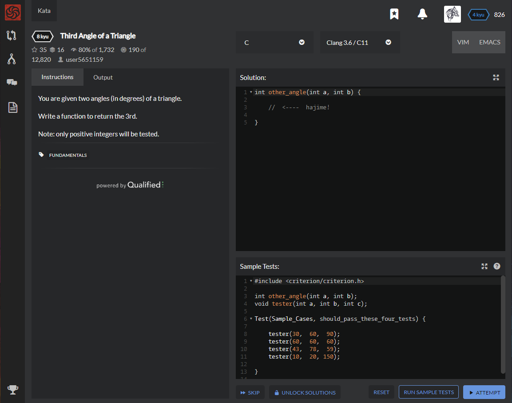

# [[8 Kyu] Third Angle of a Triangle](https://www.codewars.com/kata/5a023c426975981341000014/train/c)




## Instructions

You are given two angles (in degrees) of a triangle.

Write a function to return the 3rd.

Note: only positive integers will be tested.


## Sample Test

```c
#include <criterion/criterion.h>

int other_angle(int a, int b);
void tester(int a, int b, int c);

Test(Sample_Cases, should_pass_these_four_tests) {

    tester(30,  60,  90);
    tester(60,  60,  60);
    tester(43,  78,  59);
    tester(10,  20, 150);

}

```


## My solution

```c
int other_angle(int a, int b) {

    return 180-a-b;

}
```


## Test Results

Test Passed

Test Passed

Test Passed

You have passed all of the tests! :)

---------

Time: 961ms Passed: 104 Failed: 0


## Best Solution

```c
same
```


## The things I got

