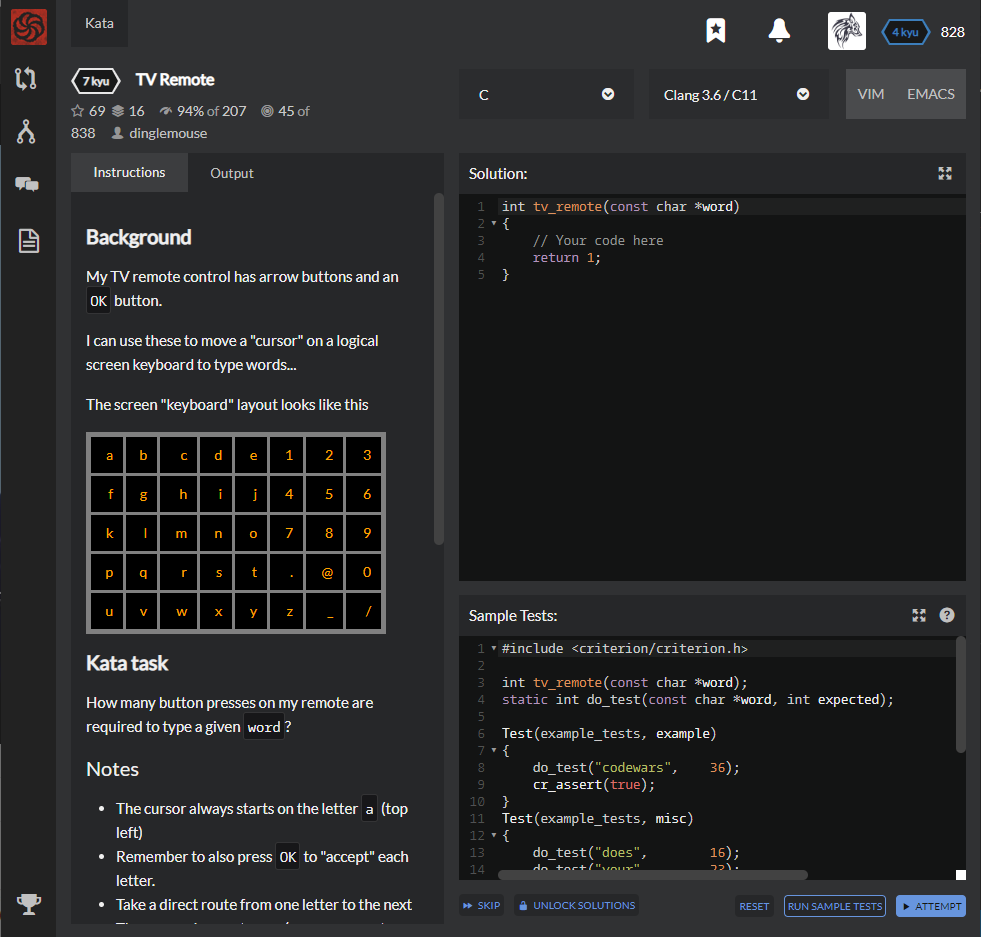

# [[7 Kyu] TV Remote](https://www.codewars.com/kata/5a5032f4fd56cb958e00007a/train/c)




## Instructions

### Background

My TV remote control has arrow buttons and an `OK` button.

I can use these to move a "cursor" on a logical screen keyboard to type words...

The screen "keyboard" layout looks like this

| a    | b    | c    | d    | e    | 1    | 2    | 3    |
| ---- | ---- | ---- | ---- | ---- | ---- | ---- | ---- |
| f    | g    | h    | i    | j    | 4    | 5    | 6    |
| k    | l    | m    | n    | o    | 7    | 8    | 9    |
| p    | q    | r    | s    | t    | .    | @    | 0    |
| u    | v    | w    | x    | y    | z    | _    | /    |

### Kata task

How many button presses on my remote are required to type a given `word`?

### Notes

- The cursor always starts on the letter `a` (top left)
- Remember to also press `OK` to "accept" each letter.
- Take a direct route from one letter to the next
- The cursor does not wrap (e.g. you cannot leave one edge and reappear on the opposite edge)

### Example

word = `codewars`

- c => `a`-`b`-`c`-OK = 3
- o => `c`-`d`-`e`-`j`-`o`-OK = 5
- d => `o`-`j`-`e`-`d`-OK = 4
- e => `d`-`e`-OK = 2
- w => `e`-`j`-`o`-`t`-`y`-`x`-`w`-OK = 7
- a => `w`-`r`-`m`-`h`-`c`-`b`-`a`-OK = 7
- r => `a`-`f`-`k`-`p`-`q`-`r`-OK = 6
- s => `r`-`s`-OK = 2

Answer = 3 + 5 + 4 + 2 + 7 + 7 + 6 + 2 = 36

------

*Good Luck!
DM.*


## Sample Test

```c
#include <criterion/criterion.h>

int tv_remote(const char *word);
static int do_test(const char *word, int expected);

Test(example_tests, example)
{
    do_test("codewars",    36);
    cr_assert(true);
}
Test(example_tests, misc)
{
    do_test("does",        16);
    do_test("your",        23);
    do_test("solution",    33);
    do_test("work",        20);
    do_test("for",         12);
    do_test("these",       27);
    do_test("words",       25);
    cr_assert(true);
}
static int do_test(const char *word, int expected)
{
    int actual = tv_remote(word);
    if ( actual != expected )
        cr_assert_eq(actual, expected, "Expected %d\nReceived %d\n", expected, actual);
}
```


## My solution

```c
#include <math.h>

int tv_remote(const char *word)
{
    char keyboard [40] = {"abcde123fghij456klmno789pqrst.@0uvwxyz_/"};
    int start=0, end=0, result = 0;
    for(char *p = word; *p; p++){
      for(int i=0; i<40; i++){
        if(keyboard[i]==*p) { end=i; break; }
      }
      result += (abs(start/8-end/8))+(abs(start%8-end%8))+1;
      start = end;
    }
    return result;
}
```


## Test Results

Test Passed

Test Passed

Test Passed

You have passed all of the tests! :)

---------

Time: 871ms Passed: 4 Failed: 0


## Best Solution

```c

```


## The things I got

