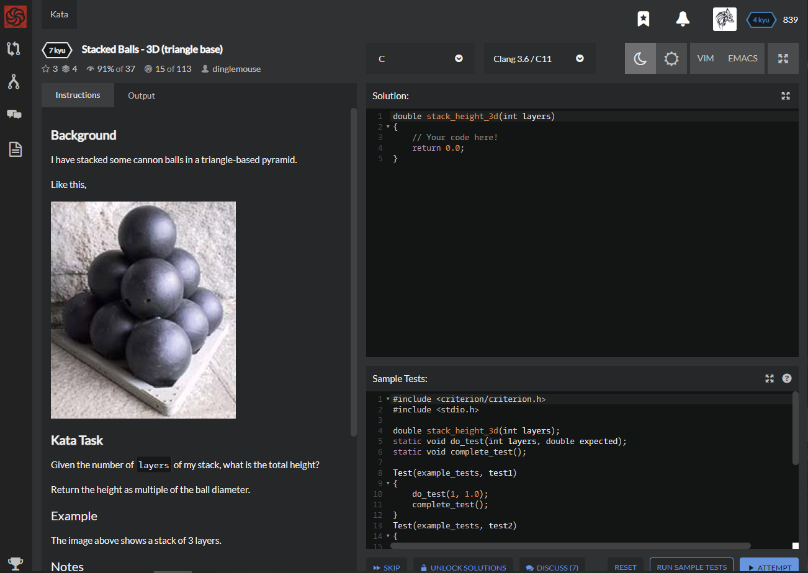

# [[7 Kyu] Stacked Balls - 3D (triangle base)](https://www.codewars.com/kata/5bbad1082ce5333f8b000006/train/c)




## Instructions

# Background

I have stacked some cannon balls in a triangle-based pyramid.

Like this,


Given the number of `layers` of my stack, what is the total height?

Return the height as multiple of the ball diameter.

## Example

The image above shows a stack of 3 layers.

## Notes

- `layers` >= 0
- approximate answers (within 0.001) are good enough


## Sample Test

```c
#include <criterion/criterion.h>
#include <stdio.h>

double stack_height_3d(int layers);
static void do_test(int layers, double expected);
static void complete_test();

Test(example_tests, test1)
{
    do_test(1, 1.0);
    complete_test();
}
Test(example_tests, test2)
{
    do_test(2, 1.816);
    complete_test();
}
static void do_test(int layers, double expected)
{
    #define EPSILON 0.001
    double actual = stack_height_3d(layers);
    if ( fabs(actual - expected) > EPSILON )
        cr_assert(false, "Expected %f (+/- %.3f)\nReceived %f\n", expected, EPSILON, actual);
}
static void complete_test()
{
    fflush(stdout);
    cr_assert(true);
}
```


## My solution

```c
#include <math.h>

double stack_height_3d(int layers)
{
    printf("%d",layers);
    int margin = (layers-1);
    return layers? margin*sqrt(2.0/3.0)+1.0 : 0;
}
```


## Test Results

Test Passed

Test Passed

Test Passed

You have passed all of the tests! :)

---------

Time: 


## Best Solution

```c
double stack_height_3d(int layers) {
    return layers > 0 ? 1+--layers*0.81649 : 0;
}
```


## The things I got

