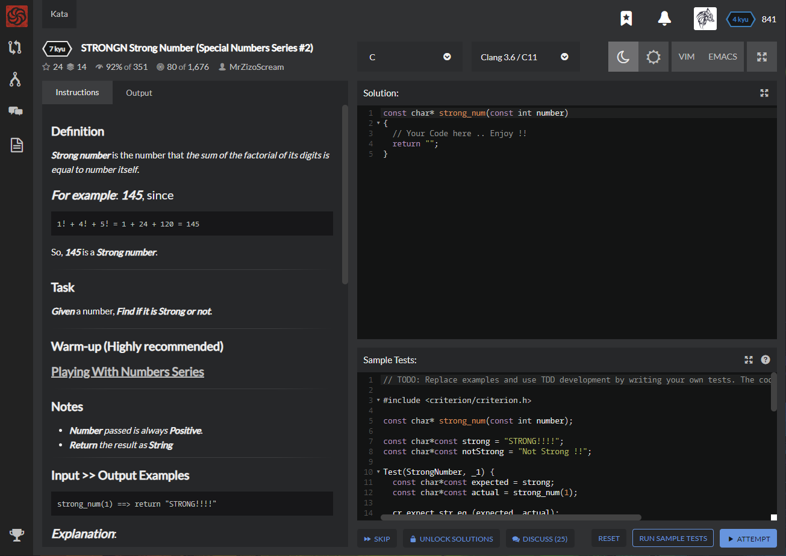

# [[7 Kyu] STRONGN Strong Number (Special Numbers Series #2)](https://www.codewars.com/kata/5a4d303f880385399b000001/train/c)




## Instructions

### Definition

**Strong number** is the number that *the sum of the factorial of its digits is equal to number itself*.


### For example

```c
1! + 4! + 5! = 1 + 24 + 120 = 145
```

So, **145** is a **Strong number**.  


### Task

**Given** a number, **Find if it is Strong or not**.


### Notes

- **Number** *passed is always* **Positive**.
- **Return** *the result as* **String**


### Input >> Output Examples

```c
strong_num(1) ==> return "STRONG!!!!"
```

Since , **the sum of its digits' factorial of (1) is equal to number itself (1)** , **Then** its a **Strong** .

------

```c
strong_num(123) ==> return "Not Strong !!"
```

Since **the sum of its digits' factorial of 1! + 2! + 3! = 9 is not equal to number itself (123)** , **Then** it's **Not Strong** .

------

```c
strong_num(2)  ==>  return "STRONG!!!!"
```

Since **the sum of its digits' factorial of 2! = 2 is equal to number itself (2)** , **Then** its a **Strong** .

------

```c
strong_num(150) ==> return "Not Strong !!"
```

Since **the sum of its digits' factorial of 1! + 5! + 0! = 122 is not equal to number itself (150)**, **Then** it's **Not Strong** .


## Sample Test

```c
// TODO: Replace examples and use TDD development by writing your own tests. The code provided here is just a how-to example.

#include <criterion/criterion.h>

const char* strong_num(const int number);

const char*const strong = "STRONG!!!!";
const char*const notStrong = "Not Strong !!";

Test(StrongNumber, _1) {
  const char*const expected = strong;
  const char*const actual = strong_num(1);

  cr_expect_str_eq (expected, actual);
}

Test(StrongNumber, _2) {
  const char*const expected = strong;
  const char*const actual = strong_num(2);

  cr_expect_str_eq (expected, actual);
}

Test(StrongNumber, _3) {
  const char*const expected = strong;
  const char*const actual = strong_num(145);

  cr_expect_str_eq (expected, actual);
}

Test(StrongNumber, _4) {
  const char*const expected = notStrong;
  const char*const actual = strong_num(7);

  cr_expect_str_eq (expected, actual);
}

Test(StrongNumber, _5) {
  const char*const expected = notStrong;
  const char*const actual = strong_num(93);

  cr_expect_str_eq (expected, actual);
}

Test(StrongNumber, _6) {
  const char*const expected = notStrong;
  const char*const actual = strong_num(185);

  cr_expect_str_eq (expected, actual);
}
```


## My solution

```c
const char* strong_num(const int number)
{
  int sum=0;
  int next=number;
  while (next) {
    sum += fac(next%10,1);
    next = next/10;
  }
  return (sum==number) ? "STRONG!!!!" : "Not Strong !!";
}

int fac(int i,int result)
{
  return i ? fac(i-1,result*i) : result;
}
```


## Test Results

Test Passed

Test Passed

Test Passed

You have passed all of the tests! :)

---------

Time: 916ms Passed: 106 Failed: 0


## Best Solution

```c

```


## The things I got

