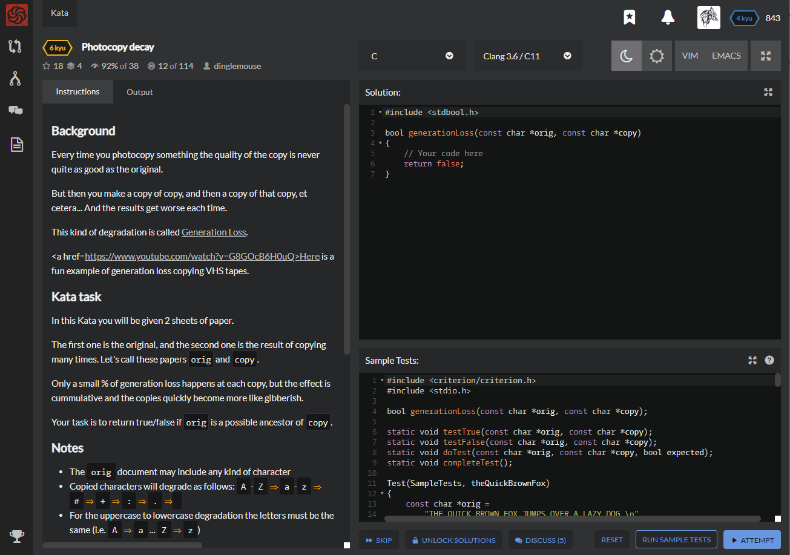

# [[6 Kyu] Photocopy decay](https://www.codewars.com/kata/5b6fcd9668cb2e282d00000f/train/c)




## Instructions

### Background

Every time you photocopy something the quality of the copy is never quite as good as the original.

But then you make a copy of copy, and then a copy of that copy, et cetera... And the results get worse each time.

This kind of degradation is called [Generation Loss](https://en.wikipedia.org/wiki/Generation_loss).

[Here](https://www.youtube.com/watch?v=G8GOcB6H0uQ) is a fun example of generation loss copying VHS tapes.

### Kata task

In this Kata you will be given 2 sheets of paper.

The first one is the original, and the second one is the result of copying many times. Let's call these papers `orig` and `copy`.

Only a small % of generation loss happens at each copy, but the effect is cumulative and the copies quickly become more like gibberish.

Your task is to return true/false if `orig` is a possible ancestor of `copy`.

### Notes

- The `orig` document may include any kind of character
- Copied characters will degrade as follows: `A`-`Z` ⇒ `a`-`z` ⇒ `#` ⇒ `+` ⇒ `:` ⇒ `.` ⇒ ` `
- For the uppercase to lowercase degradation the letters must be the same (i.e. `A` ⇒ `a` ... `Z` ⇒ `z`)

### Example

(5% error rate)

| Original                                                     | After 20 copies...                                           | After 75 copies...                                           |
| :----------------------------------------------------------- | :----------------------------------------------------------- | :----------------------------------------------------------- |
| `THE QUICK BROWN FOX JUMPS OVER A LAZY DOG. THE QUICK BROWN FOX JUMPS OVER A LAZY DOG. THE QUICK BROWN FOX JUMPS OVER A LAZY DOG. THE QUICK BROWN FOX JUMPS OVER A LAZY DOG. THE QUICK BROWN FOX JUMPS OVER A LAZY DOG. THE QUICK BROWN FOX JUMPS OVER A LAZY DOG. THE QUICK BROWN FOX JUMPS OVER A LAZY DOG. THE QUICK BROWN FOX JUMPS OVER A LAZY DOG. THE QUICK BROWN FOX JUMPS OVER A LAZY DOG. THE QUICK BROWN FOX JUMPS OVER A LAZY DOG. ` | `TH# Q+#Ck BRow# F+x J#MPS over A Laz# #+#  :He Qui#k #rO#n foX Ju#Ps oVer a la+y Do+  THe QUiC# b:OWn #oX ##m#s #Ver + lAZ# D#G  ##E #uIcK BROWn Fox #UMPS o#Er A LaZY doG. #H+ Qui## BROW# +ox jUMPs OV#r a lAzy ###. ##e +UICK #ROWn fo# +#mPs #Ve+ a lazY dOg  ### ##IC+ Br### f#x Jump# oVE+ A La## dOg. th+ qUI#k bRO#n fOX #umP# o#ER A La+Y #O.  tH# #U:#k +r+## F+# +#mP+ #VeR A ###Y DOg. #H# QUIcK #ROwN #o+ juM#s #V#+ A #aZy dog  ` | `##  q :c+ +r# . ..# #. #+   #+ a #:+:  .   .+  Q#:## +:::  +++ :::+. .#.# . :. +  #:  ::  q#.c# . ..#   : :.:   :v:+   +a.+ .+#  :++  :.+k +:+:# f.. .:m:  o:#  . :+#y  #+  +#   :::. +::++  :: #:.+: #+     +:z. .:   . e .:#c# ##:+#     : .p# +v:  . #++: #++  ..: ..:.  ++++  +++ ++:p: +ve  A L+.. # +  ::. :ui   :## : +Ox +#::: :::+ + ++ + :#   +#   +  + +  .+ f . : +   :.   : ++ y +.+  ++  .u#+k +r#.. +:  :::+. ##   #  :+# +## ` |


## Sample Test

```c
#include <criterion/criterion.h>
#include <stdio.h>

bool generationLoss(const char *orig, const char *copy);

static void testTrue(const char *orig, const char *copy);
static void testFalse(const char *orig, const char *copy);
static void doTest(const char *orig, const char *copy, bool expected);
static void completeTest();

Test(SampleTests, theQuickBrownFox)
{
    const char *orig =
        "THE QUICK BROWN FOX JUMPS OVER A LAZY DOG.\n"
        "THE QUICK BROWN FOX JUMPS OVER A LAZY DOG.\n"
        "THE QUICK BROWN FOX JUMPS OVER A LAZY DOG.\n"
        "THE QUICK BROWN FOX JUMPS OVER A LAZY DOG.\n"
        "THE QUICK BROWN FOX JUMPS OVER A LAZY DOG.\n"
        "THE QUICK BROWN FOX JUMPS OVER A LAZY DOG.\n"
        "THE QUICK BROWN FOX JUMPS OVER A LAZY DOG.\n"
        "THE QUICK BROWN FOX JUMPS OVER A LAZY DOG.\n"
        "THE QUICK BROWN FOX JUMPS OVER A LAZY DOG.\n"
        "THE QUICK BROWN FOX JUMPS OVER A LAZY DOG.\n";  

    const char * gen10 =
        "THE QUIcK BRoWN Fo# JUmPs OV#r A LAZY DOG \n"
        "THE QUIcK #ROwN FOX JUmpS O#eR + ##ZY DOG.\n"
        "THe +uIcK BroWN #Ox jUmPs OVER a LAZ# Dog \n"
        "thE qUiCk BR#WN FOX #UMPS OVe# A La#Y dog.\n"
        "TH# QUICK brOWn FOX JUMpS OVEr A LaZY dog \n"
        "tHe QuICk BR#WN FOX J#M#+ o##r a lAZY DOg \n"
        "THe QUiCK bRowN FOX JuMp# OvER A laZY Dog.\n"
        "THE QUicK B#OWN FOx JuMPS OVER A LAZy DoG.\n"
        "ThE qUIC# bROwN FO# JUMPS OVEr A LAzY dOG \n"
        "T#E QuICK bROwN fOX JUmP# oVER A lazy #o#.\n";

    const char * gen20 = 
        "tHe qUicK BRoW+ F## #umPs OV#r A lAzY dOG \n"
        "THE qu#cK +R#wN fOX jU#ps O#e# + ##zY DOG.\n"
        "THe +uic# broW# #Ox jUm#s oVER a LA+# Dog \n"
        "t+# qU#Ck bR#WN FO# #uMpS OVe# A ###Y #og.\n"
        "tH# Qu#C# bro+: FOX jumpS Over A lazY d## \n"
        "#He #uiC+ BR##N fOX J+M#+ #+#r # #aZY DO: \n"
        "tHe Qu+CK bRowN fOx #uM## ##eR a lazY D#+ \n"
        "tHe QUi+k B#oWN FOx J#mPs O##R A lAz# doG.\n"
        "T#E quIC# bRO#n fO# JUMP+ oVer a lA#Y doG \n"
        "T#e Q#i#K bR+wN #OX JumP# #Ver A laz# #++.\n";

    const char * gen50 =
        "#:e #u:cK #R##: F.: :+mP+ o#++ a #azy #o+ \n"
        "T:e :u##k  .#w+ +ox +#+:. +:+# : ++:y d:G \n"
        "T+: .+i+: b#++  .ox #U#+# +### # LA.+ #++ \n"
        ":+. #u+C+ #r#Wn f++ #uM#s o+e. A :++y :## \n"
        "#:. q##+# #++:  +++ #+#p# ov#+ a :a:# ++# \n"
        ":h# ++#c. b#++n +oX + :.. #+#+ + #+#y do  \n"
        "t#e Q++.k bro## ### +:+#. +:#+ . :### d+: \n"
        "#H# q##.# B:#++ F## j++P# o+:# # .#z: #+g.\n"
        "t#e :u+c# +:o+n fo+ +umP: ::#r + #++# +og \n"
        "T.: q#::+ ++::n +o# jum#+ +V#. # ++## :+  \n";

    const char * gen75 =
        ":.+ ++.+K #R+:  f :  +.p  +#:. + #++y ++  \n"
        "t.+ .u +    +#+ :++ .+  . + +# . ++.: #.: \n"
        "T.. .+#:: ++.+   #x #U+++ +:+. : La + ++: \n"
        "  . +:.#: +r#++ #:+ +#m+# #:e. +  .:+ :#+ \n"
        ".   q++:# +++   +.: :.+#: :#++ # :a:+ ..+ \n"
        ":#+ ::+#  +#+ # ::X + .   #:+. + ::++ d:  \n"
        "#.e #+  # ##+:: #++ :.:   .::+ .  :#+ # : \n"
        "#H. #.+ : B.:++ F.: j++p# +:.+ +  :z. :.# \n"
        "++e  u.:+ :.::+ #o+ .+#p: :.:+   #.:: ::+ \n"
        "+   q:. :  :  n :++ ju##  .v#  + :+##  +  \n";

    const char * gen99 = 
        "..:  + +K .r+:  f      +  :+.  . +:+# ::  \n"
        "# :  #      ::+ .++ ..  . + .+   :: . +   \n"
        "#.   .#    . +   :: .U.:: +:+    ## + ::: \n"
        "    :. :. :#: : # + +#+.# +.e.      . .#: \n"
        "    q::.# +++   +    ...   #++ # :a:    + \n"
        "::. :::.  .++ # : X       +... + :.:  d   \n"
        "+.+ ::  + +:... ::+ . :     :+ .  :#: : : \n"
        ".h  # : : b ::: f . j+.p# ::.:    .z  . # \n"
        "..e  u    . ::+ +++ .::#.    :   :  :   : \n"
        "    q.. .  :  + .+: ju:#   v#  + .:.+  :  \n";

    testTrue(orig, gen10);
    testTrue(orig, gen20);
    testTrue(orig, gen50);
    testTrue(orig, gen75);
    testTrue(orig, gen99);

    testTrue(gen10, gen20);
    testTrue(gen10, gen50);
    testTrue(gen10, gen75);
    testTrue(gen10, gen99);

    testTrue(gen20, gen50);
    testTrue(gen20, gen75);
    testTrue(gen20, gen99);

    testTrue(gen50, gen75);
    testTrue(gen50, gen99);

    testTrue(gen75, gen99);

    testFalse(gen99, gen75);
    testFalse(gen99, gen50);
    testFalse(gen99, gen20);
    testFalse(gen99, gen10);
    testFalse(gen99, orig);

    testFalse(gen75, gen50);
    testFalse(gen75, gen20);
    testFalse(gen75, gen10);
    testFalse(gen75, orig);

    testFalse(gen50, gen20);
    testFalse(gen50, gen10);
    testFalse(gen50, orig);

    testFalse(gen20, gen10);
    testFalse(gen20, orig);

    testFalse(gen10, orig);
    
    completeTest();
}
static void testTrue(const char *orig, const char *copy)
{
    doTest(orig, copy, true);
}
static void testFalse(const char *orig, const char *copy)
{
    doTest(orig, copy, false);
}
static void doTest(const char *orig, const char *copy, bool expected)
{
    #define b2s(v) (v ? "true" : "false")
    if ( generationLoss(orig, copy) != expected )
        cr_assert(false, "Expected %s\nReceived %s\n", b2s(expected), b2s(!expected));
}
static void completeTest()
{
    fflush(stdout);
    cr_assert(true);
}
```


## My solution

```c
#include <stdbool.h>
#include <string.h>

int position(char input)
{
  if ( (int)(input) >= 65 && (int)(input) <= 90 ) return 1;
  else if ( (int)(input) >= 97 && (int)(input) <= 122 ) return 2;
  else if ( input == '#' ) return 3;
  else if ( input == '+' ) return 4;
  else if ( input == ':' ) return 5;
  else if ( input == ':' ) return 6;
  else if ( input == '.' ) return 7;
  else if ( input == ' ' ) return 8;
  else return 0;
}

bool ispossible(const char original, const char copy)
{
  if(position(original)==1 && position(copy)==1) return (original==toupper(copy))? true : false;
  else if(position(original)==1 && position(copy)==2) return (original==toupper(copy))? true : false;
  else if(!position(original) && position(copy)) return false;
  return (position(original) <= position(copy)) ? true : false;
}

bool generationLoss(const char *orig, const char *copy)
{
    if(strlen(orig)!=strlen(copy)) return false;
    for(int i = 0; i<strlen(orig) ; i++){
      if(ispossible(orig[i],copy[i])) continue;
      else return false;
    }
    return true;
}
```


## Test Results

Test Passed

Test Passed

Test Passed

You have passed all of the tests! :)

---------

Time: 888ms Passed: 12 Failed: 0


## Best Solution

```c
#include <ctype.h>
#include <stdbool.h>

bool isDecayed(char orig, char copy) {
    static const char *decayed = "#+:. ";
    if (copy == orig) return true;
    if (isalpha(copy)) return (copy == tolower(orig));
    const char *decayedCopy = strchr(decayed, copy);
    if (!decayedCopy) return false;
    if (isalpha(orig)) return true;
    const char *decayedOrig = strchr(decayed, orig);
    return decayedOrig && decayedOrig < decayedCopy;
}

bool generationLoss(const char *orig, const char *copy) {
    for (; *orig && *copy; ++orig, ++copy)
        if (!isDecayed(*orig, *copy)) return false;
    return !*orig && !*copy;
}
```


## The things I got

**strchr(대상 문자열, 검색할 문자)** : 문자열에서 특정문자로 검색

```c
#include <stdio.h>
#include <string.h>    // strchr 함수가 선언된 헤더 파일

int main()
{
    char s1[30] = "A Garden Diary";  // 크기가 30인 char형 배열을 선언하고 문자열 할당

    char *ptr = strchr(s1, 'a');     // 'a'로 시작하는 문자열 검색, 포인터 반환

    while (ptr != NULL)              // 검색된 문자열이 없을 때까지 반복
    {
        printf("%s\n", ptr);         // 검색된 문자열 출력
        ptr = strchr(ptr + 1, 'a');  // 포인터에 1을 더하여 a 다음부터 검색
    }

    return 0;
}
```

```c
arden Diary
ary
```


