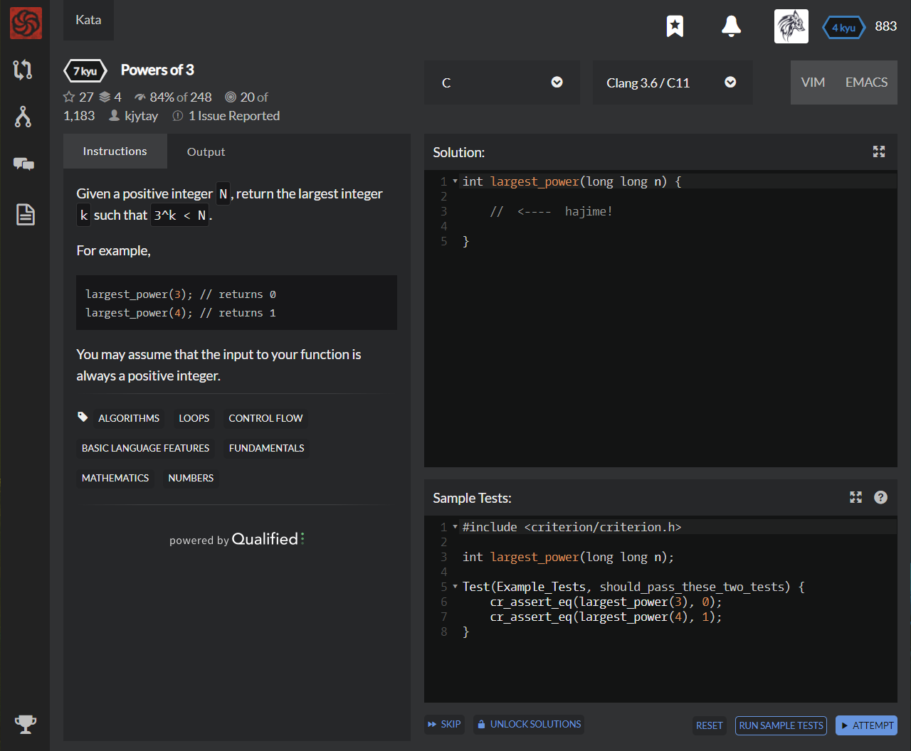

# [[7 Kyu] Powers of 3](https://www.codewars.com/kata/57be674b93687de78c0001d9/train/c)




## Instructions

Given a positive integer `N`, return the largest integer `k` such that `3^k < N`.

For example,

```c
largest_power(3); // returns 0
largest_power(4); // returns 1
```

You may assume that the input to your function is always a positive integer.


## Sample Test

```c
#include <criterion/criterion.h>

int largest_power(long long n);

Test(Example_Tests, should_pass_these_two_tests) {
    cr_assert_eq(largest_power(3), 0);
    cr_assert_eq(largest_power(4), 1);
}
```


## My solution

```c
#include <math.h>

int largest_power(long long n) {
  if(n==1) return -1;
  return (int)(log(n)/log(3)-0.00001);
}
```


## Test Results

Test Passed

Test Passed

Test Passed

You have passed all of the tests! :)

---------

Time: 867ms Passed: 112 Failed: 0


## Best Solution

```c
int largest_power(long long n) {
  int k = -1;
  while (pow(3,++k) < n);
  return k-1;
}
```


## The things I got


