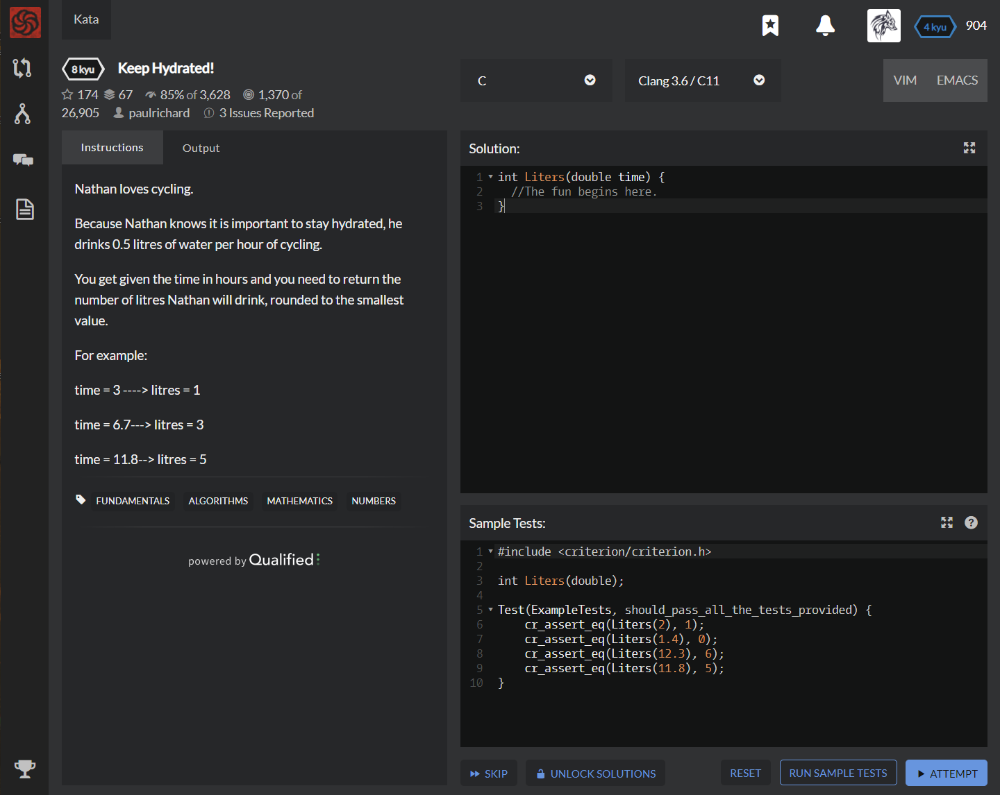

# [[8 Kyu] Keep Hydrated!](https://www.codewars.com/kata/582cb0224e56e068d800003c/train/c)




## Instructions

Nathan loves cycling.

Because Nathan knows it is important to stay hydrated, he drinks 0.5 litres of water per hour of cycling.

You get given the time in hours and you need to return the number of litres Nathan will drink, rounded to the smallest value.

For example:

time = 3 ----> litres = 1

time = 6.7---> litres = 3

time = 11.8--> litres = 5


## Sample Test

```c
#include <criterion/criterion.h>

int Liters(double);

Test(ExampleTests, should_pass_all_the_tests_provided) {
    cr_assert_eq(Liters(2), 1);
    cr_assert_eq(Liters(1.4), 0);
    cr_assert_eq(Liters(12.3), 6);
    cr_assert_eq(Liters(11.8), 5);
}
```


## My solution

```c
int Liters(double time) {
  return time/2;
}
```


## Test Results

Test Passed

Test Passed

Test Passed

You have passed all of the tests! :)

---------

Time: 965ms Passed: 9 Failed: 0


## Best Solution

```c
same
```


## The things I got

