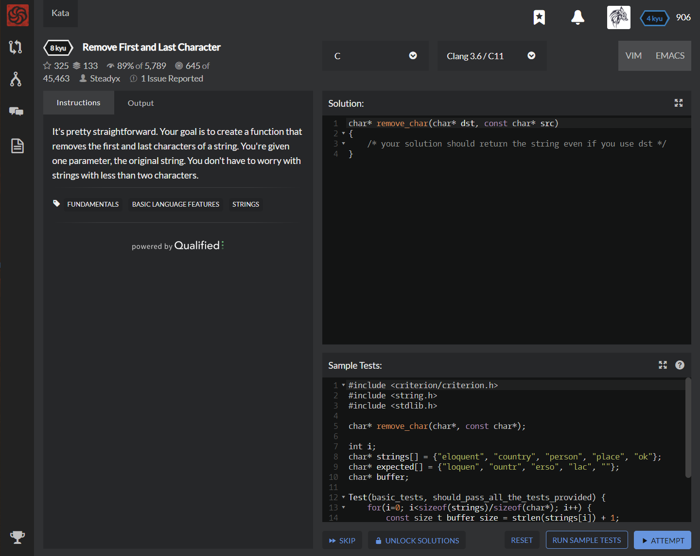

# [[8 Kyu] Remove First and Last Character]( https://www.codewars.com/kata/56bc28ad5bdaeb48760009b0/train/c )




## Instructions

 It's pretty straightforward. Your goal is to create a function that removes the first and last characters of a string. You're given one parameter, the original string. You don't have to worry with strings with less than two characters. 


## Sample Test

```c
#include <criterion/criterion.h>
#include <string.h>
#include <stdlib.h>

char* remove_char(char*, const char*);

int i;
char* strings[] = {"eloquent", "country", "person", "place", "ok"};
char* expected[] = {"loquen", "ountr", "erso", "lac", ""};
char* buffer;

Test(basic_tests, should_pass_all_the_tests_provided) {
    for(i=0; i<sizeof(strings)/sizeof(char*); i++) {
        const size_t buffer_size = strlen(strings[i]) + 1;
        buffer = (char*) malloc(buffer_size);
        memset(buffer, '#', buffer_size);
        cr_assert_str_eq(remove_char(buffer, strings[i]), expected[i]);
        free(buffer);
    }
}
```


## My solution

```c
char* remove_char(char* dst, const char* src)
{ 
  strcpy(dst,++src);
  dst[strlen(dst)-1]='\0';
  
  return dst;
}
```


## Test Results

Test Passed

Test Passed

Test Passed

You have passed all of the tests! :)

---------

 Time: 910ms Passed: 116 Failed: 0 


## Best Solution

```c
same
```


## The things I got

