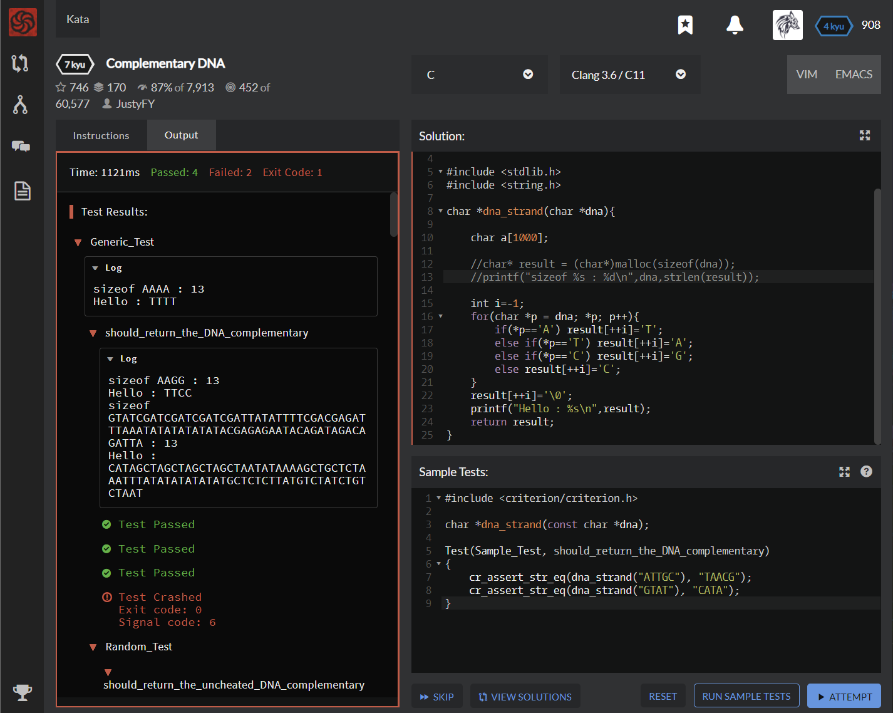

# [[7 Kyu] Complementary DNA](https://www.codewars.com/kata/554e4a2f232cdd87d9000038/train/c )




## Instructions

Deoxyribonucleic acid (DNA) is a chemical found in the nucleus of cells and carries the "instructions" for the development and functioning of living organisms.

If you want to know more http://en.wikipedia.org/wiki/DNA

In DNA strings, symbols "A" and "T" are complements of each other, as "C" and "G". You have function with one side of the DNA (string, except for Haskell); you need to get the other complementary side. DNA strand is never empty or there is no DNA at all (again, except for Haskell).

More similar exercise are found here http://rosalind.info/problems/list-view/ (source)

```c
dna_strand("ATTGC") /* return "TAACG" */
dna_strand("GTAT")  /* return "CATA"  */
```


## Sample Test

```c
#include <criterion/criterion.h>

char *dna_strand(const char *dna);

Test(Sample_Test, should_return_the_DNA_complementary)
{
    cr_assert_str_eq(dna_strand("ATTGC"), "TAACG");
    cr_assert_str_eq(dna_strand("GTAT"), "CATA");
}
```


## My solution

```c
#include <stdlib.h>
#include <string.h>

char *dna_strand(char *dna){
    char* result = (char*)malloc((strlen(dna)+1)*sizeof(char));
        
    int i=-1;
    for(char *p = dna; *p; p++){
        if(*p=='A') result[++i]='T';
        else if(*p=='T') result[++i]='A';
        else if(*p=='C') result[++i]='G';
        else result[++i]='C';
    }
    result[++i]='\0';
    
    return result;
}
```


## Test Results

Test Passed

Test Passed

Test Passed

You have passed all of the tests! :)

---------

  Time: 937ms Passed: 89 Failed: 0 


## Best Solution

```c
#include <string.h>

char *dna_strand(const char *dna)
{
    char *result = strdup(dna);
    for (char *cp = result; *cp; ++cp)
    {
        switch (*cp)
        {
        case 'A': *cp = 'T'; break;
        case 'C': *cp = 'G'; break;
        case 'G': *cp = 'C'; break;
        case 'T': *cp = 'A'; break;
        }
    }
    return result;
}
```


## The things I got

**String 길이만큼의 메모리를 할당할 때** : sizeof(char)*(strlen(string)+1) 해줘야된다!!  

왜냐하면 strlen은 \0을 포함하지 않기때문에 메모리 할당이 하나 적게됨  

귀찮으면 strdup를 쓰자

**char** ***strdup**(**const** **char** *s);  :  문자열 s길이 + 1만큼 메모리 할당 후 문자열 복사해줌  

사실상 (malloc(strlen(s)+1), strcpy(,s)) 한거임  

```c
#include <string.h>
#include <stdio.h>

int main(int argc, char **argv)
{
    char *ptr; char src[256]; ......
    
    /* strdup(3)의 return은 반드시 pointer로 선언된 변수이어야 합니다. */
    if((ptr = strdup(src)) == NULL) {
        fprintf(stderr, "문자열 복제를 위한 메모리가 부족합니다.\n");
        return 1;
    }
    ... 
    
    /* free(3)로 메모리 해제를 하지 않으면 메모리 leak이 발생합니다. */=
    free(ptr); ...... return 0; }
```


study with [Flatinum - strdup]( https://www.it-note.kr/78 ) 