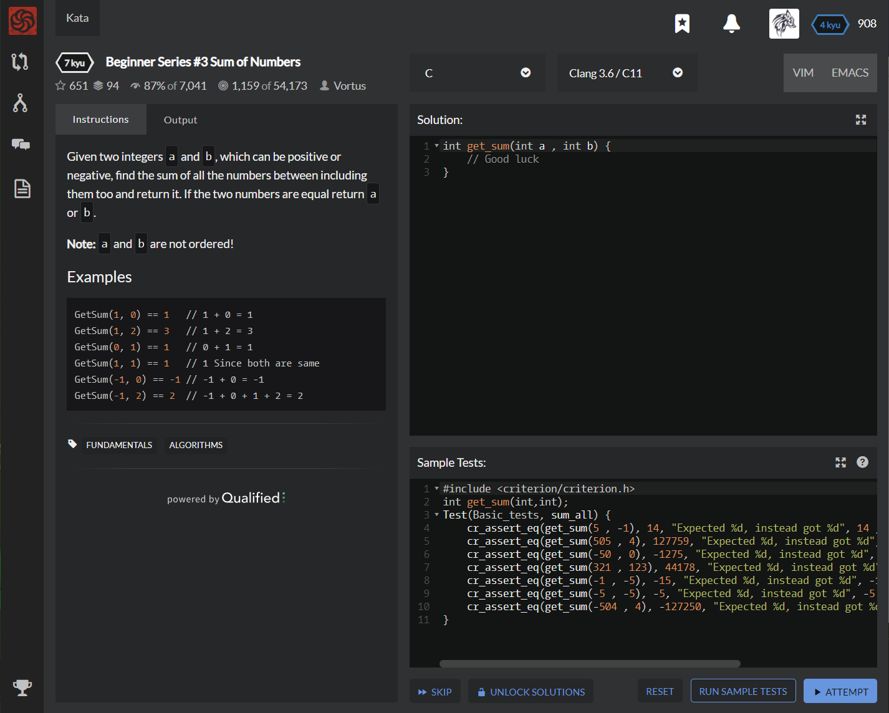

# [[7 Kyu] Beginner Series #3 Sum of Numbers]( https://www.codewars.com/kata/55f2b110f61eb01779000053/train/c  )




## Instructions

Given two integers `a` and `b`, which can be positive or negative, find the sum of all the numbers between including them too and return it. If the two numbers are equal return `a` or `b`.

**Note:** `a` and `b` are not ordered!

### Examples

```c
GetSum(1, 0) == 1   // 1 + 0 = 1
GetSum(1, 2) == 3   // 1 + 2 = 3
GetSum(0, 1) == 1   // 0 + 1 = 1
GetSum(1, 1) == 1   // 1 Since both are same
GetSum(-1, 0) == -1 // -1 + 0 = -1
GetSum(-1, 2) == 2  // -1 + 0 + 1 + 2 = 2
```


## Sample Test

```c
#include <criterion/criterion.h>
int get_sum(int,int);
Test(Basic_tests, sum_all) {
    cr_assert_eq(get_sum(5 , -1), 14, "Expected %d, instead got %d", 14 , get_sum(5 , -1));
    cr_assert_eq(get_sum(505 , 4), 127759, "Expected %d, instead got %d", 127759 , get_sum(505 , 4));
    cr_assert_eq(get_sum(-50 , 0), -1275, "Expected %d, instead got %d", -1275 , get_sum(-50 , 0));
    cr_assert_eq(get_sum(321 , 123), 44178, "Expected %d, instead got %d", 44178 , get_sum(321 , 123));
    cr_assert_eq(get_sum(-1 , -5), -15, "Expected %d, instead got %d", -15 , get_sum(-1 , -5));
    cr_assert_eq(get_sum(-5 , -5), -5, "Expected %d, instead got %d", -5 , get_sum(-5 , -5));
    cr_assert_eq(get_sum(-504 , 4), -127250, "Expected %d, instead got %d", -127250 , get_sum(-504 , 4));
}
```


## My solution

```c
int get_sum(int a , int b) {
   int sum=0;
   if(a>b) for(int i=b; i<=a ; i++) sum+=i;
   else if(a<b) for(int i=a; i<=b ; i++) sum+=i;
   else return a;
   return sum;
}
```


## Test Results

Test Passed

Test Passed

Test Passed

You have passed all of the tests! :)

---------

  Time: 1544ms Passed: 111 Failed: 0 


## Best Solution

```c
int get_sum(int a , int b) {
    
    int start = b;
    int finish = a;
    
    if (a < b){
      start = a;
      finish = b;
    }
      
    int sum = 0;  
    for (; start <= finish; start++){
      sum += start;
    }
    
    return sum;
}
```


## The things I got

