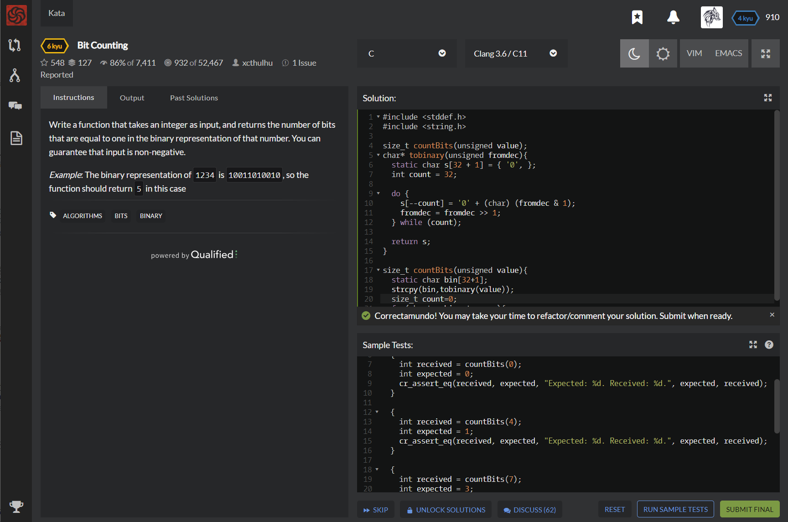

# [[6 Kyu] Bit Counting]( https://www.codewars.com/kata/526571aae218b8ee490006f4/train/c )




## Instructions

Write a function that takes an integer as input, and returns the number of bits that are equal to one in the binary representation of that number. You can guarantee that input is non-negative.

*Example*: The binary representation of `1234` is `10011010010`, so the function should return `5` in this case

### Examples

```c
#include <criterion/criterion.h>

size_t countBits(unsigned value);

Test(CoreTests, ShouldPassAllTheTestsProvided) {
  {
    int received = countBits(0);
    int expected = 0;
    cr_assert_eq(received, expected, "Expected: %d. Received: %d.", expected, received);
  }
  
  {
    int received = countBits(4);
    int expected = 1;
    cr_assert_eq(received, expected, "Expected: %d. Received: %d.", expected, received);
  }
  
  {
    int received = countBits(7);
    int expected = 3;
    cr_assert_eq(received, expected, "Expected: %d. Received: %d.", expected, received);
  }
  
  {
    int received = countBits(9);
    int expected = 2;
    cr_assert_eq(received, expected, "Expected: %d. Received: %d.", expected, received);
  }
  
  {
    int received = countBits(10);
    int expected = 2;
    cr_assert_eq(received, expected, "Expected: %d. Received: %d.", expected, received);
  }
}
```


## Sample Test

```c
#include <stddef.h>
#include <string.h>

size_t countBits(unsigned value);
char* tobinary(unsigned fromdec){
  static char s[32 + 1] = { '0', };
  int count = 32;

  do {
    s[--count] = '0' + (char) (fromdec & 1);
    fromdec = fromdec >> 1;
  } while (count);

  return s;
}

size_t countBits(unsigned value){
  static char bin[32+1];
  strcpy(bin,tobinary(value));
  size_t count=0;
  for(char* p=bin; *p; p++){
    if(*p=='1') count++;
  }
  return count;
}
```


## My solution

```c
int get_sum(int a , int b) {
   int sum=0;
   if(a>b) for(int i=b; i<=a ; i++) sum+=i;
   else if(a<b) for(int i=a; i<=b ; i++) sum+=i;
   else return a;
   return sum;
}
```


## Test Results

Test Passed

Test Passed

Test Passed

You have passed all of the tests! :)

---------

  Time: 1544ms Passed: 111 Failed: 0 


## Best Solution

```c
#include <stddef.h>

size_t countBits(unsigned value)
{
    size_t count = 0;
    for (; value; value >>= 1) if ( value & 1 ) count++;
    return count;
}
```


## The things I got

**2진수** : for(; value; value >>=1)

사용자가 무슨 형태로 값을 받든간에 컴퓨터는 2진수로 만들어서 연산을 함

study with [x86boa](https://x86boa.tistory.com/entry/비트연산으로-10진수에서-2진수-16진수-만들기) 

