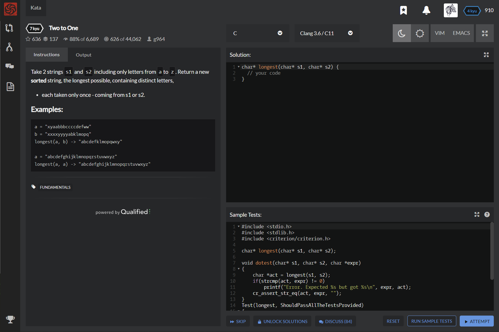

# [[7 Kyu] Two to One]( https://www.codewars.com/kata/5656b6906de340bd1b0000ac/train/c )




## Instructions

Take 2 strings `s1` and `s2` including only letters from `a`to `z`. Return a new **sorted** string, the longest possible, containing distinct letters,

- each taken only once - coming from s1 or s2.

### Examples

```c
a = "xyaabbbccccdefww"
b = "xxxxyyyyabklmopq"
longest(a, b) -> "abcdefklmopqwxy"

a = "abcdefghijklmnopqrstuvwxyz"
longest(a, a) -> "abcdefghijklmnopqrstuvwxyz"
```


## Sample Test

```c
#include <stdio.h>
#include <stdlib.h>
#include <criterion/criterion.h>

char* longest(char* s1, char* s2);

void dotest(char* s1, char* s2, char *expr)
{
    char *act = longest(s1, s2);
    if(strcmp(act, expr) != 0)
        printf("Error. Expected %s but got %s\n", expr, act);
    cr_assert_str_eq(act, expr, "");
}
Test(longest, ShouldPassAllTheTestsProvided)
{ 
    dotest("aretheyhere", "yestheyarehere", "aehrsty");
    dotest("loopingisfunbutdangerous", "lessdangerousthancoding", "abcdefghilnoprstu");
    dotest("inmanylanguages", "theresapairoffunctions", "acefghilmnoprstuy");
    dotest("lordsofthefallen", "gamekult", "adefghklmnorstu");
    dotest("codewars", "codewars", "acdeorsw");
}

```


## My solution

```c
#include <stdbool.h>

char* longest(char* s1, char* s2) {
  char *result = (char*)malloc(26);
  bool alreadyExist[127] = {false,};
  int i=-1;
  for(char c = 'a'; c <= 'z' ; c++){
    for(char *p=s1; *p; p++) if(c==*p && !alreadyExist[c]) {result[++i]=c; alreadyExist[c]=true;}
    for(char *p=s2; *p; p++) if(c==*p && !alreadyExist[c]) {result[++i]=c; alreadyExist[c]=true;}
  }
  result[++i]='\0';
  return result;
}
```


## Test Results

Test Passed

Test Passed

Test Passed

You have passed all of the tests! :)

---------

  Time: 871ms Passed: 211 Failed: 0 


## Best Solution

```c
char* longest(char* s1, char* s2) {
  char letters [26] = {0}, *temp, *final = temp = (char *) calloc(sizeof(char), 26);;
  while(*s1) letters[*(s1++) - 'a']++;
  while(*s2) letters[*(s2++) - 'a']++;
  
  for(int i = 0; i < 26; i++)
    if(letters[i])
      *(temp++) = 'a' + i;
      
  return final;
}
```


## The things I got


