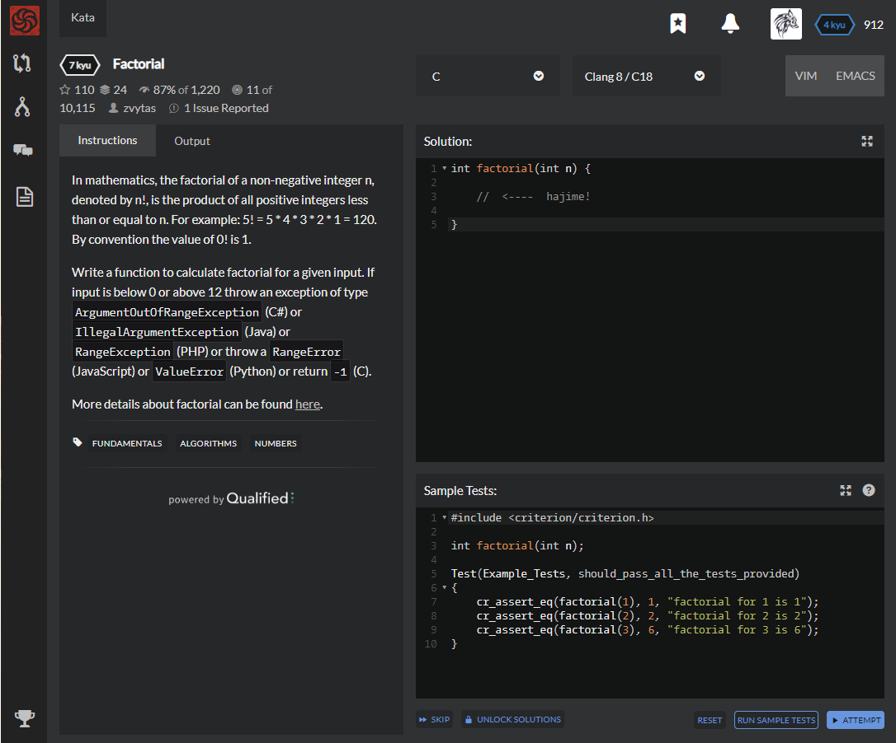

# [[7 Kyu] Factorial](https://www.codewars.com/kata/54ff0d1f355cfd20e60001fc/train/c)




## Instructions

In mathematics, the factorial of a non-negative integer n, denoted by n!, is the product of all positive integers less than or equal to n. For example: 5! = 5 * 4 * 3 * 2 * 1 = 120. By convention the value of 0! is 1.

Write a function to calculate factorial for a given input. If input is below 0 or above 12 throw an exception of type `ArgumentOutOfRangeException` (C#) or `IllegalArgumentException` (Java) or `RangeException` (PHP) or throw a `RangeError` (JavaScript) or `ValueError` (Python) or return `-1` (C).

More details about factorial can be found [here](https://www.wikiwand.com/en/Factorial).


## Sample Test

```c
#include <criterion/criterion.h>

int factorial(int n);

Test(Example_Tests, should_pass_all_the_tests_provided)
{
    cr_assert_eq(factorial(1), 1, "factorial for 1 is 1");
    cr_assert_eq(factorial(2), 2, "factorial for 2 is 2");
    cr_assert_eq(factorial(3), 6, "factorial for 3 is 6");
}
```


## My solution

```c
int factorial(int n) {
  if(n<0 || n>12) return -1;
  return n ? n*factorial(n-1) : 1;
}
```


## Test Results

Test Passed

Test Passed

Test Passed

You have passed all of the tests! :)

---------

Time: 988ms Passed: 106 Failed: 0


## Best Solution

```c
same
```


## The things I got


