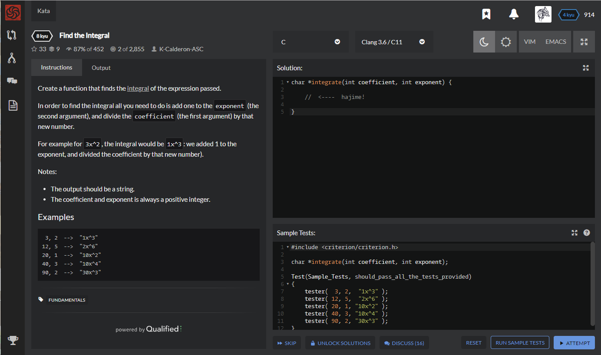

# [[8 Kyu] Find the Integral](https://www.codewars.com/kata/59811fd8a070625d4c000013/train/c)




## Instructions

Create a function that finds the [integral](https://en.wikipedia.org/wiki/Integral) of the expression passed.

In order to find the integral all you need to do is add one to the `exponent` (the second argument), and divide the `coefficient` (the first argument) by that new number.

For example for `3x^2`, the integral would be `1x^3`: we added 1 to the exponent, and divided the coefficient by that new number).

Notes:

- The output should be a string.
- The coefficient and exponent is always a positive integer.

## Examples

```c
 3, 2  -->  "1x^3"
12, 5  -->  "2x^6"
20, 1  -->  "10x^2"
40, 3  -->  "10x^4"
90, 2  -->  "30x^3"
```


## Sample Test

```c
#include <criterion/criterion.h>

char *integrate(int coefficient, int exponent);

Test(Sample_Tests, should_pass_all_the_tests_provided)
{
    tester(  3, 2,  "1x^3" );
    tester( 12, 5,  "2x^6" );
    tester( 20, 1, "10x^2" );
    tester( 40, 3, "10x^4" );
    tester( 90, 2, "30x^3" );
}
```


## My solution

```python
char *integrate(int coefficient, int exponent) {
    char *result = (char*)malloc(10);
    coefficient /= ++exponent;
    sprintf(result, "%dx^%d", coefficient,exponent);
    return result;
}
```


## Test Results

Test Passed

Test Passed

Test Passed

You have passed all of the tests! :)

---------

Time: 952ms Passed: 105 Failed: 0


## Best Solution

```python
#define _GNU_SOURCE
#include <stdio.h>

char *integrate(int coeff, int exp) {
  char *res;
  asprintf(&res, "%gx^%d", (double)coeff / (exp + 1), exp + 1);
  return res;
}
```


## The things I got

**sprintf(&destination, format, source)** : 형식지정자, destination에 "%d, %d"같은 꼴의 source를 집어넣어라

**asprintf(&destination, format, source)** : sprintf와 같은데 자동으로 메모리를 할당해줌 (free는 자동으로 안해줌)