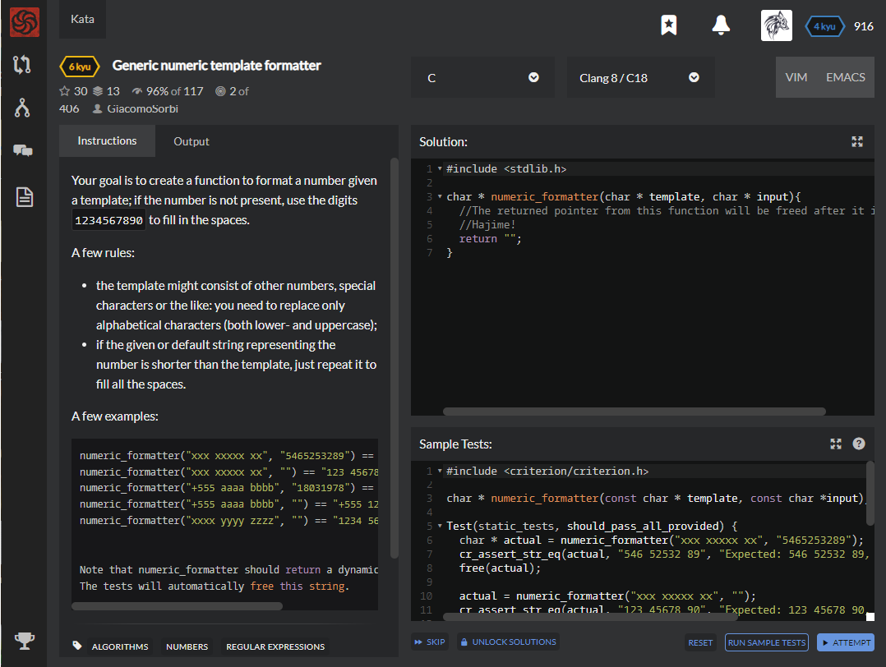

# [[6 Kyu] Generic numeric template formatter](https://www.codewars.com/kata/59901fb5917839fe41000029/train/c)




## Instructions

Your goal is to create a function to format a number given a template; if the number is not present, use the digits `1234567890` to fill in the spaces.

A few rules:

- the template might consist of other numbers, special characters or the like: you need to replace only alphabetical characters (both lower- and uppercase);
- if the given or default string representing the number is shorter than the template, just repeat it to fill all the spaces.

A few examples:

```c
numeric_formatter("xxx xxxxx xx", "5465253289") == "546 52532 89"
numeric_formatter("xxx xxxxx xx", "") == "123 45678 90"
numeric_formatter("+555 aaaa bbbb", "18031978") == "+555 1803 1978"
numeric_formatter("+555 aaaa bbbb", "") == "+555 1234 5678"
numeric_formatter("xxxx yyyy zzzz", "") == "1234 5678 9012"


Note that numeric_formatter should return a dynamically allocated string.
The tests will automatically free this string.
```


## Sample Test

```c
#include <criterion/criterion.h>

char * numeric_formatter(const char * template, const char *input);

Test(static_tests, should_pass_all_provided) {
  char * actual = numeric_formatter("xxx xxxxx xx", "5465253289");
  cr_assert_str_eq(actual, "546 52532 89", "Expected: 546 52532 89, Actual: %s\n", actual);
  free(actual);
  
  actual = numeric_formatter("xxx xxxxx xx", "");
  cr_assert_str_eq(actual, "123 45678 90", "Expected: 123 45678 90, Actual: %s\n", actual);
  free(actual);
  
  actual = numeric_formatter("+555 aaaa bbbb", "18031978");
  cr_assert_str_eq(actual, "+555 1803 1978", "Expected: +555 1803 1978, Actual: %s\n", actual);
  free(actual);
  
  actual = numeric_formatter("+555 aaaa bbbb", "");
  cr_assert_str_eq(actual, "+555 1234 5678", "Expected: +555 1234 5678, Actual: %s\n", actual);
  free(actual);
  
  actual = numeric_formatter("xxxx yyyy zzzz", "");
  cr_assert_str_eq(actual, "1234 5678 9012", "Expected: 1234 5678 9012, Actual: %s\n", actual);
  free(actual);
}
```


## My solution

```c
#include <stdlib.h>
#include <string.h>
#include <stdbool.h>

bool isAlpha(char input){
  if((input >= 65 && input <= 90) || (input >= 97 && input <= 122)) return true;
  else return false;
}

char* expandedString(char* string, int range){
  char* expanded = (char*)malloc(strlen(string)*range);
  for(int i=0; i<range; i++) strcpy(expanded+strlen(string)*i,string);
  return expanded;
}

char * numeric_formatter(char * template, char * input){
  printf("template : %s, input : %s\n",template,input);
  char *spare = {"1234567890"};

  char *temp = (char*)malloc(sizeof(template)+1);
  char *expandedSpare = expandedString(spare,strlen(template)/strlen(spare)+1);
  char *expandedInput = expandedString(input,strlen(template)/(strlen(input)+1)+1);
  temp=strdup(template);
  int i;
  printf("Debugggg\n");
  for(i=0; i<strlen(temp); i++){
    if(!isAlpha(temp[i])) temp[i]=template[i];
    else{
      if(strlen(input)==0) temp[i]=*(expandedSpare++);
      else temp[i]=*(expandedInput++);
    }
  }
  //temp[++i]='\0';
  //free(expandedInput-k);
  //free(expandedSpare-j);
  return temp;
}
```


## Test Results

Test Passed

Test Passed

Test Passed

You have passed all of the tests! :)


Time: 844ms Passed: 133 Failed: 0


## Best Solution

```c
char *numeric_formatter(char *template, char *input)
{
    char *dflt = "1234567890";
    if (!*input) input = dflt;
    else dflt = input;
    char *res = strdup(template);
    char *str = res;
    while (*str)
    {
        if (*str >= 'a' && *str <= 'z' || *str >= 'A' && *str <= 'Z' && *input)
            *str = *input++;
        ++str;
        if (!*input) input = dflt;
    }
    return res;
}
```


## The things I got

