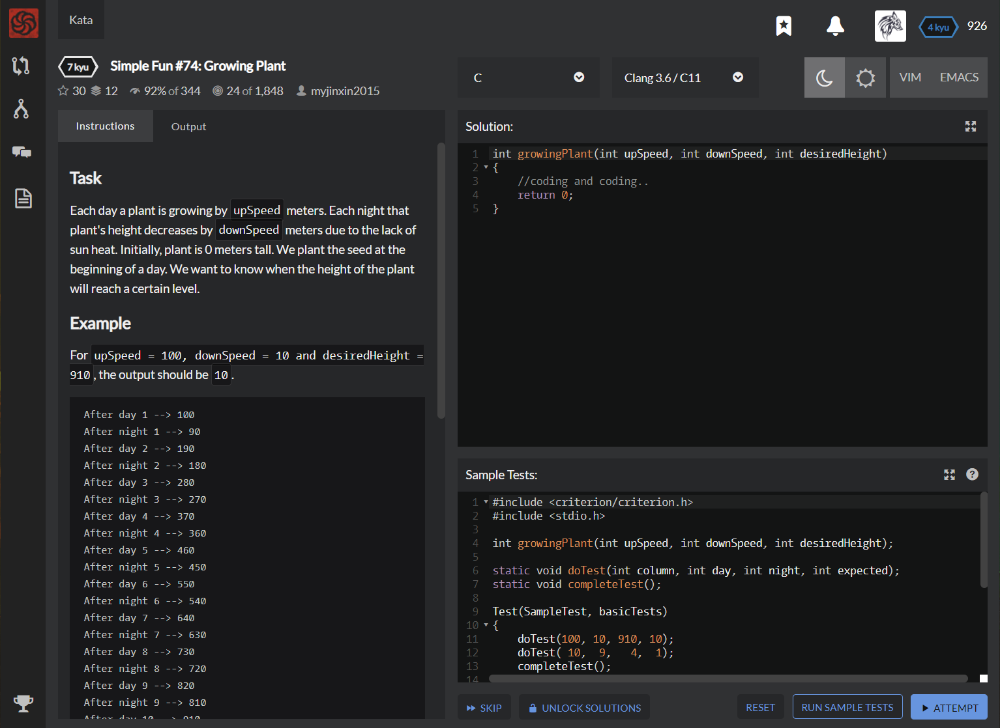

# [[7 Kyu] Simple Fun #74: Growing Plant]( https://www.codewars.com/kata/58941fec8afa3618c9000184/train/c )




## Instructions

### Task

Each day a plant is growing by `upSpeed` meters. Each night that plant's height decreases by `downSpeed` meters due to the lack of sun heat. Initially, plant is 0 meters tall. We plant the seed at the beginning of a day. We want to know when the height of the plant will reach a certain level.

### Example

For `upSpeed = 100, downSpeed = 10 and desiredHeight = 910`, the output should be `10`.

```c
 After day 1 --> 100
 After night 1 --> 90
 After day 2 --> 190
 After night 2 --> 180
 After day 3 --> 280
 After night 3 --> 270
 After day 4 --> 370
 After night 4 --> 360
 After day 5 --> 460
 After night 5 --> 450
 After day 6 --> 550
 After night 6 --> 540
 After day 7 --> 640
 After night 7 --> 630
 After day 8 --> 730
 After night 8 --> 720
 After day 9 --> 820
 After night 9 --> 810
 After day 10 --> 910 
```

For `upSpeed = 10, downSpeed = 9 and desiredHeight = 4`, the output should be `1`.

Because the plant reach to the desired height at day 1(10 meters).

```
 After day 1 --> 10
```

### Input/Output

- `[input]` integer `upSpeed`

  A positive integer representing the daily growth.

  Constraints: `5 ≤ upSpeed ≤ 100.`

- `[input]` integer `downSpeed`

  A positive integer representing the nightly decline.

  Constraints: `2 ≤ downSpeed < upSpeed.`

- `[input]` integer `desiredHeight`

  A positive integer representing the threshold.

  Constraints: `4 ≤ desiredHeight ≤ 1000.`

- `[output]` an integer

  The number of days that it will take for the plant to reach/pass desiredHeight (including the last day in the total count).

  

## Sample Test

```c
#include <criterion/criterion.h>
#include <stdio.h>

int growingPlant(int upSpeed, int downSpeed, int desiredHeight);

static void doTest(int column, int day, int night, int expected);
static void completeTest();

Test(SampleTest, basicTests)
{
    doTest(100, 10, 910, 10);
    doTest( 10,  9,   4,  1);
    completeTest();
}
static void doTest(int upSpeed, int downSpeed, int desiredHeight, int expected)
{
    int actual = growingPlant(upSpeed, downSpeed, desiredHeight);
    if ( actual != expected )
        cr_assert(false, "Expected %d\nReceived %d\n", expected, actual);
}
static void completeTest()
{
    fflush(stdout);
    cr_assert(true);
}
```


## My solution

```c
int growingPlant(int upSpeed, int downSpeed, int desiredHeight)
{
    if(downSpeed>0) {desiredHeight -= upSpeed; upSpeed -= downSpeed; downSpeed=0;}
    return desiredHeight>0 ? growingPlant(upSpeed, downSpeed-1, desiredHeight-upSpeed) : -1*downSpeed+1;
}
```


## Test Results

Test Passed

Test Passed

Test Passed

You have passed all of the tests! :)

----------

 Time: 953ms Passed: 2 Failed: 0 


## Best Solution

```c
#include <math.h>

int growingPlant(int upSpeed, int downSpeed, int desiredHeight)
{
  return 1 + (upSpeed >= desiredHeight ? 0 : ceil( (1.0 * desiredHeight - upSpeed) / (upSpeed - downSpeed) ));
}
```


## The things I got

