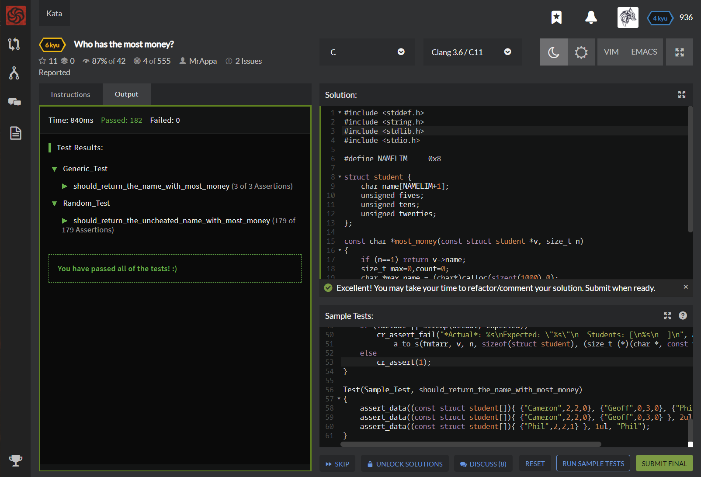

# [[6 Kyu] Who has the most money?](https://www.codewars.com/kata/528d36d7cc451cd7e4000339/train/c)




## Instructions

- You're going on a trip with some students and it's up to you to keep track of how much money each Student has:

  ```c
class Student
    attr_reader :name
    attr_reader :fives
    attr_reader :tens
    attr_reader :twenties
  
    def initialize(name, fives, tens, twenties)
      @name = name
      @fives = fives
      @tens = tens
      @twenties = twenties
    end
  end
  ```
  
  As you can tell, each Student has some fives, tens, and twenties. Your job is to return the name of the student with the most money. If every student has the same amount, then the return value should be "all"
  
  Notes: 1) Each student will have an unique name 2) There will be a clear winner (either one person has the most or everyone has the same amount) 3) If there is only one student, then that student has the most money  

## Sample Test

```c
#include <criterion/criterion.h>
#include <stddef.h>
#include <string.h>
#include <limits.h>
#include <stdio.h>

struct student;
extern const char *most_money(const struct student *v, size_t n);

#define NLIM        0x8
#define NAMELIM     0x8
#define FMT_UINT    (CHAR_BIT * sizeof(unsigned) / 3)
#define FMT_STUDENT (NAMELIM + FMT_UINT * 3 + 0x10)
#define FMT_ALIGN   0x4
#define FMT_ARR     ((FMT_ALIGN + FMT_STUDENT + 2) * NLIM + 1)

struct student {
    char name[NAMELIM+1];
    unsigned fives;
    unsigned tens;
    unsigned twenties;
};

size_t student_to_s(char *outpf, const struct student *s)
{
    return sprintf(outpf, "{ %*s: %u, %u, %u }", NAMELIM, s->name, s->fives, s->tens, s->twenties);
}

char *a_to_s(char *outpf, const void *a, size_t n, size_t sz, size_t (*to_s)(char *, const void *))
{
    const char *mem = a;
    size_t pos;
    for (pos = 0ul; n--; mem += sz) {
        pos += sprintf(outpf+pos, "    ");
        pos += to_s(outpf+pos, (const struct student *)mem);
        pos += sprintf(outpf+pos, "\n");
    }
    if (pos)
        outpf[--pos] = '\0';
    return outpf;
}

void assert_data(const struct student *v, size_t n, const char *expected)
{
    char fmtarr[FMT_ARR];
    char actual_name[NAMELIM+3];
    const char *actual = most_money(v, n);
    actual? sprintf(actual_name, "\"%s\"", actual) : sprintf(actual_name, "NULL");
    if (!actual || strcmp(actual, expected))
        cr_assert_fail("*Actual*: %s\nExpected: \"%s\"\n  Students: [\n%s\n  ]\n", actual_name, expected,
            a_to_s(fmtarr, v, n, sizeof(struct student), (size_t (*)(char *, const void *))student_to_s));
    else
        cr_assert(1);
}

Test(Sample_Test, should_return_the_name_with_most_money)
{
    assert_data((const struct student[]){ {"Cameron",2,2,0}, {"Geoff",0,3,0}, {"Phil",2,2,1} }, 3ul, "Phil");
    assert_data((const struct student[]){ {"Cameron",2,2,0}, {"Geoff",0,3,0} }, 2ul, "all");
    assert_data((const struct student[]){ {"Phil",2,2,1} }, 1ul, "Phil");
}
```


## My solution

```c
#include <stddef.h>
#include <string.h>
#include <stdlib.h>
#include <stdio.h>

#define NAMELIM     0x8

struct student {
    char name[NAMELIM+1];
    unsigned fives;
    unsigned tens;
    unsigned twenties;
};

const char *most_money(const struct student *v, size_t n)
{
    if (n==1) return v->name;
    size_t max=0,count=0;
    char *max_name = (char*)calloc(sizeof(1000),0);
    const struct student *p = v;
    for(size_t i=0; i<n; i++,p++){
      size_t sum = (p->fives)*5 + (p->tens)*10 + (p->twenties)*20;
      if(sum > max) { 
        max = sum;
        strcpy(max_name,p->name);
        count=0;
      }
      if(sum == max) count++;
    }
    return (count==n) ? "all" : max_name;
}
```


## Test Results

Test Passed

Test Passed

Test Passed

You have passed all of the tests! :)

----------

 Time: 840ms Passed: 182 Failed: 0 


## Best Solution

```c
#include <stddef.h>

#define NAMELIM     0x8

struct student {
    char name[NAMELIM+1];
    unsigned fives;
    unsigned tens;
    unsigned twenties;
};

const char *most_money(const struct student *v, size_t n)
{
    int i,m;
    int max_m=-1;
    char *name;
    for (i=0; i<n; i++) {
        m=v[i].twenties*20+v[i].tens*10+v[i].fives*5;
        if (m==max_m) name=NULL;
        else if (m>max_m) {
            max_m=m;
            name=v[i].name;
        }
    }
    if (name==NULL) return "all";
    return name;
}
```


## The things I got

