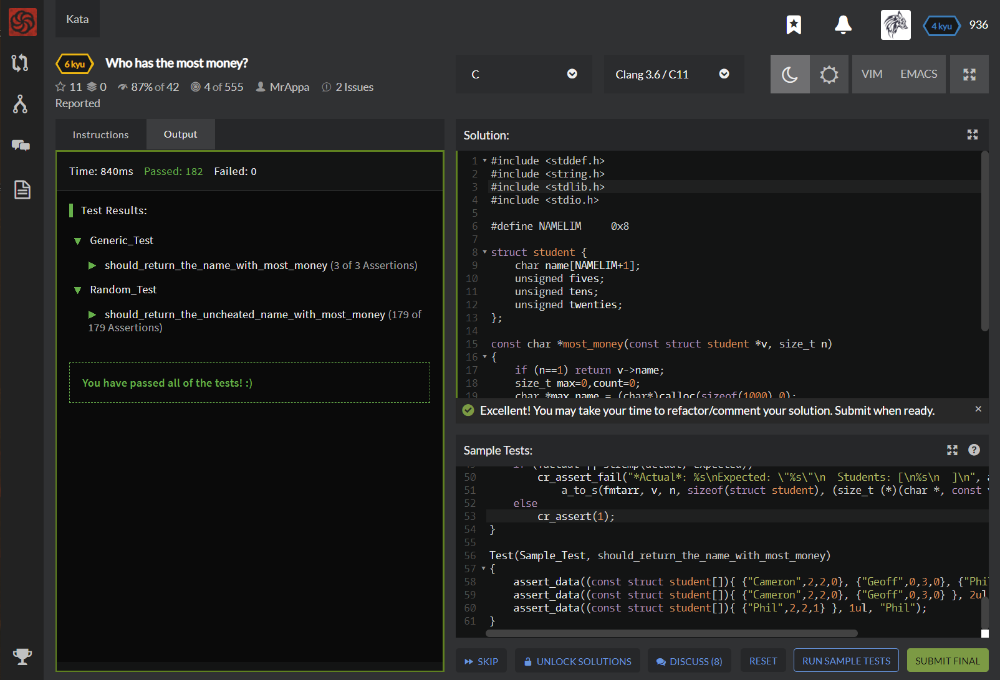

# [[7 Kyu] Thinking & Testing: A and B?](https://www.codewars.com/kata/56d904db9963e9cf5000037d/train/c)




## Instructions

No Story

No Description

Only by Thinking and Testing

Look at result of testcase, guess the code!


## Sample Test

```c
#include <criterion/criterion.h>

unsigned testit(unsigned a, unsigned b);

Test(testit, should_return_correct_results) {
  // a + b ?
  cr_assert_eq(testit(0, 1), 1);
  cr_assert_eq(testit(1, 2), 3);
  cr_assert_eq(testit(10, 20), 30);
  // a * b ?
  cr_assert_eq(testit(1, 1), 1);
  cr_assert_eq(testit(1, 3), 3);
  // try "Attempt" to find more...
}

```


## My solution

```c
unsigned testit(unsigned a, unsigned b) {
  return a|b;
}
```


## Test Results

Test Passed

Test Passed

Test Passed

You have passed all of the tests! :)

----------

 Time: 876ms Passed: 62 Failed: 0 


## Best Solution

```c
unsigned testit(unsigned a, unsigned b) {
  return a|b;
}
```


## The things I got

