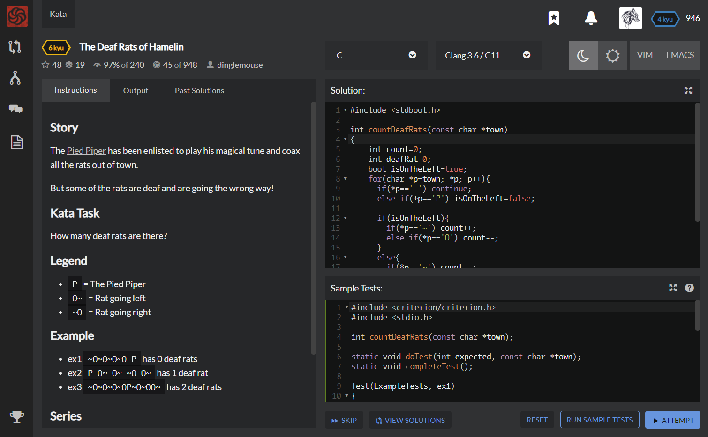

# [[6 Kyu] The Deaf Rats of Hamelin](https://www.codewars.com/kata/the-deaf-rats-of-hamelin/train/c)




## Instructions

### Story

The [Pied Piper](https://en.wikipedia.org/wiki/Pied_Piper_of_Hamelin) has been enlisted to play his magical tune and coax all the rats out of town.

But some of the rats are deaf and are going the wrong way!

### Kata Task

How many deaf rats are there?

### Legend

- `P` = The Pied Piper
- `O~` = Rat going left
- `~O` = Rat going right

### Example

- ex1 `~O~O~O~O P` has 0 deaf rats

- ex2 `P O~ O~ ~O O~` has 1 deaf rat

- ex3 `~O~O~O~OP~O~OO~` has 2 deaf rats


## Sample Test

```c
#include <criterion/criterion.h>
#include <stdio.h>

int countDeafRats(const char *town);

static void doTest(int expected, const char *town);
static void completeTest();

Test(ExampleTests, ex1)
{
    doTest(0, "~O~O~O~O P");
    completeTest();
}
Test(ExampleTests, ex2)
{
    doTest(1, "P O~ O~ ~O O~");
    completeTest();
}
Test(ExampleTests, ex3)
{
    doTest(2, "~O~O~O~OP~O~OO~");
    completeTest();
}
static void doTest(int expected, const char *town)
{
    int actual = countDeafRats(town);
    if ( actual != expected )
        cr_assert(false, "Expected %d\nReceived %d\n", expected, actual);
}
static void completeTest()
{
    fflush(stdout);
    cr_assert(true);
}
```


## My solution

```c
#include <stdbool.h>

int countDeafRats(const char *town)
{
    int count=0;
    int deafRat=0;
    bool isOnTheLeft=true;
    for(char *p=town; *p; p++){
      if(*p==' ') continue;
      else if(*p=='P') isOnTheLeft=false; 
      
      if(isOnTheLeft){
        if(*p=='~') count++;
        else if(*p=='O') count--;
      }
      else{
        if(*p=='~') count--;
        else if(*p=='O') count++;
      }
      if(count<0) deafRat++;
    }
    return deafRat;
}
```


## Test Results

Test Passed

Test Passed

Test Passed

You have passed all of the tests! :)

----------

 Time: 907ms Passed: 7 Failed: 0 


## Best Solution

```c
int countDeafRats(const char *town)
{
  int deafCount = 0;
  int p = 0;
  int isRat = 0;
  
  char c;
  while (c = *town++) 
  {
    switch (c)
    {      
      case 'P':
        p = 1;      
        break;
      case '~':
        deafCount += isRat && !p ? 1 : 0; // left
        isRat = !isRat;
        break;
      case 'O':
        deafCount += isRat && p ? 1 : 0; // right
        isRat = !isRat;
        break;
    }
  }
    
  return deafCount;
}
```


## The things I got

