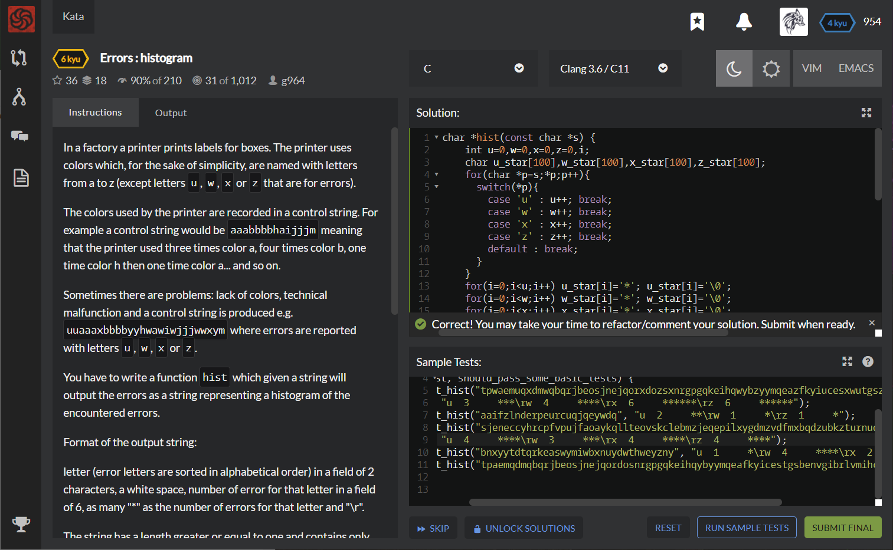

# [[6 Kyu] Errors : histogram](https://www.codewars.com/kata/59f44c7bd4b36946fd000052/train/c)




## Instructions

- In a factory a printer prints labels for boxes. The printer uses colors which, for the sake of simplicity, are named with letters from a to z (except letters `u`, `w`, `x` or `z` that are for errors).

  The colors used by the printer are recorded in a control string. For example a control string would be `aaabbbbhaijjjm` meaning that the printer used three times color a, four times color b, one time color h then one time color a... and so on.

  Sometimes there are problems: lack of colors, technical malfunction and a control string is produced e.g. `uuaaaxbbbbyyhwawiwjjjwwxym` where errors are reported with letters `u`, `w`, `x` or `z`.

  You have to write a function `hist` which given a string will output the errors as a string representing a histogram of the encountered errors.

  Format of the output string:

  letter (error letters are sorted in alphabetical order) in a field of 2 characters, a white space, number of error for that letter in a field of 6, as many "*" as the number of errors for that letter and "\r".

  The string has a length greater or equal to one and contains only letters from `a` to `z`.

  ### Examples

  ```c
  s="uuaaaxbbbbyyhwawiwjjjwwxym"
  hist(s) => "u  2     **\rw  5     *****\rx  2     **"
  
  or with dots to see white spaces:
  hist(s) => "u..2.....**\rw..5.....*****\rx..2.....**"
  
  s="uuaaaxbbbbyyhwawiwjjjwwxymzzzzzzzzzzzzzzzzzzzzzzzzzzzzzzz"
  hist(s) => "u..2.....**\rw..5.....*****\rx..2.....**\rz..31....*******************************"
  or printed:
  u  2     **
  w  5     *****
  x  2     **
  z  31    *******************************
  ```

  ### Notes

  - Unfortunately most often Codewars compresses all white spaces into one.
  - You can see another examples in the "Sample tests".
  - Translators are welcome for all languages.


## Sample Test

```c
#include <criterion/criterion.h>
void test_hist(const char *s, const char *expected);

Test(hist, should_pass_some_basic_tests) {
    test_hist("tpwaemuqxdmwqbqrjbeosjnejqorxdozsxnrgpgqkeihqwybzyymqeazfkyiucesxwutgszbenzvgxibxrlvmzihcb",
        "u  3     ***\rw  4     ****\rx  6     ******\rz  6     ******");
    test_hist("aaifzlnderpeurcuqjqeywdq", "u  2     **\rw  1     *\rz  1     *");
    test_hist("sjeneccyhrcpfvpujfaoaykqllteovskclebmzjeqepilxygdmzvdfmxbqdzubkzturnuqxsewrwgmdfwgdx",
        "u  4     ****\rw  3     ***\rx  4     ****\rz  4     ****");
    test_hist("bnxyytdtqrkeaswymiwbxnuydwthweyzny", "u  1     *\rw  4     ****\rx  2     **\rz  1     *");
    test_hist("tpaemqdmqbqrjbeosjnejqordosnrgpgqkeihqybyymqeafkyicestgsbenvgibrlvmihcb", "");
}

```


## My solution

```c
char *hist(const char *s) {
    int u=0,w=0,x=0,z=0,i;
    char u_star[100],w_star[100],x_star[100],z_star[100];
    for(char *p=s;*p;p++){
      switch(*p){
        case 'u' : u++; break;
        case 'w' : w++; break;
        case 'x' : x++; break;
        case 'z' : z++; break;
        default : break;
      }
    }
    for(i=0;i<u;i++) u_star[i]='*'; u_star[i]='\0';
    for(i=0;i<w;i++) w_star[i]='*'; w_star[i]='\0';
    for(i=0;i<x;i++) x_star[i]='*'; x_star[i]='\0';
    for(i=0;i<z;i++) z_star[i]='*'; z_star[i]='\0';
    
    char *result = (char*)calloc(1000,sizeof(char));
    
    char add[100]; 
    if(u){
      if(u>9) sprintf(add,"u  %d    %s\r",u,u_star);
      else sprintf(add,"u  %d     %s\r",u,u_star);
      strcat(result,add);
    }
    if(w){
      if(w>9) sprintf(add,"w  %d    %s\r",w,w_star);
      else sprintf(add,"w  %d     %s\r",w,w_star);
      strcat(result,add);
    }
    if(x){
      if(x>9) sprintf(add,"x  %d    %s\r",x,x_star);
      else sprintf(add,"x  %d     %s\r",x,x_star);
      strcat(result,add);
    }
    if(z){
      if(z>9) sprintf(add,"z  %d    %s\r",z,z_star);
      else sprintf(add,"z  %d     %s\r",z,z_star);
      strcat(result,add);
    }
    result[strlen(result)-1]='\0';
    //result++;
    //sprintf(result,"u  %d     %s\rw  %d     %s\rx  %d     %s\rz  %d     %s",u,u_star,w,w_star,x,x_star,z,z_star);
    return result; // the returned string will be free()-d
}
```


## Test Results

Test Passed

Test Passed

Test Passed

You have passed all of the tests! :)

----------

 Time: 1038ms Passed: 122 Failed: 0 


## Best Solution

```c
#define h(c) c+=*s==#c[0]
char *hist (const char *s) {
  int n,u,w,x,z; u=w=x=z=0; char *p=calloc (1, n=41+strlen (s--)), *r=p; memset (p, 42, n);
  while (*++s) h(u),h(w),h(x),h(z);
  if (u) p += sprintf (p, "u  %-6d", u), *p = 42, p += u, *p++ = 13;
  if (w) p += sprintf (p, "w  %-6d", w), *p = 42, p += w, *p++ = 13;
  if (x) p += sprintf (p, "x  %-6d", x), *p = 42, p += x, *p++ = 13;
  if (z) p += sprintf (p, "z  %-6d", z), *p = 42, p += z, *p++ = 13;
  return *(p==r?p:p-1) = 0, r;
}
```


## The things I got

