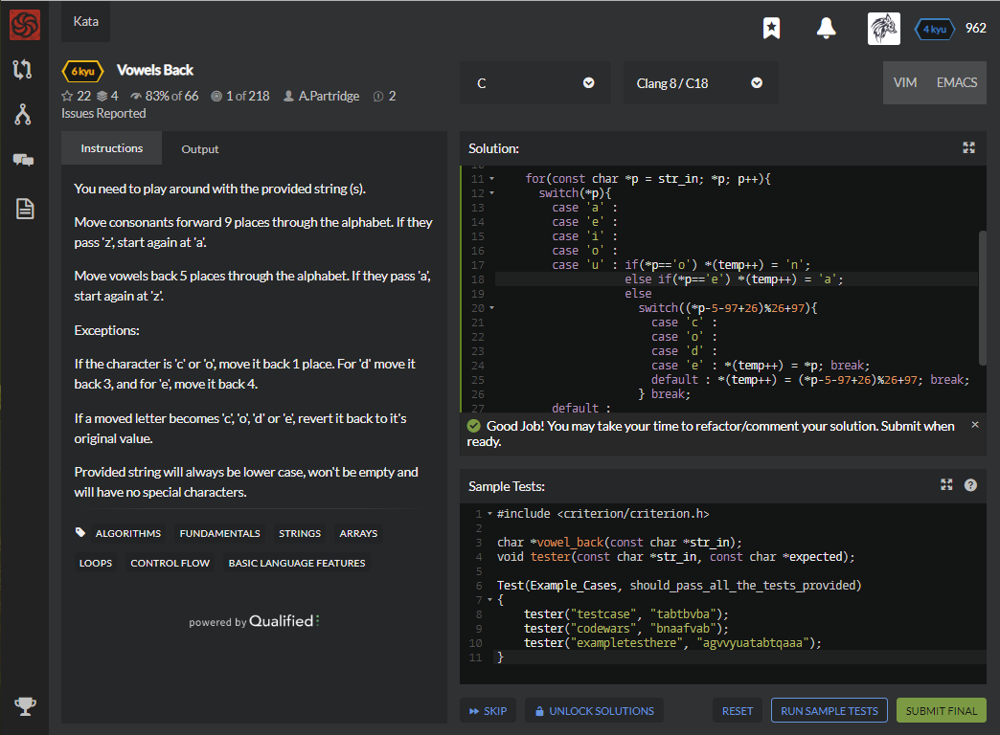

# [[6 Kyu] Vowels Back](https://www.codewars.com/kata/57cfd92c05c1864df2001563/train/c)




## Instructions

You need to play around with the provided string (s).

Move consonants forward 9 places through the alphabet. If they pass 'z', start again at 'a'.

Move vowels back 5 places through the alphabet. If they pass 'a', start again at 'z'.

Exceptions:

If the character is 'c' or 'o', move it back 1 place. For 'd' move it back 3, and for 'e', move it back 4.

If a moved letter becomes 'c', 'o', 'd' or 'e', revert it back to it's original value.

Provided string will always be lower case, won't be empty and will have no special characters.


## Sample Test

```c
#include <criterion/criterion.h>

char *vowel_back(const char *str_in);
void tester(const char *str_in, const char *expected);

Test(Example_Cases, should_pass_all_the_tests_provided)
{
    tester("testcase", "tabtbvba");
    tester("codewars", "bnaafvab");
    tester("exampletesthere", "agvvyuatabtqaaa");
}
```


## My solution

```c
#include <stdlib.h>
#include <string.h>
#include <stdio.h>
#include <math.h>

char *vowel_back(const char *str_in) {
    
    char *result = (char*)malloc(sizeof(char)*strlen(str_in)+1);
    char *temp = result;
    
    for(const char *p = str_in; *p; p++){
      switch(*p){
        case 'a' :
        case 'e' : 
        case 'i' :
        case 'o' :
        case 'u' : if(*p=='o') *(temp++) = 'n';
                   else if(*p=='e') *(temp++) = 'a';
                   else 
                     switch((*p-5-97+26)%26+97){
                       case 'c' :
                       case 'o' : 
                       case 'd' :
                       case 'e' : *(temp++) = *p; break;
                       default : *(temp++) = (*p-5-97+26)%26+97; break;
                     } break;
        default :
                   if(*p=='c') *(temp++) = 'b';
                   else if(*p=='d') *(temp++) = 'a';
                   else                  
                     switch((*p+9-97)%26+97){
                       case 'c' :
                       case 'o' : 
                       case 'd' :
                       case 'e' : *(temp++) = *p; break;
                       default : *(temp++) = (*p+9-97)%26+97; break;
                     } break;
      }
    }
    *temp = '\0';
    
    return result;
}
```


## Test Results

Test Passed

Test Passed

Test Passed

You have passed all of the tests! :)

---------

Time: 


## Best Solution

```python

```


## The things I got

