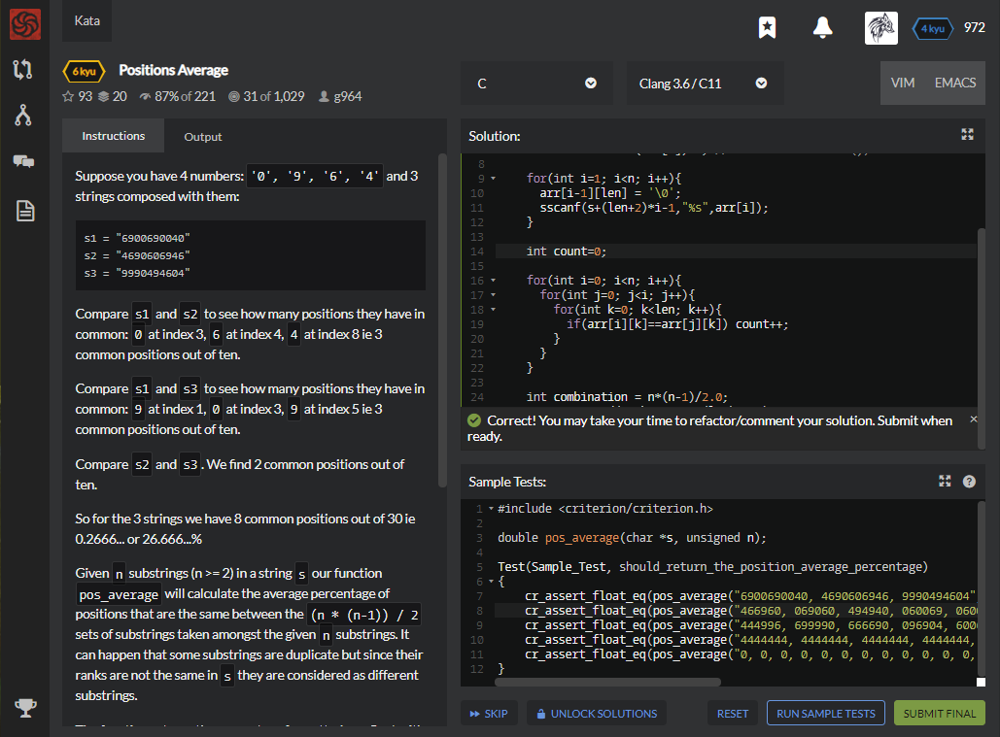

# [[6 Kyu] Positions Average](https://www.codewars.com/kata/59f4a0acbee84576800000af/train/c)




## Instructions

Suppose you have 4 numbers: `'0', '9', '6', '4'` and 3 strings composed with them:

```c
s1 = "6900690040"
s2 = "4690606946"
s3 = "9990494604"
```

Compare `s1` and `s2` to see how many positions they have in common: `0` at index 3, `6` at index 4, `4` at index 8 ie 3 common positions out of ten.

Compare `s1` and `s3` to see how many positions they have in common: `9` at index 1, `0` at index 3, `9` at index 5 ie 3 common positions out of ten.

Compare `s2` and `s3`. We find 2 common positions out of ten.

So for the 3 strings we have 8 common positions out of 30 ie 0.2666... or 26.666...%

Given `n` substrings (n >= 2) in a string `s` our function `pos_average` will calculate the average percentage of positions that are the same between the `(n * (n-1)) / 2` sets of substrings taken amongst the given `n` substrings. It can happen that some substrings are duplicate but since their ranks are not the same in `s` they are considered as different substrings.

The function returns the percentage formatted as a float with 10 decimals but the result is tested at 1e.-9 (see function assertFuzzy in the tests).

### Example

Given string s = "444996, 699990, 666690, 096904, 600644, 640646, 606469, 409694, 666094, 606490" composing a set of n = 10 substrings (hence 45 combinations), `pos_average` returns `29.2592592593`.

In a set the `n` substrings will have the same length ( > 0 ).


## Sample Test

```c
#include <criterion/criterion.h>

double pos_average(char *s, unsigned n);

Test(Sample_Test, should_return_the_position_average_percentage)
{
    cr_assert_float_eq(pos_average("6900690040, 4690606946, 9990494604", 3u), 26.6666666667, 0.0000000001);
    cr_assert_float_eq(pos_average("466960, 069060, 494940, 060069, 060090, 640009, 496464, 606900, 004000, 944096", 10u), 26.6666666667, 0.0000000001);
    cr_assert_float_eq(pos_average("444996, 699990, 666690, 096904, 600644, 640646, 606469, 409694, 666094, 606490", 10u), 29.2592592593, 0.0000000001);
    cr_assert_float_eq(pos_average("4444444, 4444444, 4444444, 4444444, 4444444", 5u), 100.0, 0.0000000001);
    cr_assert_float_eq(pos_average("0, 0, 0, 0, 0, 0, 0, 0, 0, 0, 0, 0, 0, 0, 0, 0, 0", 17u), 100.0, 0.0000000001);
}
```


## My solution

```c
#include <string.h>

double pos_average(char *s, unsigned n)
{
    char arr[100][100];
    sscanf(s,"%s",arr[0]);
    int len = strlen(arr[0])-1; // -1 : remove comma(,)
    
    for(int i=1; i<n; i++){
      arr[i-1][len] = '\0';
      sscanf(s+(len+2)*i-1,"%s",arr[i]);
    }    
    
    int count=0;
    
    for(int i=0; i<n; i++){
      for(int j=0; j<i; j++){
        for(int k=0; k<len; k++){
          if(arr[i][k]==arr[j][k]) count++;
        }
      }
    }
    
    int combination = n*(n-1)/2.0;
    return count/(combination*(len)*1.0)*100;
}

```


## Test Results

Test Passed

Test Passed

Test Passed

You have passed all of the tests! :)

---------

Time: 879ms Passed: 115 Failed: 0


## Best Solution

```python
#include <stdlib.h>
#include <string.h>


double pos_average(char *str, size_t n) {
    double sum  = 0.0;
    size_t len  = strchr(str, ',') - str;
    size_t end  = n;
     
    while ( *(str+len) ) {
        for (size_t s=1; s<end; s++)
            for (size_t i=0; i<len; i++)
                sum += str[i] == str[s*(len+2) + i];

        end--;
        str += len+2;
    }

    return sum / ((len*n*(n-1)/2)/100.0);
}
```


## The things I got

