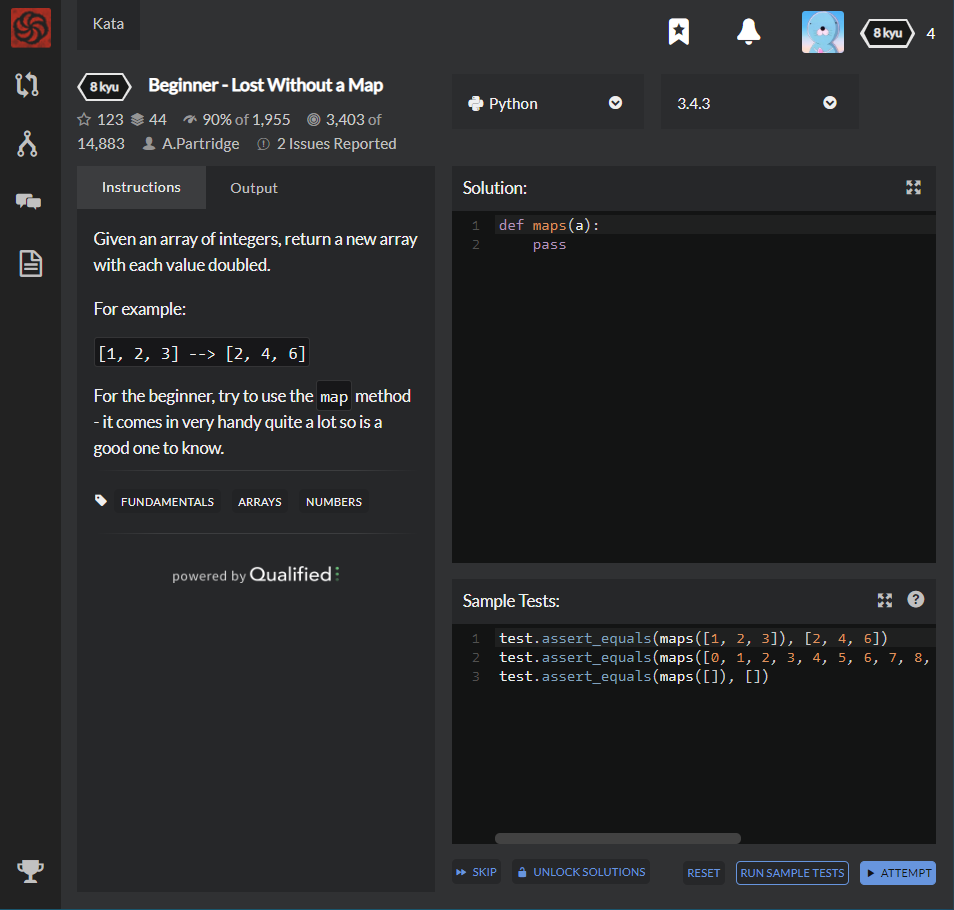

# [8 kyu] Beginner - Lost Without a Map




## Instructions

Given an array of integers, return a new array with each value doubled.

For example:

`[1, 2, 3] --> [2, 4, 6]`

For the beginner, try to use the  `map`  method - it comes in very handy quite a lot so is a good one to know.


## Sample Test

```python
test.assert_equals(maps([1, 2, 3]), [2, 4, 6])   
test.assert_equals(maps([0, 1, 2, 3, 4, 5, 6, 7, 8, 9]), [0, 2, 4, 6, 8, 10, 12, 14, 16, 18])   
test.assert_equals(maps([]), [])
```


## My solution

```python
def maps(a):
    result = []
    
    for i in a :
        result.append(2*i)
    return result
    pass
```


## Test Results

Test Passed

Test Passed

Test Passed

You have passed all of the tests! :)

---------

Time: 768ms Passed: 3 Failed: 0


## Best Solution

```python
def maps(a):
    return [2 * x for x in a]
```


## The things I got

List can be declared by   `name = []`

and can be set by  `name.append(value)` or `name.extend([value1, value2, ...])`

Also, List can be extract by  `for i in List :`

**Consequently,** I can lessen this by creating and returning list simultaneously like this  `[2 * x for x in a]`